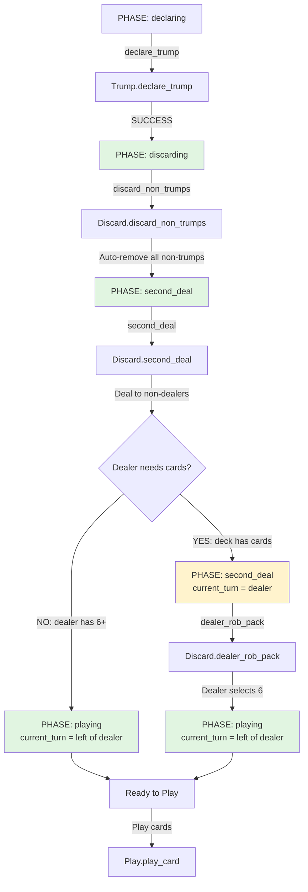

# Redeal Flow Analysis: Actual vs Expected

## Flow Diagram



---

## Detailed Step Analysis

### ✅ Step 1: Trump Declaration → Discarding

**Location**: [Trump.declare_trump](file:///Users/marcelfahle/code/pidro/_PIDRO2/code-ralph/pidro_backend/apps/pidro_engine/lib/pidro/game/trump.ex#L100-L113)

**Expected**:
- Declare trump suit
- Transition to `:discarding` phase
- Maintain `current_turn` as bidding winner
- Emit `{:trump_declared, suit}` event

**Actual**:
```elixir
# Lines 105-109
updated_state =
  state
  |> GameState.update(:trump_suit, trump_suit)
  |> GameState.update(:events, state.events ++ [{:trump_declared, trump_suit}])
  |> GameState.update(:phase, :discarding)
```

**Status**: ✅ **CORRECT**
- ✅ Phase transition to `:discarding`
- ✅ Event emission present
- ✅ `current_turn` preserved (not modified)
- ✅ No gate validation issues

---

### ✅ Step 2: Discarding Non-Trumps

**Location**: [Discard.discard_non_trumps](file:///Users/marcelfahle/code/pidro/_PIDRO2/code-ralph/pidro_backend/apps/pidro_engine/lib/pidro/game/discard.ex#L106-L143)

**Expected** (per spec):
- Each player discards all non-trump cards
- Discarded cards go to `discarded_cards` pile
- Emit `{:cards_discarded, position, [card]}` for each player
- Transition to `:second_deal` phase

**Actual**:
```elixir
# Lines 110-131: Process each player
%{trump: trump_cards, non_trump: non_trump_cards} =
  Trump.categorize_hand(player.hand, state.trump_suit)

updated_player = %{player | hand: trump_cards}

# Lines 134-139: Update state
updated_state =
  state
  |> GameState.update(:players, updated_players)
  |> GameState.update(:discarded_cards, state.discarded_cards ++ all_discarded_cards)
  |> GameState.update(:events, state.events ++ events)
  |> GameState.update(:phase, :second_deal)
```

**Status**: ✅ **CORRECT**
- ✅ All non-trumps removed from hands
- ✅ Discarded cards tracked
- ✅ Events emitted per player
- ✅ Phase transition to `:second_deal`
- ✅ `current_turn` unchanged (stays with bidding winner)

---

### ⚠️ Step 3: Second Deal to Non-Dealers

**Location**: [Discard.second_deal](file:///Users/marcelfahle/code/pidro/_PIDRO2/code-ralph/pidro_backend/apps/pidro_engine/lib/pidro/game/discard.ex#L239-L303)

**Expected** (per [specs/redeal.md](file:///Users/marcelfahle/code/pidro/_PIDRO2/code-ralph/pidro_backend/apps/pidro_engine/specs/redeal.md#L12-L18)):
1. Deal clockwise starting **left of dealer**
2. Each non-dealer gets cards to reach 6 total
3. Track how many cards each player requested (public info)
4. Emit `{:second_deal_complete, %{position => [card]}}` event
5. Leave remaining cards for dealer to rob

**Actual**:
```elixir
# Lines 244-245: Correct dealing order
first_player = Types.next_position(state.current_dealer)
deal_order = get_deal_order(first_player)

# Lines 248-269: Deal to each player
Enum.reduce(deal_order, {state.players, state.deck, %{}}, fn position, {players_acc, deck_acc, dealt_acc} ->
  player = Map.get(players_acc, position)
  current_hand_size = length(player.hand)

  if current_hand_size >= 6 do
    # Skip if already has 6+
    {players_acc, deck_acc, Map.put(dealt_acc, position, [])}
  else
    cards_needed = 6 - current_hand_size
    {dealt_cards, new_deck} = Enum.split(deck_acc, cards_needed)
    # ... deal cards
  end
end)

# Lines 276-301: Phase transition logic
dealer_hand_size = length(Map.get(updated_players, state.current_dealer).hand)
dealer_needs_rob = length(remaining_deck) > 0 and dealer_hand_size < 6

if dealer_needs_rob do
  # Stay in second_deal, set turn to dealer
  final_state = GameState.update(updated_state, :current_turn, state.current_dealer)
  {:ok, final_state}
else
  # Move to playing, turn to left of dealer
  final_state =
    updated_state
    |> GameState.update(:phase, :playing)
    |> GameState.update(:current_turn, Types.next_position(state.current_dealer))
  {:ok, final_state}
end
```

**Status**: ⚠️ **MOSTLY CORRECT - MISSING KILL LOGIC**
- ✅ Deals clockwise from left of dealer
- ✅ Brings players to 6 cards
- ✅ Leaves cards for dealer
- ✅ Event emission present
- ❌ **MISSING**: No tracking of `cards_requested` per player (spec line 87-91)
- ❌ **MISSING**: No check for players with >6 trump cards
- ❌ **MISSING**: No kill card logic implementation

**Deck Tracking**: ✅ **CORRECT**
- Cards removed from `state.deck` as dealt
- Remaining deck passed to dealer rob

---

### ⚠️ Step 4: Dealer Rob the Pack

**Location**: [Discard.dealer_rob_pack](file:///Users/marcelfahle/code/pidro/_PIDRO2/code-ralph/pidro_backend/apps/pidro_engine/lib/pidro/game/discard.ex#L350-L392)

**Expected** (per [specs/redeal.md](file:///Users/marcelfahle/code/pidro/_PIDRO2/code-ralph/pidro_backend/apps/pidro_engine/specs/redeal.md#L24-L31)):
1. Dealer takes ALL remaining deck cards
2. Combines: `dealer.hand ++ remaining_deck`
3. Dealer selects best 6 from this pool
4. Discarded cards go to `discarded_cards`
5. Emit `{:dealer_robbed_pack, position, taken, kept}` event
6. Transition to `:playing` phase
7. **CRITICAL**: Set `current_turn` to **left of dealer** (first player)

**Actual**:
```elixir
# Lines 356-361: Dealer combines hand + deck
dealer = state.current_dealer
dealer_player = Map.get(state.players, dealer)
remaining_cards = state.deck
dealer_full_hand = dealer_player.hand ++ remaining_cards

# Lines 364-367: Validate and calculate discards
case validate_cards_in_hand(selected_cards, dealer_full_hand) do
  :ok ->
    discarded = dealer_full_hand -- selected_cards
    
    # Lines 377-384: Update state
    updated_state =
      state
      |> GameState.update(:players, updated_players)
      |> GameState.update(:deck, [])  # ✅ Deck cleared
      |> GameState.update(:discarded_cards, state.discarded_cards ++ discarded)
      |> GameState.update(:events, state.events ++ [event])
      |> GameState.update(:phase, :playing)
      |> GameState.update(:current_turn, Types.next_position(dealer))  # ✅ LEFT OF DEALER
```

**Status**: ⚠️ **CORRECT TURN ORDER - MISSING KILL LOGIC**
- ✅ Dealer combines hand + remaining deck
- ✅ Dealer selects exactly 6 cards
- ✅ Discarded cards tracked
- ✅ Deck cleared (`deck: []`)
- ✅ Event emitted
- ✅ Phase transition to `:playing`
- ✅ **CRITICAL**: `current_turn` set to `Types.next_position(dealer)` (LEFT OF DEALER)
- ❌ **MISSING**: No check if dealer has >6 trump cards
- ❌ **MISSING**: No kill logic for excess trump

---

### ❌ Step 5: Kill Computation (COMPLETELY MISSING)

**Location**: **NOT IMPLEMENTED**

**Expected** (per [specs/redeal.md](file:///Users/marcelfahle/code/pidro/_PIDRO2/code-ralph/pidro_backend/apps/pidro_engine/specs/redeal.md#L38-L46)):
1. After re-deal, check if ANY player has >6 trump cards
2. Player MUST kill excess cards (place face-up, out of game)
3. Can only kill non-point trump cards (K, Q, 9, 8, 7, 6, 4, 3)
4. Cannot kill point cards (A, J, 10, Right5, Wrong5, 2)
5. If player has 7+ point cards → keep all cards >6
6. Top card of killed pile is auto-played on first trick
7. Track killed cards in game state
8. Emit kill events

**Actual**:
```
NO CODE EXISTS FOR THIS
```

**Status**: ❌ **NOT IMPLEMENTED**

**Missing Features**:
1. No `killed_cards` field in `Player` struct
2. No kill validation logic
3. No automatic first-card play from killed pile
4. No kill events in event types
5. No property tests for kill rules

**Impact**:
- Players can end up with >6 cards (violates Finnish rules)
- No mechanism to handle excess trump cards
- First trick play broken if kill cards exist

---

### ✅ Step 6: Playing Phase

**Location**: [Play.play_card](file:///Users/marcelfahle/code/pidro/_PIDRO2/code-ralph/pidro_backend/apps/pidro_engine/lib/pidro/game/play.ex#L112-L125)

**Expected**:
- Turn starts with left of dealer (set in step 4)
- Players play trump cards
- Trick winner leads next trick
- Events emitted for each card played

**Actual**:
```elixir
# Lines 113-124: Validation and play
with :ok <- validate_playing_phase(state),
     :ok <- validate_trump_declared(state),
     {:ok, card} <- Errors.validate_card(card),
     :ok <- validate_play(state, position, card),
     {:ok, state} <- remove_card_from_hand(state, position, card),
     {:ok, state} <- add_card_to_trick(state, position, card),
     {:ok, state} <- record_card_played_event(state, position, card),
     {:ok, state} <- check_player_elimination(state, position),
     {:ok, state} <- advance_turn_or_complete_trick(state) do
  {:ok, state}
end
```

**Status**: ✅ **CORRECT** (assuming no kill cards)
- ✅ Validates phase and trump
- ✅ Removes card from hand
- ✅ Adds to trick
- ✅ Emits events
- ✅ Checks elimination
- ✅ Advances turn

---

## Critical Issues Found

### 🔴 Issue 1: Kill Logic Completely Missing

**Severity**: HIGH  
**Location**: Entire codebase  
**Impact**: Game rules violated, players can have >6 cards

**Missing Components**:
1. `Player.killed_cards` field
2. Kill validation function
3. Kill event type
4. Auto-play first killed card
5. Property tests for kill rules

**Spec Reference**: [specs/redeal.md L38-46](file:///Users/marcelfahle/code/pidro/_PIDRO2/code-ralph/pidro_backend/apps/pidro_engine/specs/redeal.md#L38-L46)

---

### 🟡 Issue 2: Cards Requested Tracking Missing

**Severity**: MEDIUM  
**Location**: [Discard.second_deal](file:///Users/marcelfahle/code/pidro/_PIDRO2/code-ralph/pidro_backend/apps/pidro_engine/lib/pidro/game/discard.ex#L239-L303)  
**Impact**: Information leak mechanic not implemented

**Missing**:
```elixir
# Expected in GameState:
field(:cards_requested, %{position() => non_neg_integer()}, default: %{})
```

**Spec Reference**: [specs/redeal.md L87-91](file:///Users/marcelfahle/code/pidro/_PIDRO2/code-ralph/pidro_backend/apps/pidro_engine/specs/redeal.md#L87-L91)

---

### 🟢 Issue 3: Deck Tracking

**Severity**: LOW (working correctly)  
**Status**: ✅ **VERIFIED CORRECT**

**Evidence**:
- `second_deal`: Lines 249-269 split deck via `Enum.split(deck_acc, cards_needed)`
- `dealer_rob_pack`: Line 380 sets `deck: []`
- Remaining cards properly tracked in `state.deck` between operations

---

### 🟢 Issue 4: Current Turn After Dealer Rob

**Severity**: NONE (working correctly)  
**Status**: ✅ **VERIFIED CORRECT**

**Evidence**:
- Line 384: `GameState.update(:current_turn, Types.next_position(dealer))`
- This sets turn to **left of dealer** (first player)
- Matches spec requirement

---

## Event Emission Summary

| Event | Step | Location | Status |
|-------|------|----------|--------|
| `{:trump_declared, suit}` | Trump declaration | Trump.ex:108 | ✅ PRESENT |
| `{:cards_discarded, pos, cards}` | Discard | Discard.ex:123-128 | ✅ PRESENT |
| `{:second_deal_complete, map}` | Second deal | Discard.ex:272 | ✅ PRESENT |
| `{:dealer_robbed_pack, ...}` | Dealer rob | Discard.ex:374 | ✅ PRESENT |
| `{:cards_killed, pos, cards}` | Kill | **MISSING** | ❌ NOT IMPLEMENTED |
| `{:card_played, pos, card}` | Playing | Play.ex:514 | ✅ PRESENT |

---

## Phase Transition Gates

| Transition | Gate Function | Status |
|------------|---------------|--------|
| `declaring → discarding` | None (automatic) | ✅ OK |
| `discarding → second_deal` | None (automatic) | ✅ OK |
| `second_deal → playing` | `can_transition_from_second_deal?` | ⚠️ TOO STRICT |
| `playing → scoring` | `can_transition_from_playing?` | ✅ OK |

**Gate Issue**: [StateMachine.can_transition_from_second_deal?](file:///Users/marcelfahle/code/pidro/_PIDRO2/code-ralph/pidro_backend/apps/pidro_engine/lib/pidro/game/state_machine.ex#L296-L303)

```elixir
# Lines 297-302
def can_transition_from_second_deal?(%GameState{players: players, config: config}) do
  final_hand_size = Map.get(config, :final_hand_size, 6)

  Enum.all?(players, fn {_pos, player} ->
    length(player.hand) == final_hand_size  # ❌ TOO STRICT
  end)
end
```

**Problem**: This gate requires ALL players to have EXACTLY 6 cards, but spec allows >6 if they have excess trump that cannot be killed.

**Fix Required**:
```elixir
def can_transition_from_second_deal?(%GameState{players: players, trump_suit: trump_suit, config: config}) do
  final_hand_size = Map.get(config, :final_hand_size, 6)

  Enum.all?(players, fn {_pos, player} ->
    hand_size = length(player.hand)
    trump_count = Trump.count_trump_cards(player.hand, trump_suit)
    
    # Either exactly 6, OR more than 6 but all trump (kill scenario)
    hand_size == final_hand_size or (hand_size > final_hand_size and hand_size == trump_count)
  end)
end
```

---

## Recommendations

### Priority 1: Implement Kill Logic
1. Add `killed_cards` field to `Player` struct
2. Create `Kill` module with validation and logic
3. Add kill events to event types
4. Implement auto-play of top killed card
5. Add property tests for kill rules

### Priority 2: Track Cards Requested
1. Add `cards_requested` field to `GameState`
2. Update `second_deal` to track requests
3. Make this info available to dealer

### Priority 3: Fix Phase Transition Gate
1. Update `can_transition_from_second_deal?` to allow >6 cards if all trump
2. Add tests for this edge case

### Priority 4: Add Property Tests
1. Test that dealer always sees >= 6 cards
2. Test that killed cards are non-point or player has 7+ point cards
3. Test that deck tracking is consistent throughout flow

---

## Flow Summary: Actual vs Expected

| Step | Expected | Actual | Status |
|------|----------|--------|--------|
| 1. Trump declaration | Set trump, transition to discarding | ✅ Correct | ✅ |
| 2. Discard non-trumps | Remove all non-trumps | ✅ Correct | ✅ |
| 3. Second deal | Deal to 6, track requests | ✅ Deals correctly<br/>❌ No request tracking | ⚠️ |
| 4. Dealer rob | Combine + select 6, turn to left of dealer | ✅ Correct | ✅ |
| 5. Kill computation | Check >6 trump, kill excess | ❌ Not implemented | ❌ |
| 6. Playing | Play trump cards | ✅ Correct (if no kills) | ⚠️ |

**Overall Status**: ⚠️ **PARTIALLY IMPLEMENTED**
- Core flow works for normal cases
- Kill logic completely missing
- Cards requested tracking missing
- Phase gate too strict for edge cases
