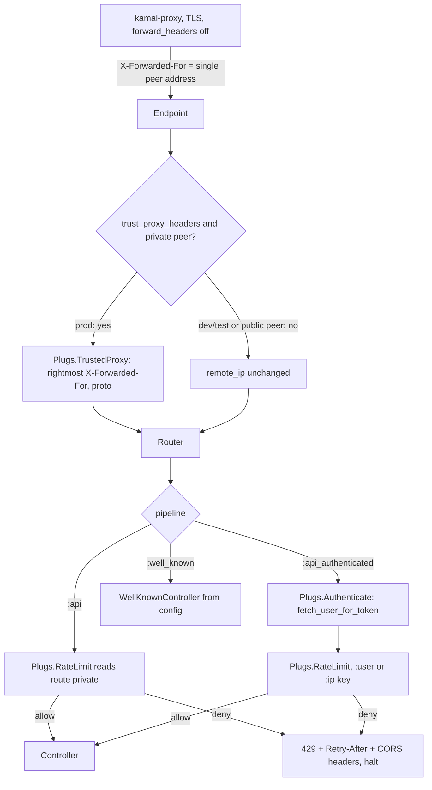
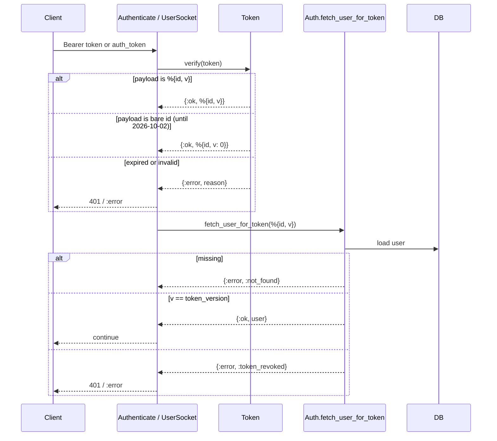

# Invite Prerequisites (Phase 0) - Plan

## Goal Capsule

- **Objective:** an invite link and a guest account can be added to Pidro without opening the API to abuse: callers are throttled by real client address, room codes cannot collide or be guessed cheaply, the guest flag cannot be forged, a user's tokens can be revoked, and the domain-association files the app links need are served by the API.
- **Means:** Hammer ETS throttling behind a trusted-proxy step, CSPRNG room codes with a serialized collision retry, an internal-only guest changeset, a `token_version` claim in the existing Phoenix.Token, and a config-driven well-known controller (KTD1–KTD7, KTD10).
- **Authority:** this plan, then `apps/pidro_server/thoughts/AGENTS.md` (style, commit format, `mix precommit`), then the origin requirements doc. The origin's product decisions D2, D5, D7, D9 govern; `session-settled:` KTDs are not re-litigated.
- **Execution profile:** one PR on `feat/invites-phase-0-prereqs`, backend only, no data backfill. Clients need no change for tokens; they will see a 429 for the first time (R25) and the frontend end-to-end harness needs relaxed dev limits (Assumptions).
- **Stop conditions:** a settled decision proves infeasible (report, do not work around); `mix precommit` cannot be made green without weakening an assertion; the production smoke test would change status codes.
- **Tail ownership:** the calling pipeline owns review, PR, CI babysitting, and merge.

---

## Product Contract

### Summary

Add five prerequisites to `apps/pidro_server` so phases 1–2 (invites, guests, landing page) can land safely: a configurable rate-limit plug on the auth and room endpoints that keys on the real client IP behind kamal-proxy, collision-safe CSPRNG room codes, a `users` migration with `display_name`, `token_version`, `last_seen_at` and `install_id`, a versioned `Phoenix.Token` payload with revocation, and `/.well-known/apple-app-site-association` plus `/.well-known/assetlinks.json` served from runtime config.

### Problem Frame

The backend has no rate limiting, room codes come from `Enum.random/1` with no collision check behind a public lookup endpoint, `guest` is mass-assignable on the public register endpoint, the 30-day token cannot be revoked, and the API cannot serve association files. Every one of these becomes exploitable or blocking the moment a link can create a guest (see origin: D2, D9, "Token and session model", "Abuse, privacy, compliance").

### Key Decisions

- **Rate limiting with Hammer (ETS) as one plug.** (session-settled: user-approved — chosen over PlugAttack or no limiter: standard library, in-memory, fits the single-node Hetzner deploy.) Governs R1–R7, R24–R26, R31.
- **Room code stays 4 characters, uppercase, generated with a CSPRNG and retried on collision; it is a display handle, not the invite secret.** (session-settled: user-approved — chosen over lengthening the room code: the phase-1 invite code is the secret and the room code must stay typeable.) Governs R8, R9.
- **`token_version` inside the existing Phoenix.Token; sessions and refresh tokens are v2.** (session-settled: user-approved — chosen over a sessions table now: smallest change that revokes tokens on upgrade, logout and delete.) Governs R15–R19, R29.
- **Association files served by Phoenix from config; `pidro.online` proxies them in phase 2.** (session-settled: user-approved — chosen over hosting them only on the Vercel sites: Phoenix is the source of truth for app ids and paths, and `play.pidro.online`'s SPA rewrite swallows them.) Governs R20–R22, R27.
- **`guest` is not castable from public params.** (session-settled: user-approved — chosen over leaving `User.changeset/2` as is: a client could flag itself guest or a guest endpoint could mint a non-guest.) Governs R10–R12, R28.
- **iOS and Android have priority; web play is deferred.** (session-settled: user-directed — chosen over building web join now: user priority.) Governs Scope Boundaries only.

### Requirements

**Throttling**
- R1. `POST /api/v1/auth/register`, `/login`, `/password-reset` and `/password-reset/confirm` are limited per client IP, each in its own bucket.
- R2. `POST /api/v1/rooms` is limited per authenticated user id.
- R3. `GET /api/v1/rooms/:code` is limited per client IP.
- R4. A denied request returns HTTP 429 with the `%{errors: [%{code: "RATE_LIMITED", title, detail}]}` body shape used by `FallbackController` and a `Retry-After` header in whole seconds, rounded up, minimum 1.
- R5. Limits are numeric only: per-policy `limit` and `scale_ms` in `config/config.exs`, relaxed numbers in `config/dev.exs`, effectively unlimited numbers (1,000,000) in `config/test.exs`, and per-policy `RATE_LIMIT_<POLICY>_LIMIT` / `_SCALE_MS` overrides in `config/runtime.exs`. There is no boolean off switch.
- R6. In production the limiter keys on the client IP that kamal-proxy places in `X-Forwarded-For`: the rightmost value, read only when `trust_proxy_headers` is true and the TCP peer is a loopback or private address. Outside production the header is ignored. kamal-proxy keeps `forward_headers` off so the header holds exactly one trusted value, and the rightmost rule keeps the limiter correct even if that setting is ever flipped.
- R7. `ops/smoke-production` keeps returning 401 for `/api/v1/lobby` and 403 for `/socket/websocket` after deploy: no limited route is on its path and default limits exceed smoke volume by an order of magnitude.
- R24. `POST /api/v1/auth/password-reset` is additionally limited per normalized identifier (trimmed, lower-cased, then SHA-256 hashed so the key and the log never hold the address), applied identically whether or not the account exists, so the 429 is not an enumeration oracle; a missing or non-binary identifier param skips that bucket and still counts against the IP bucket.
- R25. A halted 429 still carries the CORS headers `CORSPlug` set, and the response is documented in OpenAPI so the mobile and web clients (and the frontend repo's end-to-end harness) can surface it.
- R26. Limits are per node and fail open: an exception from the Hammer `hit` call logs at `:error` and lets the request through, while key construction runs outside that rescue; every 429 logs at `:info` with the bucket key, which never contains a raw identifier or credential.
- R31. `/up`, `/.well-known/*`, `GET /api/v1/rooms`, `GET /api/v1/lobby` and `POST /api/v1/rooms/:code/join` are not limited in this phase.

**Room codes**
- R8. Room codes are 4 uppercase characters from `A-Z0-9` drawn without modulo bias from `:crypto.strong_rand_bytes/1`.
- R9. Code generation retries on collision inside the `RoomManager` `:create_room` callback, bounded at 10 attempts, and returns `{:error, :room_code_exhausted}` (HTTP 503) instead of overwriting a live room.

**Guest flag**
- R10. `User.changeset/2` and therefore `POST /api/v1/auth/register` cannot set `guest`.
- R11. An internal `User.guest_changeset/2` creates a guest row from `username` (required, at least 3 characters, unique) and `display_name` with `guest: true` and no email or password.
- R12. The dev admin panel and `user_fixture/1` can still set `guest` through `User.admin_changeset/2`, and their existing tests, including `email_migration_test.exs`, keep passing.
- R28. `Auth.authenticate_user/2` treats a user whose `password_hash` is nil as invalid credentials, with a constant-time dummy verify, never a crash.

**User columns**
- R13. A migration adds `users.display_name` (string, null), `users.token_version` (integer, not null, default 0), `users.last_seen_at` (utc_datetime_usec, null) and `users.install_id` (string, null, partial index where not null). `install_id` and `last_seen_at` exist for rate limiting and recovery in later phases, are never logged, are not exposed by the API, and are deleted with the row.
- R14. `user_json` and the OpenAPI `User` schema expose `display_name` as nullable and optional; registration may set it through `changeset/2`.
- R30. `display_name` is trimmed and at most 40 characters in every changeset that casts it.

**Tokens**
- R15. `Token.generate/1` signs `%{id: user_id, v: token_version}`.
- R16. `Token.verify/1` returns `{:ok, %{id, v}}`; one context function, `Auth.fetch_user_for_token/1`, loads the user and compares `v`; the `Authenticate` plug answers 401 and `UserSocket.connect/3` answers `:error` on mismatch, missing user or bad token.
- R17. A legacy token whose payload is a bare user id verifies as `v: 0` until 30 days after this PR's production deploy (not before 2026-10-02); the accepting clause carries a comment with the earliest removal date, and whoever deploys writes the literal date there.
- R18. `Auth.bump_token_version/1` increments `token_version` atomically and invalidates every earlier token for that user.
- R19. After the increment commits, the context broadcasts `"disconnect"` on `"user_socket:<id>"`; a client holding the dead token then fails every reconnect until it logs in again.
- R29. `Auth.reset_user_password/2` bumps `token_version` and clears `password_reset_token_hash` and `password_reset_sent_at` in the same transaction as the password change, so a reset link cannot be replayed; the token returned by `POST /api/v1/auth/password-reset/confirm` is minted from the user the transaction returns.

**Association files**
- R20. `GET /.well-known/apple-app-site-association` and `GET /.well-known/assetlinks.json` return 200, `Content-Type: application/json`, `Cache-Control: public, max-age=3600`, no redirect, for any `Accept` header, and bodies built from config.
- R21. AASA lists `appIDs` `LSFK7YF82G.com.oneapps.pidro`, `LSFK7YF82G.com.marcelfahle.pidro3.dev`, `LSFK7YF82G.com.marcelfahle.pidro3.preview` with `components` `[{"/": "/j/*"}, {"/": "/app/*"}]` so the live Unity app's `/app/*` links survive the phase-2 proxy cutover; assetlinks lists package `com.oneapps.pidro` with fingerprint `11:24:29:B7:D0:61:FA:FF:89:D2:F0:04:92:12:FF:18:24:90:C1:EF:CF:71:00:5D:51:6A:D6:92:66:88:1A:31`; both lists have production-correct defaults in `config.exs` and are overridable from environment variables that are validated at boot only when set.
- R22. `ops/smoke-production` asserts both files after deploy.
- R27. The AASA document is also served at the legacy root path `/apple-app-site-association`.

**Documentation**
- R23. The OpenAPI description, `thoughts/API_DOCUMENTATION.md`, `thoughts/DEPLOYMENT.md`, `docs/deployment/kamal_hetzner.md` and the `Token` moduledoc no longer claim "no rate limiting" or a bare-id token payload, and the deployment doc records the proxy-header contract from R6.

### Scope Boundaries

- No invites table, no guest or upgrade endpoints, no landing page HTML, no waiting-room lifecycle change (phase 1–2).
- No sessions table or refresh tokens (token model v2).
- No web `/join` route (user-directed: web play deferred).
- The AASA served here is reachable for Apple only once `pidro.online` proxies `/.well-known/*` to `app.pidro.online` (phase 2); until then it is inert but correct, and it already carries the legacy `/app/*` path so the cutover cannot break the Unity app.
- Endpoint plugs never run for WebSocket upgrades (`:socket_dispatch` precedes them), so socket `connect_info` keeps the proxy address; per-IP socket throttling is out of scope.

#### Deferred to Follow-Up Work
- Throttling `POST /api/v1/rooms/:code/join`, the hot invite path (phase 1).
- A `POST /api/v1/auth/logout` that bumps `token_version` (lost-device revocation); phase 1's upgrade and delete endpoints must call `Auth.bump_token_version/1`.
- Phase 2 proxies `/j/:code` and `/.well-known/*` through Vercel, so those requests reach kamal-proxy from Vercel edge addresses; decide how to key their limits before throttling them.
- Unicode normalization and control-character rejection for `display_name` before it is shown to other players or rendered into Open Graph titles (phase 1–2).
- A per-username login bucket for credential stuffing across many IPs (needs a failure-only count to avoid locking users out).
- Clients: clear the cached token on REST 401 or socket 403 instead of reconnecting forever (frontend, phase 3).
- Adding `code` to the `Authenticate` plug's 401 body so it matches the array shape the docs promise.
- Guest username generation and collision retry from a display name (phase 1); `guest_changeset/2` surfaces the unique constraint so the caller can retry.
- Turnstile on the web form and App Attest / Play Integrity on guest creation (phase 6).
- A shared `authed_conn/2` helper in `ConnCase` (blocked by the line-pinned dialyzer ignore file, KTD8).
- Fixing `room_controller.ex` reading `conn.assigns[:current_user_id]`, which no plug sets.
- Reading `WEB_URL`, `MAIL_FROM_ADDRESS`, `MAIL_REPLY_TO` from `config/runtime.exs` instead of `System.get_env` in `auth_controller.ex`.

### Acceptance Examples

- AE1. Covers R1, R4. Given policy `login` is `1 per 60_000 ms`, when the same IP posts `/api/v1/auth/login` twice inside the window, then the second response is 429 with `errors[0].code == "RATE_LIMITED"` and `Retry-After` between 1 and 60.
- AE2. Covers R6. Given `trust_proxy_headers: false`, when a request carries `X-Forwarded-For: 203.0.113.9`, then `conn.remote_ip` stays the peer address and the header changes nothing.
- AE3. Covers R6. Given `trust_proxy_headers: true` and a peer of `172.18.0.2`, when a request carries `X-Forwarded-For: 203.0.113.9`, then `conn.remote_ip == {203,0,113,9}` and `conn.scheme == :https` when `X-Forwarded-Proto: https`.
- AE4. Covers R9. Given the code generator is forced to return an existing code 10 times, when a room is created, then the reply is `{:error, :room_code_exhausted}` and the colliding room keeps its host and players.
- AE5. Covers R16, R18, R19. Given a user with a valid token, when `Auth.bump_token_version/1` runs, then the old token gets 401 on `GET /api/v1/auth/me`, `connect/3` returns `:error`, a `"disconnect"` broadcast is received on `"user_socket:<id>"`, and a freshly generated token succeeds on both surfaces.
- AE6. Covers R17. Given a token signed with the bare user id under the same salt, when it is presented, then it verifies as `%{id: id, v: 0}` and succeeds for a user whose `token_version` is 0.
- AE7. Covers R10, R12. Given `POST /api/v1/auth/register` with `user[guest]=true`, when the user is created, then `guest` is false; and `user_fixture(%{guest: true, email: "g@x.test"})` yields a guest row that keeps its email.
- AE8. Covers R20, R21. Given default config, when `/.well-known/apple-app-site-association` is fetched with `Accept: text/html`, then the response is 200 JSON whose `applinks.details[0].appIDs` contains the three app ids and `components[0]["/"] == "/j/*"`.
- AE9. Covers R6. Given `trust_proxy_headers: true` and a peer of `198.51.100.7` (public), when a request carries `X-Forwarded-For: 203.0.113.9`, then `conn.remote_ip` stays `{198,51,100,7}`.
- AE15. Covers R6. Given `trust_proxy_headers: true` and a peer of `{0,0,0,0,0,65535,44050,2}` (`::ffff:172.18.0.2`, the shape a dual-stack listener produces), when a request carries `X-Forwarded-For: 203.0.113.9`, then `conn.remote_ip == {203,0,113,9}`.
- AE13. Covers R6. Given `trust_proxy_headers: true` and a private peer, when a request carries `X-Forwarded-For: 1.2.3.4, 203.0.113.9`, then `conn.remote_ip == {203,0,113,9}`; the forged first value never wins.
- AE14. Covers R29. Given a password-reset link, when it is used once, then a second use of the same link fails with the invalid-or-expired error.
- AE10. Covers R28. Given a guest row with a nil `password_hash`, when someone posts `/api/v1/auth/login` with that username, then the response is 401 invalid credentials, not 500.
- AE11. Covers R29. Given a user with a valid token, when they complete a password reset, then the old token gets 401 and the token in the reset response succeeds.
- AE12. Covers R24. Given policy `password_reset_identifier` is `1 per hour`, when two reset requests for `Anna@x.test` and ` anna@x.test ` arrive from different IPs, then the second is 429 whether or not the account exists.

### Sources

- Origin: docs/brainstorms/2026-09-02-invite-links-and-guest-play-requirements.md (Decisions, Data model, Token and session model, Abuse, Build plan item 0, answered questions 3 and 4).
- Research: docs/research/2026-09-02-invite-links-deep-linking-guest-play-landscape.md (sections 1, 2, 6, 7).
- Hammer 7.4.1 module API and the end-of-life notice on `hammer_plug`: https://hammer.hexdocs.pm/Hammer.html , https://hammer.hexdocs.pm/upgrade-v7.html , https://github.com/ExHammer/hammer-plug .
- Phoenix.Token term payloads and `max_age` at verify time: https://phoenix.hexdocs.pm/Phoenix.Token.html .
- kamal-proxy `forwardHeaders` (`internal/server/target.go`): with `forward_headers` off it discards client `X-Forwarded-*` and Go's `ProxyRequest.SetXForwarded` writes exactly the peer address; with it on, client values are kept and the peer is appended. Go's reverse proxy deletes inbound `X-Forwarded-*` before `Rewrite` (`net/http/httputil/reverseproxy.go`).
- `Plug.RewriteOn` reads the first `X-Forwarded-For` value and ignores the header when it appears more than once (`deps/plug/lib/plug/rewrite_on.ex`).
- Phoenix merges route `private` before pipelines run (`deps/phoenix/lib/phoenix/router.ex`, `router/route.ex`); `accepts` raises 406 for non-matching `Accept` headers (`deps/phoenix/lib/phoenix/controller.ex`); `"disconnect"` broadcasts stop the socket with close code 1001 (`deps/phoenix/lib/phoenix/socket.ex`).
- Apple AASA `components` and `appIDs`: https://developer.apple.com/documentation/xcode/supporting-associated-domains ; Android statement list: https://developers.google.com/digital-asset-links/v1/statements .
- Repo precedents: `apps/pidro_server/lib/pidro_server_web/plugs/dev_access.ex` (runtime-read config plug), commit `9dd36fc` (dual-accept socket auth transition), `apps/pidro_server/lib/pidro_server/accounts/auth.ex` password-reset token generation (CSPRNG idiom), `config/runtime.exs` `LIFECYCLE_*` block (env overrides in every env), `config/test.exs` Lifecycle block (per-env values), commit `d5b815e` (behavior over timing in tests).

---

## Planning Contract

### Key Technical Decisions

- KTD1. **`PidroServer.RateLimit` is a `use Hammer, backend: :ets` module started in `PidroServer.Application` before the endpoint.** Hammer `~> 7.4` is a runtime dependency; `hammer_plug` is end-of-life and is not added. (session-settled: user-approved — chosen over PlugAttack or no limiter: standard library, in-memory, fits the single-node deploy.) Instantiates the Key Decision governing R1–R7.
- KTD2. **One plug, `PidroServerWeb.Plugs.RateLimit`, mounted in both `:api` and `:api_authenticated`, selects its policies from route `private: %{rate_limit: [:login]}` (a list, so password reset can carry `[:password_reset, :password_reset_identifier]`).** A route without the key passes through at the cost of one map lookup. Policies are a config map `%{policy => %{limit, scale_ms, key: :ip | :user | :identifier}}` under `config :pidro_server, PidroServerWeb.Plugs.RateLimit`, read with `Application.get_env/3` inside `call/2` (the `DevAccess` shape) so runtime overrides and per-test changes apply. In `:api_authenticated` the plug is listed after `Authenticate` so `:user` policies see `conn.assigns[:current_user]`; a `:user` policy with no current user falls back to the IP key and logs a warning. IP keys are normalized: IPv4-mapped IPv6 collapses to IPv4, native IPv6 keys on the /64 prefix, formatted with `:inet.ntoa/1`. The plug renders the 429 itself and halts, because `FallbackController`'s atom catch-all would answer 422. Verified: Phoenix merges route `private` before `pipe_through` runs, so one pipeline plug can read it; no new pipelines, no controller-level plugs.
- KTD3. **Client IP comes from `PidroServerWeb.Plugs.TrustedProxy`, placed first in `PidroServerWeb.Endpoint` (above `Plug.RequestId` and `Plug.Telemetry`), which acts only when `config :pidro_server, :trust_proxy_headers` is true and `conn.remote_ip`, after collapsing an IPv4-mapped IPv6 tuple to its IPv4 form, is a proxy-side address: loopback, RFC 1918, CGNAT `100.64.0.0/10`, IPv6 loopback, ULA `fc00::/7` or link-local `fe80::/10`.** Production binds Bandit on `::`, so the proxy's IPv4 peer arrives as `{0,0,0,0,0,65535,a,b}`; a 4-tuple-only check would never fire and every request would key on the proxy. It sets `remote_ip` from the **rightmost** `X-Forwarded-For` value (all header lines joined, last comma-separated entry, parsed with `:inet.parse_address/1`, IPv6 brackets or ports rejected) and delegates `X-Forwarded-Proto` to `Plug.RewriteOn`. Production sets the flag from `TRUST_PROXY_HEADERS` (default true in prod, false elsewhere). `config/deploy.yml` keeps kamal-proxy's `forward_headers` at its default (off with TLS): kamal-proxy then discards any client-supplied `X-Forwarded-*` and writes exactly the true peer, so the header has one value. If `forward_headers` is ever enabled, client values are kept and the peer is appended, and the rightmost rule still picks the peer; `Plug.RewriteOn`'s first-value read would not, which is why the address parse is our own. Chosen over the `remote_ip` package: exactly one trusted proxy sits in front, no dependency is added, and the peer check is defense in depth for the case where port 4000 is ever published. Without this step every production request shares the proxy's bridge IP and R1/R3 would throttle the whole world at once.
- KTD4. **Room codes: a new pure module `PidroServer.Games.RoomCodes` draws bytes from `:crypto.strong_rand_bytes/1` with rejection sampling (discard bytes ≥ 252) onto the 36-character uppercase alphabet, and `generate_unique/3` takes a `taken?` function, an attempt bound (10) and an optional generator function so collisions are testable.** The `:create_room` handler calls it with `&Map.has_key?(state.rooms, &1)`; exhaustion returns `{:error, :room_code_exhausted}`, the `create_room/2` spec is widened, and a `FallbackController` clause placed above the atom catch-all maps it to 503 `ROOM_CODE_EXHAUSTED`. (session-settled: user-approved — chosen over lengthening the room code: the invite code is the secret.) Uppercase is mandatory because every lookup path upcases its argument.
- KTD5. **Token payload `%{id, v}` with the version compared against the database on every verify through one context function.** `Token.verify/1` normalizes a bare-id payload to `%{id: id, v: 0}` in a clause commented with its removal date (deploy date plus 30 days, no earlier than 2026-10-02), mirroring commit `9dd36fc`, so exactly one place knows about legacy payloads. `Auth.fetch_user_for_token/1` returns `{:ok, user} | {:error, :not_found | :token_revoked}` and is called by both `Authenticate` and `UserSocket.connect/3`; the socket keeps `assigns.user_id` a string. The socket gains one indexed query per connect, which is cheaper than any authenticated HTTP request (each already loads the user); no cache in phase 0. `bump_token_version/1` is `Repo.update_all` on a query that selects the user struct (`update_all` has no `returning` option) with `inc: [token_version: 1]`, then the disconnect broadcast strictly after commit. (session-settled: user-approved — chosen over a sessions table now: smallest revocable change.)
- KTD6. **`PidroServerWeb.WellKnownController` behind a `:well_known` pipeline with no `accepts` plug builds both documents from `config :pidro_server, PidroServerWeb.WellKnownController` (`ios_app_ids`, `ios_paths` defaulting to `["/j/*", "/app/*"]`, `android_packages` as `[%{package, fingerprints}]`), which `config/runtime.exs` overrides from `AASA_APP_IDS`, `AASA_PATHS` and `ASSETLINKS` (`package:fp1|fp2,package2:fp3`) only when those variables are set; a set value is validated at boot in every environment (fingerprints upper-cased and matched against 32 colon-separated hex pairs, malformed values raise), an unset one falls back to the `config.exs` defaults, so a first deploy without the variables cannot fail its health check.** The controller uses `send_resp/3` with an explicit `application/json` content type so `Accept: text/html` cannot 406. `static_paths/0` is left untouched because it also feeds verified routes. (session-settled: user-approved — chosen over Vercel-only hosting.)
- KTD7. **`User.changeset/2` drops `:guest`; `User.guest_changeset/2` and `User.admin_changeset/2` own it.** `Auth.change_user/2` and `Auth.update_user/2` both switch to `admin_changeset/2` (they are only compiled for dev routes). `user_fixture/1` registers through `Auth.register_user/1` with every attribute except `guest`, then flips `guest` with `admin_changeset/2` and `Repo.update`, so fixtures that pass an email keep it. (session-settled: user-approved — chosen over leaving the cast.)
- KTD8. **New test helpers go in a new support module, `test/support/rate_limit_case.ex`, never in `conn_case.ex` or `channel_case.ex`.** `dialyzer.ignore-warnings` pins those files by line with `list_unused_filters: true`; shifting a line fails `mix precommit`. Rate-limit tests are `async: false` with an explanatory comment, reset the Hammer ETS table between tests, and give each test its own IP via `%{conn | remote_ip: ...}`.
- KTD9. **Limits are asserted by behavior, never by sleeping.** Tests set a policy with limit 1 and assert 429 plus `Retry-After`; the window is never waited out (precedent: commit `d5b815e`).
- KTD10. **The token format change is a one-way door: roll forward only.** A previous release fed a map payload into `Auth.get_user/1` and would answer 500, not 401, for up to a token lifetime. If an emergency rollback is ever needed, rotate `@signing_salt` in `accounts/token.ex` so every v2 token dies and users log in again.

### High-Level Technical Design

Request path after this plan, showing where each decision sits:

Token verification, both surfaces, through one context function:

### System-Wide Impact

- Endpoint plug chain: the trusted-proxy plug runs for every HTTP request, including `/up`, which kamal polls every 3 s; it is a no-op outside production.
- Router: `:api` and `:api_authenticated` pay one map lookup per request whether or not a route is tagged; a new `/.well-known` scope and pipeline are added.
- Supervision tree: `PidroServer.RateLimit` starts before `PidroServerWeb.Endpoint` in `lib/pidro_server/application.ex`, in every environment.
- `Token.verify/1` return type: exactly two production callers (`plugs/authenticate.ex`, `channels/user_socket.ex`); no bot or script mints tokens.
- Config surface: rate-limit policies, `trust_proxy_headers`, well-known lists; new env vars `RATE_LIMIT_*`, `TRUST_PROXY_HEADERS`, `AASA_APP_IDS`, `AASA_PATHS`, `ASSETLINKS`; `config/deploy.yml` documents that `forward_headers` stays off.
- `ops/smoke-production`: edited by U4 and U6; CI lints it with `bash -n`.
- OpenAPI: `display_name` on `User`, a 429 response on six operations, a corrected description.
- Cross-repo consumer: the frontend end-to-end harness registers several accounts from one address against a dev-env backend; `config/dev.exs` limits are sized for it (Assumptions).

### Risks and Rollback

- **Proxy contract drift.** If someone later enables `forward_headers`, client-supplied values enter the header; the rightmost rule keeps the limiter correct, and the deployment doc plus a comment next to the `proxy` stanza state the contract. The one-time production check in U4 proves the header arrives at all.
- **Token payload rollback.** KTD10: roll forward; emergency rollback rotates the salt. Limiter misbehaviour in production is corrected by raising `RATE_LIMIT_<POLICY>_LIMIT` or setting `TRUST_PROXY_HEADERS=false` and redeploying the environment, never by rolling back the release, because the previous release rejects every token minted since the deploy.
- **Cold CI run.** Adding Hammer changes `mix.lock`, so the first CI run rebuilds deps and the dialyzer PLT inside the 30-minute timeout; if it times out, add a restore-keys fallback to the cache step rather than raising the timeout.
- **Reconnect storm after deploy.** Each socket reconnect now costs one indexed select; revisit with an ETS cache only if p99 connect latency or pool queueing (`POOL_SIZE: 20`) shows it.
- **Window semantics.** Hammer's fixed window admits up to 2× the limit across a boundary; acceptable and documented.

### Assumptions

- Default production policies: `login` 10 per minute per IP; `register` 10 per 10 minutes per IP; `password_reset` 3 per 15 minutes per IP and `password_reset_identifier` 3 per hour; `password_reset_confirm` 5 per 15 minutes per IP; `room_create` 10 per minute per user; `room_lookup` 120 per minute per IP (the web waiting room polls every 3 s per player, four players behind one NAT is 80 per minute). `config/dev.exs` multiplies every limit by 10 for the frontend end-to-end harness; `config/test.exs` sets 1,000,000. Per-IP policies are sized for household NAT; mobile carrier-grade NAT can pool many users behind one address, so a 429 report from mobile users is diagnosed as keying first, and `RATE_LIMIT_<POLICY>_LIMIT` is the operational response until phase 1 adds `install_id` keying.
- The legacy bare-id clause is removed 30 days after the production deploy of this PR (not before 2026-10-02): the 30-day `max_age` runs from mint time, so the window is deploy-relative.
- Room code uniqueness is among live rooms only; `game_stats.room_code` and `abandonment_events` keep historical codes, so a code can recur over time. Phase 1 invites must not assume global uniqueness.
- The per-identifier password-reset bucket lets anyone who knows an address hold its owner at 429 for the window; accepted as the smaller harm against mailbox flooding, and bounded by the 3-per-hour size.
- The retry bound of 10 over a 36⁴ space is generous; exhaustion is a monitor for leaked rooms, not a feature.
- `install_id` is not an identity: many rows may share one, no phase-0 changeset casts it, and phase 1 bounds its length before it reaches the index.
- Dev and preview Android packages get no assetlinks entry until their fingerprints are known; the config list accepts more entries.
- kamal-proxy emits exactly one `X-Forwarded-For` line; if several arrive, all values are joined and the rightmost wins.

### Sequencing

U1 → U2 (schema before token version); U1 → U3 → U4 (limiter before proxy step, both before the smoke changes); U5 and U6 independent of U2–U4, U6 after U4 to avoid a conflict in `ops/smoke-production`; U7 last.

---

## Implementation Units

### U1. Users migration, guest and admin changesets, display_name exposure

- **Goal:** land the new columns and make `guest` settable only through internal changesets, without breaking the admin panel, the fixtures, or login for guest rows.
- **Requirements:** R10, R11, R12, R13, R14, R28, R30 (KTD7).
- **Dependencies:** none.
- **Files:** `apps/pidro_server/priv/repo/migrations/20260902120000_add_guest_prereqs_to_users.exs` (create), `apps/pidro_server/lib/pidro_server/accounts/user.ex`, `apps/pidro_server/lib/pidro_server/accounts/auth.ex` (`authenticate_user/2`, `admin_user_attrs/1`, `change_user/2`, `update_user/2`), `test/support/fixtures.ex`, `apps/pidro_server/lib/pidro_server_web/controllers/api/user_json.ex`, `apps/pidro_server/lib/pidro_server_web/schemas/user_schemas.ex`, tests: `test/pidro_server/accounts/user_test.exs` (create), `test/pidro_server/accounts/auth_test.exs` (create or extend), `test/pidro_server_web/controllers/api/auth_controller_test.exs`, `test/pidro_server_web/live/dev/user_management_live_test.exs`, `test/pidro_server/email_migration_test.exs` (must keep passing unchanged).
- **Approach:**
  1. Migration: `alter table(:users)` adding the four columns per R13, plus `create index(:users, [:install_id], where: "install_id IS NOT NULL")`; reversible `change/0`.
  2. Schema: fields with matching types and `token_version` schema default 0 so a freshly inserted struct signs correctly without a reload; `changeset/2` casts `[:username, :email, :password, :display_name]`; `guest_changeset/2` casts `[:username, :display_name]`, requires username (min 3, unique constraint), puts `guest: true`; `admin_changeset/2` pipes `changeset/2` then casts `[:guest]`; every changeset that casts `display_name` trims it and validates length ≤ 40.
  3. `Auth.authenticate_user/2`: when the user has no `password_hash`, run `Bcrypt.no_user_verify/0` and return invalid credentials.
  4. `Auth.change_user/2` and `update_user/2` use `admin_changeset/2`; `admin_user_attrs/1` keeps whitelisting `:guest`.
  5. `user_fixture/1` pops `:guest`, registers with the remaining attrs, then flips `guest` via `admin_changeset/2` and `Repo.update` when requested.
  6. `user_json` and the OpenAPI `User` schema add nullable, optional `display_name`.
- **Patterns to follow:** `20260506110000_add_password_reset_to_users.exs`; the changeset-per-purpose layout in `user.ex`; KTD7 (`guest` is never cast from public params).
- **Test scenarios:**
  - Register with `user[guest]=true` creates a non-guest user (AE7).
  - Register with `display_name: "  Anna  "` stores `"Anna"`; a 41-character display name is a 422 validation error, not a 500.
  - `guest_changeset/2` with username and display_name is valid, sets `guest: true`, leaves email and password_hash nil; with a 2-character username it is invalid; with a taken username it returns the unique-constraint error.
  - Login with a guest's username returns 401 invalid credentials and does not raise (AE10).
  - `admin_changeset/2` toggles `guest`; the admin LiveView test that flips the checkbox still asserts the change.
  - `user_fixture(%{guest: true, email: "g@x.test"})` returns a guest row with that email; `email_migration_test.exs` passes unchanged.
  - `GET /api/v1/auth/me` includes `display_name` (nil for existing users).
  - Migration round-trips: rollback then migrate succeeds and existing rows read `token_version == 0`.
- **Verification:** accounts, auth controller, dev LiveView and email-migration tests green; `/api/openapi` renders.

### U2. Versioned token payload with revocation

- **Goal:** tokens carry `token_version`, both auth surfaces enforce it through one context function, password reset revokes old tokens, legacy tokens keep working until the dated cutoff.
- **Requirements:** R15, R16, R17, R18, R19, R29 (KTD5, KTD10).
- **Dependencies:** U1.
- **Files:** `apps/pidro_server/lib/pidro_server/accounts/token.ex`, `apps/pidro_server/lib/pidro_server/accounts/auth.ex` (`fetch_user_for_token/1`, `bump_token_version/1`, `reset_user_password/2`), `apps/pidro_server/lib/pidro_server_web/plugs/authenticate.ex`, `apps/pidro_server/lib/pidro_server_web/channels/user_socket.ex`, `apps/pidro_server/lib/pidro_server_web/controllers/api/auth_controller.ex` (`reset_password/2` mints from the reloaded user), tests: `test/pidro_server/accounts/token_test.exs` (create), `test/pidro_server_web/plugs/authenticate_test.exs` (create), `test/pidro_server_web/channels/user_socket_test.exs`, `test/pidro_server_web/controllers/api/auth_controller_test.exs`.
- **Approach:**
  1. `Token.generate/1` signs `%{id: user.id, v: user.token_version}`; `verify/1` matches the map, then the legacy binary id clause (comment: remove 30 days after the production deploy, not before 2026-10-02), then errors; returns `{:ok, %{id, v}}`.
  2. `Auth.fetch_user_for_token/1` loads the user by id and compares `v`; `Authenticate` renders the existing 401 on any error; `UserSocket.connect/3` destructures `%{id: id, v: v}` and returns `:error` on any error, keeping the three-clause order from `9dd36fc`. `assigns.user_id` stays a bare id string: `UserSocket.id/1`, Presence, the game and lobby channels all read it, and the R19 topic is built from it.
  3. `Auth.bump_token_version/1`: `Repo.update_all` on `from(u in User, where: u.id == ^id, select: u)` with `inc: [token_version: 1]`, which returns `{1, [user]}`; after it returns, `Endpoint.broadcast("user_socket:#{id}", "disconnect", %{})`.
  4. `Auth.reset_user_password/2` runs the password update, the version increment and the clearing of `password_reset_token_hash` / `password_reset_sent_at` in one `Ecto.Multi`; the Multi increments the version without broadcasting, and the disconnect broadcast fires only after `Repo.transaction` returns; `AuthController.reset_password/2` mints the response token from the user returned by the Multi.
  5. Update the `Token` moduledoc examples by hand (no doctest runs them).
- **Patterns to follow:** commit `9dd36fc`; `thoughts/AGENTS.md` for query style.
- **Test scenarios:**
  - Fresh token round-trips to `{:ok, %{id: id, v: 0}}`.
  - Legacy token signed with the bare id under the same salt verifies as `v: 0` and passes both surfaces for a version-0 user (AE6).
  - After `bump_token_version/1`, the old token gets 401 and `:error`, the disconnect broadcast is received by a subscriber of `"user_socket:<id>"`, and a new token succeeds on both surfaces (AE5).
  - After a completed password reset the pre-reset token gets 401 and the returned token succeeds (AE11).
  - A token for a deleted user gets 401 and `:error`.
  - Expired and tampered tokens still map to 401 and `:error`.
  - Both socket auth paths (`connect_info.auth_token` and `%{"token" => ...}`) enforce the version, and `UserSocket.id/1` still returns `"user_socket:<id>"` with the bare id.
  - A password-reset link used twice fails the second time (AE14).
  - Two concurrent bumps leave `token_version` incremented by exactly 2.
- **Verification:** token, plug, socket and auth-controller tests green; `ChannelCase.create_token/1` unchanged and still valid.

### U3. Hammer rate-limit module, plug, policies and router wiring

- **Goal:** throttle the listed routes with numeric, configurable policies and a documented 429 that clients can act on.
- **Requirements:** R1, R2, R3, R4, R5, R7, R24, R25, R26, R31 (KTD1, KTD2, KTD8, KTD9).
- **Dependencies:** U1.
- **Files:** `apps/pidro_server/mix.exs` (add `{:hammer, "~> 7.4"}`), `mix.lock`, `apps/pidro_server/lib/pidro_server/rate_limit.ex` (create), `apps/pidro_server/lib/pidro_server/application.ex`, `apps/pidro_server/lib/pidro_server_web/plugs/rate_limit.ex` (create), `apps/pidro_server/lib/pidro_server_web/router.ex`, `config/config.exs`, `config/dev.exs`, `config/test.exs`, `config/runtime.exs`, `apps/pidro_server/lib/pidro_server_web/schemas/error_schemas.ex` (`too_many_requests_error/0`), `apps/pidro_server/lib/pidro_server_web/controllers/api/auth_controller.ex` and `room_controller.ex` (429 on the six operation specs), `test/support/rate_limit_case.ex` (create), tests: `test/pidro_server_web/plugs/rate_limit_test.exs` (create), `test/pidro_server_web/controllers/api/auth_controller_test.exs`, `test/pidro_server_web/controllers/api/room_controller_test.exs`.
- **Approach:**
  1. `PidroServer.RateLimit` is `use Hammer, backend: :ets`; add `{PidroServer.RateLimit, clean_period: :timer.minutes(1)}` to the children before the endpoint.
  2. Config: policies per the Assumptions in `config.exs`; ×10 in `dev.exs` (restated by hand, since `Config` cannot read `config.exs` values; keep the two tables adjacent in a comment so they do not drift); 1,000,000 in `test.exs`; `runtime.exs` merges `RATE_LIMIT_<POLICY>_LIMIT` / `_SCALE_MS` with the `LIFECYCLE_*` reduce pattern. No boolean switch anywhere.
  3. Plug: read config at call time; `conn.private[:rate_limit]` lists the policies to apply in order; build keys outside any rescue (`"ip:"` + normalized address, `"user:"` + id, `"ident:"` + the first 16 bytes of the SHA-256 of the trimmed lower-cased `params["identifier"]` or `params["email"]`, hex-encoded; when the param is missing, empty or not a binary the identifier policy is skipped, the IP policy still applies, and the controller answers its usual 422); call `PidroServer.RateLimit.hit/3` inside the only rescue; on the first `{:deny, ms}` set `retry-after` to `max(1, div(ms + 999, 1000))`, status 429, the array error body, log at `:info` with the key, halt; on an exception from `hit/3` log at `:error` and continue.
  4. Router: `plug PidroServerWeb.Plugs.RateLimit` in `:api` and, after `Authenticate`, in `:api_authenticated`; tag the six routes with `private: %{rate_limit: [...]}`; password reset carries both policies.
  5. `RateLimitCase`: `with_limit(policy, limit, scale_ms)` saves and restores app env in `on_exit`; `reset/0` clears the Hammer table; `from_ip(conn, tuple)` sets `remote_ip`.
  6. OpenAPI: `too_many_requests_error/0` and the 429 response on the six operations.
- **Patterns to follow:** `plugs/dev_access.ex` and `dev_access_test.exs`; `config/test.exs` Lifecycle block; `FallbackController` error body shape; every module gets a `@moduledoc`.
- **Execution note:** start with the plug test at limit 1 so the 429 contract is red before wiring the router.
- **Test scenarios:**
  - `login` at limit 1: first `POST /login` passes (401 for bad credentials is fine), second from the same IP is 429 with `RATE_LIMITED` and `Retry-After` between 1 and the window (AE1).
  - Two different IPs at limit 1 each get one allowed request.
  - `room_create` at limit 1: the same user's second `POST /rooms` is 429; a different user is allowed.
  - `room_lookup` at limit 1: second `GET /rooms/:code` from the same IP is 429 whether or not the code exists.
  - `password_reset_identifier` at limit 1: `Anna@x.test` and ` anna@x.test ` from different IPs share a bucket, for an existing and for an unknown account (AE12).
  - `GET /api/v1/rooms`, `GET /up` and both well-known routes are never limited even at limit 0.
  - IPv4-mapped IPv6 `{0,0,0,0,0,65535,x,y}` and the dotted IPv4 share a key; two native IPv6 addresses in one /64 share a key.
  - A `:user` policy on a request with no `current_user` falls back to the IP key.
  - The 429 response carries `access-control-allow-origin` when the request has an allowed `Origin`.
  - The 429 body matches the `too_many_requests_error` schema fields.
  - With the Hammer backend made to raise (stub the `hit/3` call, do not delete the ETS table, which would crash Hammer's cleanup process), a limited request passes and an error is logged.
  - `POST /auth/password-reset` with no identifier, or with `identifier: ["a"]`, returns 422 (never 500) at identifier limit 1, logs no error, and counts against the IP bucket.
  - The logged 429 line for an identifier bucket contains the hashed key and not the address.
  - `mix hex.audit` reports no retired package after adding Hammer.
- **Verification:** plug and controller tests green with `async: false`; `/api/openapi` includes 429 on the six operations.

### U4. Trusted proxy headers and smoke-test guard

- **Goal:** the limiter sees the real client IP in production and cannot be spoofed anywhere.
- **Requirements:** R6, R7, R23 (KTD3).
- **Dependencies:** U3.
- **Files:** `apps/pidro_server/lib/pidro_server_web/plugs/trusted_proxy.ex` (create), `apps/pidro_server/lib/pidro_server_web/endpoint.ex`, `config/config.exs` (`trust_proxy_headers: false`), `config/runtime.exs` (`TRUST_PROXY_HEADERS`, default true only in prod), `config/deploy.yml` (comment on the `proxy` stanza: `forward_headers` must stay off), `.github/workflows/ci.yml` (deployment-config guard), `ops/smoke-production` (comment only), `docs/deployment/kamal_hetzner.md`, tests: `test/pidro_server_web/plugs/trusted_proxy_test.exs` (create).
- **Approach:**
  1. `Plugs.TrustedProxy` (module plug, `@moduledoc`, `init/1`, `call/2` reading the flag at call time): normalize the peer first (IPv4-mapped IPv6 to IPv4, shared with the KTD2 key normalizer), then, when the flag is true and the peer is in one of the proxy-side ranges named in KTD3, take the rightmost `X-Forwarded-For` value, parse it, and set `remote_ip`; leave the conn untouched on any parse failure; then apply `Plug.RewriteOn` for `:x_forwarded_proto`. Mount it as the first plug in the endpoint.
  2. `deploy.yml`: do not set `forward_headers`; add the contract comment; add a step to the CI `deployment-config` job (`.github/workflows/ci.yml`) that fails when `config/deploy.yml` contains a `forward_headers` key.
  3. Deployment doc: the header contract, `TRUST_PROXY_HEADERS`, what happens if `forward_headers` is enabled, and a one-time production check to run after the first deploy: set `RATE_LIMIT_LOGIN_LIMIT=1` temporarily, confirm 429 from the operator's network and 200 from a second network, then remove the override. A smoke probe cannot verify this without echoing the derived address, so the smoke test only gains a comment that limited routes must never join its path.
- **Patterns to follow:** `plugs/dev_access.ex` runtime read; `ops/smoke-production` curl blocks; `bash -n` runs on it in CI.
- **Test scenarios:**
  - Flag false: a request with `X-Forwarded-For: 203.0.113.9` keeps `conn.remote_ip == {127,0,0,1}` (AE2).
  - Flag true, peer `172.18.0.2`: `remote_ip == {203,0,113,9}` and `scheme == :https` with `X-Forwarded-Proto: https` (AE3).
  - Flag true, peer `{0,0,0,0,0,65535,44050,2}`: `remote_ip == {203,0,113,9}` (AE15).
  - Flag true, public peer `198.51.100.7`: header ignored (AE9); peers `100.64.1.1`, `fd00::1` and `fe80::1` are treated as proxy-side.
  - Flag true, header `1.2.3.4, 203.0.113.9`: the rightmost value wins (AE13).
  - Flag true, two `x-forwarded-for` header lines: the last value of the last line wins.
  - Flag true, header `2001:db8::9`: `remote_ip` is the IPv6 tuple; header `[2001:db8::9]:443` or `garbage` leaves `remote_ip` unchanged.
  - The plug runs before `Plug.RequestId`: a request through the endpoint with a forwarded header logs the rewritten address in the request-id metadata (plug order is not introspectable at runtime).
  - `bash -n ops/smoke-production` passes.
- **Verification:** endpoint tests green; `kamal config` still validates in the `deployment-config` CI job.

### U5. CSPRNG room codes with serialized collision retry

- **Goal:** room codes stop colliding silently and stop being predictable.
- **Requirements:** R8, R9 (KTD4).
- **Dependencies:** none.
- **Files:** `apps/pidro_server/lib/pidro_server/games/room_codes.ex` (create), `apps/pidro_server/lib/pidro_server/games/room_manager.ex` (`:create_room` handler, `create_room/2` spec, remove `generate_room_code/0`), `apps/pidro_server/lib/pidro_server_web/controllers/api/fallback_controller.ex` (`:room_code_exhausted` → 503 above the atom catch-all), tests: `test/pidro_server/games/room_codes_test.exs` (create), `test/pidro_server/games/room_manager_test.exs`, `test/pidro_server_web/controllers/api/room_controller_test.exs`.
- **Approach:**
  1. `RoomCodes.random/0`: draw bytes, discard values ≥ 252, map the rest modulo 36 onto `A-Z0-9`, until 4 characters.
  2. `RoomCodes.generate_unique(taken?, attempts \\ 10, generator \\ &random/0)` returns `{:ok, code}` or `{:error, :room_code_exhausted}`.
  3. The `:create_room` handler threads the result through its `with`; on exhaustion it replies the error and logs the live room count at `:error`. Note: the handler already rebinds state from `maybe_evict_disconnected_player/2` before the `with`, so the caller's stale room stays evicted; the colliding room is untouched.
  4. Widen the `create_room/2` `@spec` to include the new error; add the fallback clause.
  5. Test injection uses one mechanism only: the `:create_room` handler reads an optional generator from `Application.get_env(:pidro_server, PidroServer.Games.RoomCodes, [])` at call time (absent in every environment; set by the collision tests with `Application.put_env` and restored in `on_exit`).
- **Patterns to follow:** `accounts/auth.ex` password-reset token generation; `RoomManagerCase.cleanup/0` and `async: false` in room tests.
- **Test scenarios:**
  - 5,000 generated codes are all 4 uppercase alphanumerics and every alphabet character appears.
  - `generate_unique/3` with a `taken?` that rejects the first sampled code returns a different code on the second draw.
  - A generator fixed to one code with `taken?` always true replies `{:error, :room_code_exhausted}` after exactly 10 calls (AE4 via the pure function).
  - Creating a room when a forced collision occurs leaves the existing room's host and players intact (AE4 via `RoomManager`, using the app-env generator override from step 5).
  - `POST /api/v1/rooms` maps exhaustion to 503 with `ROOM_CODE_EXHAUSTED`.
  - `get_room("abcd")` finds room `ABCD`.
- **Verification:** RoomCodes, RoomManager and room controller suites green; dialyzer accepts the widened spec.

### U6. Well-known association files from config

- **Goal:** the API serves AASA and assetlinks documents that Apple, Google and any checker accept, driven by validated config.
- **Requirements:** R20, R21, R22, R27 (KTD6).
- **Dependencies:** U4 (shared edits in `ops/smoke-production`).
- **Files:** `apps/pidro_server/lib/pidro_server_web/controllers/well_known_controller.ex` (create), `apps/pidro_server/lib/pidro_server_web/router.ex` (`:well_known` pipeline, three routes), `config/config.exs`, `config/dev.exs`, `config/test.exs`, `config/runtime.exs`, `ops/smoke-production`, tests: `test/pidro_server_web/controllers/well_known_controller_test.exs` (create).
- **Approach:**
  1. Config defaults per R21 in `config.exs` (every environment has values); `runtime.exs` overrides from `AASA_APP_IDS`, `AASA_PATHS`, `ASSETLINKS` only when set, normalizes fingerprints to upper case, and raises on a malformed value; an unset variable is not an error.
  2. Controller reads config at call time, builds `%{applinks: %{details: [%{appIDs: ids, components: [%{"/" => path, "comment" => "invite links"} ...]}]}}` and the assetlinks array, and answers with `send_resp/3`, `content-type: application/json`, `cache-control: public, max-age=3600`.
  3. Router: `pipeline :well_known` with no plugs (or only `Plug.Telemetry` if desired); routes for `/.well-known/apple-app-site-association`, `/.well-known/assetlinks.json` and `/apple-app-site-association`.
  4. Smoke test: curl blocks asserting 200, the content type, and the production app id and package.
- **Patterns to follow:** `controllers/health_controller.ex`; `config/runtime.exs` env reduce pattern and the `CORS_ORIGINS` boot check.
- **Test scenarios:**
  - AASA decodes; `appIDs` contains the three ids; `components[0]["/"] == "/j/*"` and `components[1]["/"] == "/app/*"`; the same body is served at `/apple-app-site-association` (AE8).
  - assetlinks decodes to a list whose entry has the `handle_all_urls` relation, `package_name == "com.oneapps.pidro"` and the configured fingerprint.
  - Both responses carry `content-type` starting with `application/json` and `cache-control: public, max-age=3600`.
  - `Accept: text/html` still gets 200 JSON (AE8); `HEAD` returns 200 with no body.
  - With `AASA_APP_IDS` set to two ids through a test-time config override, only those two appear.
  - A lower-case fingerprint in config is served upper-cased; a malformed fingerprint fails the validator (unit-test the validator function); an unset env var leaves the defaults in place.
- **Verification:** controller tests green; `curl -sI https://app.pidro.online/.well-known/apple-app-site-association` after deploy shows 200 and `application/json`.

### U7. Documentation, dialyzer pins and the quality gate

- **Goal:** the repo's own docs stop contradicting the code and `mix precommit` is green.
- **Requirements:** R23.
- **Dependencies:** U1–U6.
- **Files:** `apps/pidro_server/lib/pidro_server_web/api_spec.ex` (description), `apps/pidro_server/thoughts/API_DOCUMENTATION.md`, `apps/pidro_server/thoughts/DEPLOYMENT.md`, `apps/pidro_server/thoughts/WEBSOCKET_API.md`, `apps/pidro_server/specs/pidro_server_specification.md`, `docs/deployment/kamal_hetzner.md`, `dialyzer.ignore-warnings`.
- **Approach:**
  1. Replace the "no rate limiting" statements with the policy table, the 429 contract and the per-node note.
  2. Document the `%{id, v}` payload, the legacy cutoff, and the roll-forward rule from KTD10.
  3. Run `mix precommit`; regenerate any shifted `dialyzer.ignore-warnings` entries (expected for `live/dev/user_detail_live.ex`); add `@moduledoc` wherever credo asks.
- **Test expectation:** none -- documentation and gate maintenance only.
- **Verification:** `mix precommit` exits 0 locally; CI `quality` job green (expect one cold run because `mix.lock` changed).

---

## Verification Contract

| Gate | Command | Applies to | Done signal |
|---|---|---|---|
| Full quality gate | `mix precommit` at the repo root | all units | exit 0 (hex.audit, format, warnings-as-errors, tests, credo diff, dialyzer) |
| Server tests only | `mix test` in `apps/pidro_server` | U1–U6 | 0 failures |
| Formatting | `mix format --check-formatted` | all | clean |
| Deployment config | `kamal config` (CI `deployment-config` job) | U4 | validates |
| Post-deploy smoke | `just smoke` (`ops/smoke-production`) | U6 | 401/403/404 unchanged, both well-known files 200 |
| Proxy header check (manual, once) | steps in `docs/deployment/kamal_hetzner.md` | U4 | 429 from the operator's network at limit 1, 200 from another network |

---

## Definition of Done

- Every requirement R1–R31 has a passing test or, for R7 and R22, a smoke assertion committed; R6's production behaviour has the documented one-time check.
- Existing suites (accounts, auth, rooms, sockets, dev LiveViews, email migration) are green without weakened assertions.
- `mix precommit` is green; `dialyzer.ignore-warnings` has no unused filters.
- No route on the smoke path is rate limited; default limits are at least 10× smoke volume.
- The legacy token clause carries its earliest removal date; the deploy config carries the `forward_headers` contract comment and CI checks that no `forward_headers` key exists in `config/deploy.yml`.
- Docs listed in R23 are updated in the same PR.
- No dead-end code from abandoned approaches remains in the diff.
