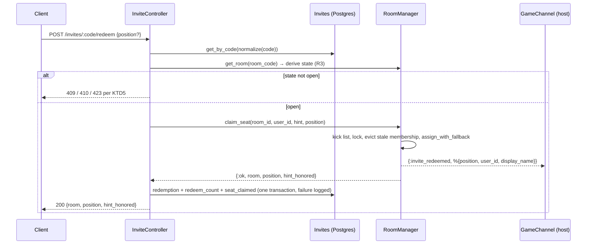
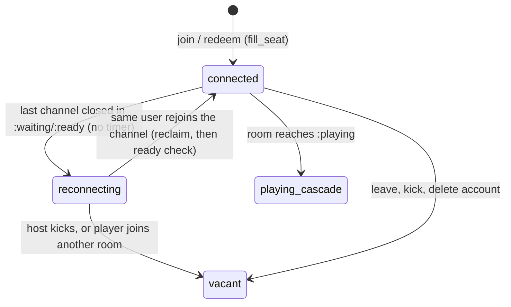
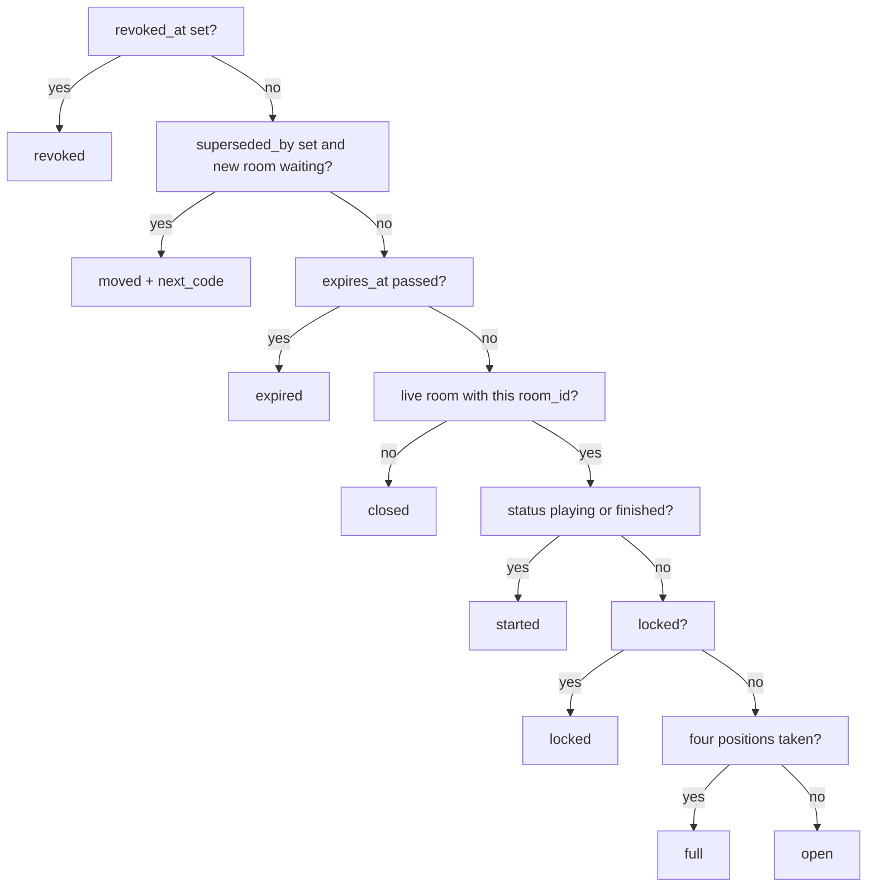
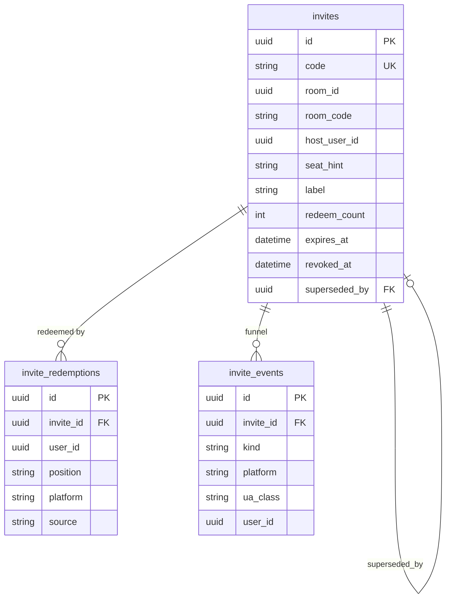
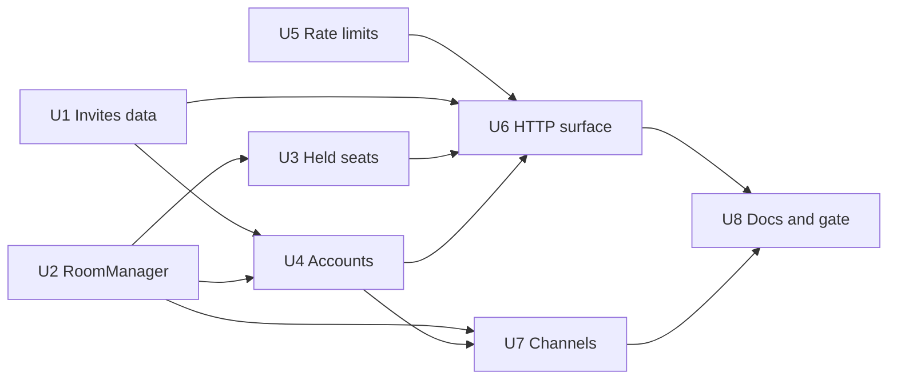

# Invites and Guest Accounts (Phase 1) - Plan

## Goal Capsule

- **Objective:** a host hands one link to friends and watches them arrive at the table by name; a friend sits down as a guest without registering and keeps every game, rating and achievement when they register later; a host who leaves the app to paste the link comes back to the same table with the same friends and the game has not started without them.
- **Means:** durable `invites` rows separate from room codes, guest `users` rows upgraded in place, a held-seat rule for waiting rooms, and host seat controls in the RoomManager (KTD1–KTD15).
- **Authority:** this plan, then `apps/pidro_server/thoughts/AGENTS.md` (style, commit format, `mix precommit`), then the origin requirements doc. The origin's decisions D1–D4, D8, D9 and answered questions 1, 5, 7 govern; `session-settled:` entries are not re-litigated.
- **Execution profile:** one PR on `feat/invites-phase-1-invites-guests`, backend only, three new tables and one index, no backfill. Existing client contracts stay intact: every existing endpoint keeps its status codes, room JSON only gains fields, and the game channel only gains events. The visible changes for current clients are a rate limit on `POST /api/v1/rooms/:code/join` (R28) and its new lock and kick answers (R24), which appear only after a host uses those controls.
- **Stop conditions:** a settled decision proves infeasible (report, do not work around); `mix precommit` cannot be made green without weakening an assertion; a change would alter the status code of an existing endpoint or the reply shape of an existing channel join.
- **Tail ownership:** the calling pipeline owns review, PR, CI babysitting, and merge.

---

## Product Contract

### Summary

Add a `PidroServer.Invites` context with `invites`, `invite_redemptions` and `invite_events` tables, and the endpoints to mint, preview, redeem, revoke and regenerate invites.
Add guest accounts: `POST /api/v1/auth/guest` creates a real user row against a valid invite, `POST /api/v1/auth/upgrade` turns that row into a registered account in place, `DELETE /api/v1/auth/me` deletes an account and its personal data, and a reaper removes guests idle for 30 days.
Teach the RoomManager to claim a seat from an invite with a seat hint, to hold a disconnected seat in a waiting room instead of starting the game around it, and to let the host move, lock and kick.
Push `invite_redeemed` on the game channel so the host sees "Anna is joining" before her socket connects.

### Problem Frame

Today a friend can only join through the public lobby or by typing a 4-character room code that anyone can enumerate, and only after registering with a username and password.
A host who backgrounds the app to paste a link keeps a "connected" seat that counts toward auto-start, so the game can begin without them.
Phase 0 (PR #19) made the API safe for these features; this phase builds them on the server so the landing page (phase 2) and the app (phase 3) have something to call.

### Key Decisions

- KD1. **One invite link per table, with an optional seat hint.** (session-settled: user-approved — chosen over one link per seat: per-seat links create dead seats and "which link went to whom"; a group chat gets one link.) Governs R1, R5.
- KD2. **The invite code is an 8-character secret stored in its own table; the 4-character room code never appears in a link or a preview.** (session-settled: user-approved — chosen over putting the room code in the link: the room-code space is enumerable.) Governs R2, R4.
- KD3. **Invites are multi-use, bound to the table's life, capped at 24 hours, revocable by the host, and never reissued.** (session-settled: user-approved — chosen over single-use or recyclable codes: chat apps prefetch links, and recycled codes have been abused.) Governs R3, R6, R7, R8.
- KD4. **A guest is a real `users` row from the first tap and is upgraded in place; there is no merge tool in v1.** (session-settled: user-approved — chosen over an anonymous session merged into an account later: every stats table references bare UUIDs, so in-place upgrade carries all history with zero migration.) Governs R10, R13, R15.
- KD5. **Only the host mints invites.** (session-settled: user-directed — chosen over any seated player: user decision for v1; the API shape leaves the door open.) Governs R1.
- KD6. **Guest creation requires a valid invite and is rate-limited per address and per install.** (session-settled: user-approved — chosen over open guest creation: an account faucet without an invite gate.) Governs R10, R12.
- KD7. **A disconnected human seat in a waiting room is held: no bot, no auto-start count, the room outlives the host's absence while an invite is live, and the host reclaims the seat on reconnect.** (session-settled: user-directed — chosen over leaving the behaviour and telling hosts not to background the app: the host must be able to leave the app to paste the link.) Governs R18–R22.
- KD8. **"Play again" mints a new invite that supersedes the old one; the old code forwards to the new table while it is waiting. Regenerate revokes the old code and never forwards.** (session-settled: user-approved — chosen over reusing the old invite: codes are never reused, and a regenerated link exists to kill a leak.) Governs R3, R7.
- KD9. **Deleting an account removes the user row and personal rows; `game_stats` keeps the bare UUID, which then resolves to nobody.** (session-settled: user-approved — chosen over scrubbing `game_stats`: it stores no names and other players' records must stay intact.) Governs R15, R17.
- KD10. **Invited tables stay in the public lobby.** Chosen during review over hiding them while an invite is live: the seat-hint fallback (R5) and the host's move-seat control (R23) already cover a stranger taking the hinted seat, and "invite my partner, let the lobby fill the opponents" must keep working. Governs R24.
- KD11. **Display names are 2–20 graphemes for every account, replacing the phase-0 cap of 40.** Chosen during planning over guest-only limits: one rule for register, guest creation and upgrade. Governs R11.

### Requirements

**Invites**

- R1. `POST /api/v1/rooms/:code/invites` mints an invite for a room the caller hosts (KD5) while the room is `:waiting` or `:ready`, with optional `seat_hint` (`north|east|south|west|north_south|east_west|partner`), `label` (≤ 40 chars) and `supersedes` (an invite code the caller hosted), and returns `code`, `url`, `share_text`, `seat_hint`, `label`, `expires_at` and `state`. A second mint on the same room updates the active invite's `seat_hint` and `label` in place and returns it with the same code. The active lookup, lifetime-cap check, insert/update and optional supersession are serialized per room in one transaction. Mint on a room in any other status answers 409 `ROOM_NOT_WAITING`; more than 20 invites for one room answers 409 `INVITE_LIMIT`.
- R2. An invite code is 8 characters from the Crockford Base32 alphabet, drawn from `:crypto.strong_rand_bytes/1`, stored upper-cased and unique; lookups strip `-`, upcase, and map `I`/`L` to `1` and `O` to `0` before matching (KD2).
- R3. Invite state is derived at read time, in this order: `revoked` (`revoked_at` set), `moved` (`superseded_by` set, not revoked, and the new invite's room is waiting), `expired` (`expires_at` passed), `closed` (no live room with the invite's `room_id`), `started` (room status `:playing` or `:finished`), `locked` (room locked), `full` (four positions taken), `open`. Nothing in the RoomManager writes invite rows when a room closes (KD3, KD8).
- R4. `GET /api/v1/invites/:code` is public and rate-limited and answers 200 with `code`, `state`, `host` (`display_name` or username), `seats_taken`, `seats_total`, `seat_hint`, `label`, `expires_at`, and `next_code` when `moved`. It never includes the room code (KD2). An unknown code answers 404.
- R5. `POST /api/v1/invites/:code/redeem` with optional `position`, `platform` and `source` claims a seat and answers 200 with `room`, `position` and `hint_honored` (KD1). Without `position` the server tries the seat hint and falls back to any open seat, reporting `hint_honored: false` on fallback and `true` when the hint was met or absent. With `position` a taken seat answers 409 `SEAT_TAKEN` with `next_open` (open positions in N/E/S/W order). A caller already seated at this table gets 200 with their current seat and no new redemption. Non-open states answer: `full` 409 `TABLE_FULL`; `locked` 423 `TABLE_LOCKED`; `started` 410 `TABLE_STARTED`; `closed` 410 `TABLE_CLOSED`; `expired` 410 `INVITE_EXPIRED`; `revoked` 410 `INVITE_REVOKED`; `moved` 410 `INVITE_MOVED` with `next_code`. A caller on the room's kick list answers 403 `KICKED`. A caller's held or bot-substituted seat in another room is evicted only after the target claim validates and can succeed; any target failure preserves the old seat. A caller connected elsewhere answers 422 `ALREADY_IN_ROOM` as today.
- R6. `DELETE /api/v1/invites/:code` sets `revoked_at` on an invite the caller hosts and answers 204; a revoked invite is never deleted (KD3).
- R7. `POST /api/v1/invites/:code/regenerate` serializes on the room, enforces the same 20-invite lifetime cap, then revokes the old invite, mints a new one with the same hint and label, sets `superseded_by` on the old row, and answers 201 with the new invite. A revoked-and-superseded invite reads `revoked`, never `moved` (KD8).
- R8. Every successful first-time redeem inserts one `invite_redemptions` row (`invite_id`, `user_id`, `position`, `platform`, `source`) and increments `redeem_count`; `invite_events` receives `created`, `revoked`, `seat_claimed`, `guest_created`, `guest_upgraded` and `game_completed` rows with `platform` and `ua_class` when known. `kind` is validated against the origin's kind list so later phases add kinds without a migration.
- R9. A successful seat claim pushes `invite_redeemed` with `position`, `user_id` and `display_name` to every socket on `game:<room_code>`.

**Guests and accounts**

- R10. `POST /api/v1/auth/guest` with `display_name`, `invite_code`, optional `install_id` (≤ 64 chars) and `platform` (`ios|android|web`) creates a `guest: true` user with a generated username when the invite is neither `revoked` nor `expired` (KD6), and answers 201 with `user`, `token` and the invite `state`; `revoked` and `expired` answer 410 as in R5. `install_id` is never written to request logs.
- R11. A display name is NFKC-normalized and trimmed, is 2–20 graphemes long, contains no control or format characters, and, for guest creation, does not match the normalized name of any player with a connected seat at the invite's table (casefolded, diacritics and non-alphanumerics removed); held seats are excluded so a guest who lost her session can return under her own name. Violations answer 422 with field `display_name` (KD11).
- R12. Guest creation is limited per client address and per `install_id`; a request without `install_id` skips the install bucket (KD6).
- R13. `POST /api/v1/auth/upgrade` with `email`, `password` and optional `username`, called with a guest token, sets `email`, `password_hash`, optional `username`, `guest: false` on the same row, increments `token_version`, and answers 200 with `user` and a new `token`. A non-guest caller answers 409 `NOT_A_GUEST`; an email in use (case-insensitive) answers 409 `EMAIL_TAKEN`; a username in use answers 409 `USERNAME_TAKEN`. Live sockets are not disconnected (KD4).
- R14. `POST /api/v1/auth/login` accepts an email address or a username as `username`.
- R15. `DELETE /api/v1/auth/me` atomically revokes invites the caller hosts, clears their labels and deletes the caller's `player_profiles`, `player_achievements`, `invite_redemptions`, `invite_events` and `users` row in one database transaction. After commit it best-effort leaves the caller's in-memory room, recomputes affected invite windows, broadcasts the socket disconnect, and answers 204 (KD9). A persistent failure rolls back every persistent mutation; `game_stats` and `abandonment_events` rows are untouched.
- R16. `last_seen_at` is set at socket connect and at every token mint when it is nil or older than one hour.
- R17. A guest reaper runs on a configurable interval, deletes guests whose `last_seen_at` (or `inserted_at` when nil) is older than 30 days with the R15 recipe, is disabled in the test environment, and exposes a synchronous run for tests.

**Waiting room**

- R18. When a player's last game channel closes in a `:waiting` or `:ready` room, the seat becomes held: status `:reconnecting`, no phase timer, no bot; `player_reconnecting` is pushed as today and the seat status is visible in room JSON (KD7).
- R19. A room becomes `:ready` and starts only when four positions are taken and no human seat is held; the check runs on join and on reclaim (KD7).
- R20. A held seat is reclaimed through the existing reconnect path when the same user rejoins the game channel; the seat returns to `:connected` (KD7).
- R21. The abandoned-room sweep closes a waiting room only when no human seat is connected and it has been idle longer than `invited_waiting_ttl_ms` while an invite is live (`invite_live_until` in the future), or five minutes otherwise; mint and redeem count as activity (KD7).
- R22. A held seat is vacated when its player creates or joins another room; when the held seat is the host's, the room is closed instead (KD7).
- R23. The host of a `:waiting` room can move a seat (`POST /api/v1/rooms/:code/seat` with `position` and optional `user_id`; a seated non-host may move only themselves; the target must be vacant), lock or unlock the table (`POST /api/v1/rooms/:code/lock` with `locked`), and kick a seated non-host player (`POST /api/v1/rooms/:code/kick` with `position`). A kicked user's channel receives `kicked` and closes, the user is added to the room's kick list, and they cannot redeem or join that room again. Each answers 200 with the room; outside `:waiting` they answer 409 `ROOM_NOT_WAITING`; a non-host answers 403. The kick list is per account: a stranger who holds the link can return as a new guest, which the host answers with regenerate (R7).
- R24. Rooms with a live invite stay in `GET /api/v1/rooms`, the lobby channel's room list and `list_lobby` categories (KD10). `POST /api/v1/rooms/:code/join` on a locked room answers 423 `TABLE_LOCKED`; a kicked user answers 403 `KICKED`.
- R25. Room JSON gains `locked`; each seat gains `display_name` (nil when the id resolves to nobody) in REST and lobby serializers.

**Configuration, docs and limits**

- R26. Invite `url` is `<link_base_url>/<code>` with `link_base_url` configurable and overridable by environment; `share_text` is the origin's English template with the dashed code.
- R27. OpenAPI operations and schemas exist for every new endpoint; `thoughts/API_DOCUMENTATION.md`, `thoughts/WEBSOCKET_API.md`, `thoughts/PUBSUB_INVENTORY.md`, `thoughts/DEPLOYMENT.md` and `docs/deployment/kamal_hetzner.md` describe the new endpoints, events, rate-limit policies and environment variables.
- R28. `POST /api/v1/rooms/:code/join` carries a per-user rate-limit policy.

### Scope Boundaries

- The HTML landing page `GET /j/:code`, Open Graph output and crawler handling (phase 2).
- Deferred-install matching, `POST /api/v1/invites/deferred` and Play Install Referrer (phase 4).
- All mobile and web client work, and changes to `pidro-site2`.
- `max_uses`: the origin lists the column; v1 has no API to set it and no enforcement, so the column is not created.

#### Deferred to Follow-Up Work

- `POST /api/v1/auth/logout` that bumps `token_version` (phase-0 deferral).
- A profanity list for display names.
- Redeeming into a `:playing` room with an owner-opened vacant seat (today's substitute path); v1 answers 410 `TABLE_STARTED`.
- Case-insensitive unique indexes on `users.email` and `users.username` (a data migration; v1 pre-checks email case-insensitively and username with an exact match, per KTD7).
- Recording `expired` and `closed` funnel events lazily from previews.
- Deleting `abandonment_events` rows on account deletion.
- Lobby visibility controls for invited tables, together with the lobby-category work (PID-32/36).
- Scoping the held-seat rule to rooms with a live invite, if public lobby tables suffer from stuck-until-kick.
- Requiring the password on `DELETE /auth/me` for registered accounts (defense in depth; guests have no password).
- Enforcing the look-alike name rule at seat claim as well as at guest creation.

### Acceptance Examples

- AE1. **Mint and share.** Given Marcel hosts waiting room `K7QP`, when he mints with `seat_hint: "partner"` and `label: "Anna"`, then the response carries an 8-character code, `url` ending in that code, `share_text` containing the dashed code, `expires_at` 24 hours ahead, `state: "open"`, and a second mint returns the same code. Covers R1, R2, R26.
- AE2. **Guest joins on the hinted seat.** Given AE1 and Marcel seated north, when Anna creates a guest with the code and redeems without `position`, then she is seated south with `hint_honored: true`, a redemption row and `guest_created` plus `seat_claimed` events exist, and Marcel's socket receives `invite_redeemed` with `display_name: "Anna"`. Covers R5, R8, R9, R10.
- AE3. **Hint already taken.** Given AE2, when Ben redeems the same invite without `position`, then he is seated on an open seat with `hint_honored: false`. Covers R5.
- AE4. **Explicit seat taken.** Given AE2, when Ben redeems with `position: "south"`, then the answer is 409 `SEAT_TAKEN` with `next_open: ["east", "west"]` and no seat changes. Covers R5.
- AE5. **Host away, table waits.** Given AE1 and Marcel's socket closed, when three players redeem, then the room stays `:waiting` with Marcel's seat `reconnecting`; when Marcel rejoins the channel, then his seat is `connected` and the game starts. Covers R18, R19, R20.
- AE6. **Host away, table survives.** Given AE5 before anyone joins and `invited_waiting_ttl_ms` not yet elapsed, when the abandoned sweep runs after five idle minutes, then the room still exists; after `invited_waiting_ttl_ms` with nobody connected it is closed and the preview reads `closed`. Covers R3, R21.
- AE7. **Regenerate kills a leak.** Given AE1, when Marcel regenerates, then the old code previews as `revoked` and redeeming it answers 410 `INVITE_REVOKED`, and the new code is `open`. Covers R6, R7.
- AE8. **Play again forwards.** Given a finished table and Marcel hosting a new waiting room, when he mints with `supersedes` set to the old code, then the old code previews as `moved` with `next_code`, and redeeming the old code answers 410 `INVITE_MOVED` with `next_code`. Covers R1, R3, R5.
- AE9. **Upgrade keeps everything.** Given guest Anna with one completed game, when she upgrades with an email and password, then her id, stats and profile rows are unchanged, `guest` is false, the old token answers 401 on the next request, the new token works, and her open socket stays connected. Covers R13.
- AE10. **Delete frees the seat.** Given guest Ben seated in a waiting room, when he deletes his account, then his seat is vacant, his profile rows are gone, `game_stats` still lists his id, and his socket is disconnected. Covers R15.
- AE11. **Kick sticks.** Given Ben seated in Marcel's waiting room, when Marcel kicks Ben's position, then Ben's channel receives `kicked` and closes, the seat is vacant, and Ben redeeming again answers 403 `KICKED`. Covers R23.
- AE12. **Locked table.** Given Marcel locks the table, when Chris redeems or joins by room code, then the answer is 423 `TABLE_LOCKED` and the preview reads `locked`; when Marcel unlocks, Chris can join. Covers R23, R24.
- AE13. **Look-alike name.** Given Marcel's display name "Marcel", when a guest is created for his table with `display_name: "marcél"`, then the answer is 422 on `display_name`. Covers R11.
- AE14. **Reaper.** Given a guest with `last_seen_at` 31 days ago and a registered user idle for a year, when the reaper runs once, then only the guest is deleted with the R15 recipe. Covers R17.
- AE15. **Returning guest.** Given guest Anna whose seat is held after a lost session, when she creates a new guest with `display_name: "Anna"` and redeems the same invite, then creation succeeds and she is seated on another open seat; her old seat stays held until the host kicks it. Covers R11, R18, R23.

### Sources

- Origin: `docs/brainstorms/2026-09-02-invite-links-and-guest-play-requirements.md` (Decisions D1–D9, User flows, Data model, API surface, Abuse/privacy/compliance, answered questions 1, 5, 7).
- Research: `docs/research/2026-09-02-invite-links-deep-linking-guest-play-landscape.md` sections 6 and 7 (invite-token design, guest identity and abuse).
- Phase 0: `docs/plans/2026-09-02-1240-feat-invite-prereqs-plan.md` (deferrals handed to this phase; room codes are unique among live rooms only).
- Code: `apps/pidro_server/lib/pidro_server/games/room_manager.ex` (`disconnect_player/4`, `maybe_set_ready/1`, `is_abandoned?/3`, `maybe_evict_disconnected_player/2`, `:join_as_substitute`, `maybe_force_disconnect/4`), `games/room/positions.ex`, `games/room/seat.ex`, `pidro_server_web/channels/game_channel.ex` (`terminate/2`, `is_reconnection?/2`, `format_reason/1`), `controllers/api/fallback_controller.ex`, `accounts/auth.ex` (`reset_user_password/2`, `bump_token_version/1`, `delete_user/1`), `plugs/rate_limit.ex`, `config/runtime.exs` rate-limit override table.

---

## Planning Contract

### Key Technical Decisions

- KTD1. **Invites live in Postgres and bind to a stable `Room.id`, and their state is derived at read time.** `Room` gains an `id` (UUID assigned at creation) and `invites` stores `room_id` next to `room_code`; the RoomManager answers `:room_not_found` when the code's live room has a different id, so a reused 4-character code cannot seat a stranger. `PidroServer.Invites.state/2` computes R3 from the row plus one `RoomManager.get_room/1` read; no GenServer callback writes invite rows. Chosen over hooking `remove_room/2`: rooms die on deploy without callbacks, and the RoomManager must never block on Postgres. Instantiates KD3, KD8; governs R3, R4, R5.
- KTD2. **`PidroServer.Invites.Codes` is a pure module: 32-symbol Crockford alphabet, 8 symbols from 8 random bytes (no rejection needed), `normalize/1` for lookups, and the `RoomCodes.generate_unique/3` retry idiom against a `taken?` function; the insert retries once on the unique-constraint error.** Guest usernames use the same module: `guest_` plus 8 symbols, retried on the unique constraint. Endpoint mint and regeneration mutations take deterministic per-room Postgres advisory transaction locks, so active-link selection, the lifetime cap and supersession cannot race. Governs R1, R2, R7, R10.
- KTD3. **Redeem is validate → claim → record, and the seat wins over the ledger.** The controller derives the state (R3), then makes one `RoomManager.claim_seat/4` call carrying `{room_id, user_id, hint, explicit_position}`; the GenServer checks lock/kick state, resolves `partner`, validates the target assignment, only then evicts a held seat elsewhere, fills the target seat and broadcasts `invite_redeemed`. Thus a failed target claim preserves an old held seat. The controller then inserts the redemption, increments `redeem_count` and writes `seat_claimed` in one transaction. A failed ledger write is logged and does not unseat the player, mirroring `persist_completed_game/5`. Chosen over recording first: an inflated count is worse than a missing funnel row. Governs R5, R8, R9.
- KTD4. **Held seats reuse `:reconnecting` without a timer.** (session-settled: user-directed — chosen over leaving waiting-room disconnects untouched: the host must be able to leave the app.) `disconnect_player/4` gains a `:waiting`/`:ready` branch that calls `Seat.disconnect/1` and pushes `player_reconnecting` but schedules no `{:phase2_start, …}`; `maybe_set_ready/1` requires four positions and no human seat with status other than `:connected`; the `:reconnecting` branch of `handle_seat_reconnection/6` re-runs the ready check and starts the game when it passes; `is_abandoned?/3` uses a new `Lifecycle` key `invited_waiting_ttl_ms` (default two hours, `LIFECYCLE_INVITED_WAITING_TTL_MS` override, 500 ms in test) while `room.invite_live_until` is in the future; `maybe_evict_disconnected_player/2` vacates the position in non-playing rooms and closes the room when the held seat is the host's. A held seat has no expiry; the host's kick (R23) is the designed exit for a player who never returns. Bot substitution and the phase timers remain `:playing`-only. Instantiates KD7; governs R18–R22.
- KTD5. **New error atoms and one tuple map to new status codes in `FallbackController`, placed above the atom catch-all.** `{:error, {:seat_taken, next_open}}` → 409 `SEAT_TAKEN` with `next_open`; `:table_full`, `:room_not_waiting`, `:invite_limit`, `:not_a_guest`, `:email_taken`, `:username_taken` → 409; `:table_started`, `:table_closed`, `:invite_expired`, `:invite_revoked`, `{:invite_moved, next_code}` → 410; `:table_locked` → 423; `:kicked` → 403. `POST /rooms/:code/join` keeps returning the bare `:seat_taken` atom so its 422 contract is unchanged. Governs R5, R10, R13, R23, R24.
- KTD6. **One display-name rule lives in `User`.** `validate_display_name/1` becomes: NFKC normalize, trim, reject control and format characters, 2–20 graphemes; `User.name_key/1` produces the look-alike key (NFKD, strip combining marks, casefold, keep alphanumerics; when nothing remains, the NFKC-casefolded name). `Auth.create_guest_user/2` takes the taken name keys of the invite's connected players (seats with status `:connected`, resolved through `Auth.get_users_map/1`) and rejects a match with a `display_name` changeset error. The phase-0 tests asserting a 40-character cap change to 20. Instantiates KD11; governs R11.
- KTD7. **Upgrade runs `User.upgrade_changeset/2` and `increment_token_version/2` in one `Repo.transaction/1`, mints the token from the returned row, and does not broadcast a disconnect.** (session-settled: user-approved — chosen over a sessions table now: smallest change that revokes old tokens.) Uniqueness is pre-checked with `lower(email)` and exact username, then the unique-constraint errors are mapped to the same atoms so a race still answers 409. Governs R13.
- KTD8. **`Auth.delete_user/1` becomes the single deletion recipe, shared by `DELETE /auth/me`, the reaper and the admin LiveViews:** one database transaction runs `Invites.revoke_hosted/1` (which also nulls `label`, the only personal data an invite tombstone carries), deletes `player_profiles`, `player_achievements`, `invite_redemptions`, `invite_events` and the user, then post-commit cleanup calls `RoomManager.leave_room/1`, recomputes invite windows and broadcasts disconnect. This ordering keeps the account recoverable if persistent deletion fails; post-commit in-memory failures are logged. `PidroServer.Accounts.GuestReaper` is a self-scheduling GenServer (`enabled`, `interval_ms`, `max_idle_days` under `config :pidro_server, PidroServer.Accounts.GuestReaper`), started after the Repo, not scheduled when disabled, with `run_once/1`. Instantiates KD9; governs R15, R17.
- KTD9. **Rate-limit policies:** `invite_mint` 10/min per user, `invite_preview` 60/min per IP, `invite_redeem` 10/min per user, `guest_create` 10/hour per IP, `guest_create_daily` 40/day per IP, `guest_create_install` 3/hour per `install_id`, `room_join` 30/min per user, `auth_upgrade` 10 per 10 minutes per IP (the same size as `register`, so upgrade is not an email-existence oracle). `Plugs.RateLimit` gains the `:install_id` key kind (hashed like `:identifier`, skipped when the param is absent or longer than 64 characters). Each policy is declared in `config/config.exs`, `config/dev.exs` (10×), `config/test.exs` (1,000,000) and the `config/runtime.exs` override table. Chosen over the origin's 5/hour: a QR party behind one NAT is the designed case. Governs R12, R28.
- KTD10. **Room-level events stay on the RoomManager PubSub tuple pattern.** `{:invite_redeemed, %{position, user_id, display_name}}` and `{:kicked, %{position, user_id}}` are broadcast on `game:<code>`; `GameChannel` gains matching `handle_info/2` clauses next to `:substitute_joined`, and a kicked player's channel pushes `kicked` then stops with `{:shutdown, :kicked}` after clearing `room_code`, so `terminate/2` does not re-hold the seat. `format_reason/1` maps `{:shutdown, :kicked}` to `"kicked"`. Chosen over `Endpoint.broadcast/3`: it keeps ordering with the room updates and the existing catch-all-free channel contract. Governs R9, R23.
- KTD11. **Host controls are RoomManager calls guarded by `ensure_owner/2` and a new `ensure_waiting/1`:** `move_seat/4` (target vacant; non-host may only move self; broadcasts `{:seat_moved, %{user_id, from, to}}` on `game:<code>` so the moved player's channel updates its position assign and re-tracks presence), `set_locked/3`, `kick_player/3` (position holds a non-host human; adds the id to `Room.kicked_ids`; sends `{:force_disconnect, :kicked}` to the player's channel pids; broadcasts `{:kicked, …}` for the other sockets; vacates the position). `ensure_room_joinable/1` gains lock and kick-list checks used by both `join_room` and `claim_seat`; a new `ensure_not_kicked/2` is also called from `:join_as_substitute`. Instantiates R23, R24.
- KTD12. **Room struct additions:** `id`, `locked` (default false), `kicked_ids` (default `[]`), `invite_live_until` (nil; set by `RoomManager.note_invite/2` to the latest `expires_at` of the room's active invites, or nil when none remain). It drives only the sweep (R21); lobby visibility is unchanged (KD10). The controller recomputes it from `Invites.active_for_room/1` after every mint, revoke and regenerate, and account deletion recomputes it for the rooms the deleted user hosted. The origin's `settings.private` does not exist in the code base and `Room.invite_ids` is replaced by `invite_live_until` plus queries by `room_id`. Instantiates KD10; governs R21, R25.
- KTD13. **Link building is configuration:** `config :pidro_server, PidroServer.Invites, link_base_url: "https://pidro.online/j"`, overridden by `INVITE_LINK_BASE_URL` in `config/runtime.exs`; `Invites.share_text/1` renders the origin template. Governs R26.
- KTD14. **Login accepts an email as the identifier:** an identifier containing `@` is looked up by `lower(email)` only, any other identifier by exact username only, with the same constant-time failure path. Governs R14.
- KTD15. **`last_seen_at` is written by `Auth.touch_last_seen/1`:** an `update_all` guarded by `last_seen_at IS NULL OR last_seen_at < now() - 1 hour`, called from `UserSocket.authenticate/2` and from every token mint. Chosen over touching in `Authenticate`: one write per user-hour instead of one per request. Governs R16.
- KTD16. **iOS and Android have priority; web play is deferred.** (session-settled: user-directed — chosen over building web join now: user priority.) No web-specific behaviour is planned in this phase.
- KTD17. **OpenAPI:** a new `schemas/invite_schemas.ex` follows `room_schemas.ex`; `InviteController` and the new `AuthController` actions use the `operation/2` macro style; the new `RoomController` actions use that file's manual `open_api_operation/1` style. A test asserts `PidroServerWeb.ApiSpec.spec/0` builds without warnings. Governs R27.

### High-Level Technical Design

Redeem, the only path that crosses the database, the GenServer and the channel:

Waiting-room seat states after this plan (the `:playing` cascade is unchanged):

Invite state derivation (R3), evaluated on every preview, redeem and guest creation:

Data model (no foreign keys to `users`, matching every existing table; `superseded_by` is a real self-reference):

### System-Wide Impact

- **Auth boundary:** guest tokens are ordinary tokens; every authenticated route accepts guests. Routes that must stay registered-only in later phases (none in v1) will need an explicit guard.
- **Room lifecycle:** waiting rooms with an away host now survive longer (R21); the disconnect cascade tests that pin today's waiting-room behaviour are rewritten in U3.
- **Held seats:** a held non-host seat is cleared only by the host's kick or by the player joining elsewhere, and public lobby tables inherit the rule: a stranger who backgrounds the app holds the table until kicked instead of being bot-substituted after the start. The phase-3 waiting room must offer remove on a held seat.
- **Existing clients:** `player_reconnecting` now arrives for waiting rooms; the web and mobile waiting rooms must render a `reconnecting` seat (phase 3 for mobile; the web client is deferred and may show it as connected).
- **Data:** the first tables that reference `users` by id in a personal-data sense (`invite_redemptions`, `invite_events`); deletion and the reaper own their cleanup (KTD8).
- **Operations:** eight new rate-limit policies with environment overrides; one new environment variable `INVITE_LINK_BASE_URL`; the reaper is a new supervised process with an `enabled` switch.
- **Dev tooling:** the admin LiveViews that call `Auth.delete_user/1` inherit the full deletion recipe.

### Risks and Rollback

- **Waiting-room semantics regress an existing client flow.** Mitigation: U3 keeps the REST-join-then-socket order starting the game, adds tests for every state transition in the diagram, and the frontend end-to-end job runs against the dev server before merge (calling pipeline). Rollback: revert the PR; the migration is additive and can stay.
- **`Room.id` mismatch after a deploy.** All invites minted before the deploy read `closed` after it because rooms are memory-only; this is the documented behaviour, not a regression.
- **Redeem partial failure.** A seat without a ledger row (KTD3) undercounts the funnel; logged at error level so it is visible.
- **Reaper deletes an active guest.** Impossible by construction: a connected guest was touched within the hour (KTD15); the reaper threshold is 30 days.
- **Rate limits on guest creation block a party.** Sizes in KTD9 are 2× the origin's; operators can raise any policy with `RATE_LIMIT_<POLICY>_LIMIT` without a deploy.
- **Dialyzer line pins.** New lines in `game_channel.ex`, `profiles.ex` and `stats.ex` shift pinned warnings; U8 regenerates `dialyzer.ignore-warnings` with zero unused filters.

### Assumptions

- Invited tables stay in the public lobby (KD10); a lobby stranger who takes the hinted seat is handled by the R5 fallback and the host's move-seat control.
- `invited_waiting_ttl_ms` defaults to two hours: long enough for a group chat to answer, bounded so abandoned invited tables do not accumulate; the invite's 24-hour expiry is the ceiling.
- Display names are 2–20 graphemes for every account (KD11); no rows carry a longer name yet because the column shipped unreleased in phase 0.
- Login accepts an email as the identifier (KTD14) so an upgraded guest can sign in on a second device without knowing the generated username.
- Upgrade does not disconnect live sockets (KTD7); the old token fails at the next REST call or socket connect.
- Kicked users are deny-listed for that room for the room's life (R23); the host regenerates the invite only when a link has leaked.
- The redeem lock and kick checks also apply to `POST /rooms/:code/join` (R24), which stays otherwise unchanged.
- Rate-limit sizes in KTD9 are defaults; the origin's tighter numbers were sized for a single household.
- `max_uses` is not built (Scope Boundaries).
- Deleting an account keeps `abandonment_events` rows (bare string ids, no names).
- `game_completed` events are written from `persist_completed_game/5` inside its existing rescue, for every redemption of the room's invites.
- `platform` for redemption rows comes from the request body (`platform`) and falls back to `unknown`; `ua_class` is `app` for the API in this phase.

### Sequencing

U1, U2 and U5 have no dependencies and can run in parallel. U3 follows U2. U4 follows U1 and U2. U6 follows U1–U5. U7 follows U2 and U4. U8 is last.

---

## Implementation Units

### U1. Invites data layer: tables, schemas, codes and state

- **Goal:** the `PidroServer.Invites` context can mint, look up, revoke, regenerate, record redemptions and events, and derive invite state from a room lookup.
- **Requirements:** R1 (mint rules), R2, R3, R6, R7, R8, R26 (KTD1, KTD2, KTD13).
- **Dependencies:** none.
- **Files:** `apps/pidro_server/priv/repo/migrations/<timestamp>_create_invites.exs` (create; three tables), `apps/pidro_server/priv/repo/migrations/<timestamp>_add_guest_reaper_index_to_users.exs` (create; partial expression index on `COALESCE(last_seen_at, inserted_at), id` where `guest`), `apps/pidro_server/priv/repo/migrations/<timestamp>_add_lower_email_index_to_users.exs` (create), `apps/pidro_server/lib/pidro_server/invites/invite.ex`, `invites/redemption.ex`, `invites/event.ex`, `invites/codes.ex`, `apps/pidro_server/lib/pidro_server/invites.ex` (create), `config/config.exs`, `config/dev.exs`, `config/test.exs`, `config/runtime.exs` (`link_base_url`), tests: `apps/pidro_server/test/pidro_server/invites/codes_test.exs`, `test/pidro_server/invites_test.exs` (create).
- **Approach:**
  1. Migration: `invites` (binary id pk; `code` string unique; `room_id` uuid; `room_code` string; `host_user_id` uuid indexed; `seat_hint`, `label`; `redeem_count` default 0; `expires_at`, `revoked_at` utc_datetime_usec; `superseded_by` references `invites`; `timestamps(type: :utc_datetime_usec)`), `invite_redemptions` (`invite_id` references `invites` on delete cascade, `user_id` uuid indexed, `position`, `platform`, `source`, insert-only timestamps), `invite_events` (`invite_id`, `kind`, `platform`, `ua_class`, `user_id` nullable indexed, insert-only timestamps). No foreign keys to `users`, matching `20260607020000_create_player_achievements.exs`.
  2. Schemas with `@primary_key {:id, :binary_id, autogenerate: true}` and `@foreign_key_type :binary_id`; `Event.kinds/0` returns the origin's kind list and `changeset/2` validates inclusion; `Invite.changeset/2` casts `seat_hint` against the seven allowed values and `label` ≤ 40; `Redemption.changeset/2` and `Event.changeset/2` coerce `platform` outside `ios|android|web` and `source` outside `wa|im|sms|qr|copy` to `unknown`.
  3. `Codes`: alphabet, `generate/0`, `normalize/1` (R2 mapping; returns `:error` for anything that is not 8 valid symbols after normalization), `valid?/1`; doctests for normalization.
  4. Context: `create_invite/2` (low-level insert, retries once on the code unique constraint), `mint_for_room/3` (per-room locked active lookup, cap, create/update and optional supersession), `get_by_code/1` (normalizes first), `active_for_room/1` (newest non-revoked, non-expired invite for a `room_id`), `revoke/1`, `regenerate/2` (per-room locked cap check + revoke + new row + `superseded_by` in one transaction), `supersede/2` for play again, `record_redemption/2` and `record_event/2`, `revoke_hosted/1` (revokes all active invites of a user and nulls `label` on every invite the user hosted), `update_hint/2` (second mint), `record_upgrade/1`, `count_for_room/1`, `redemption_user_ids/1`, `record_game_completed/1` (by `room_id`), `url/1`, `share_text/1`, and `state/2` taking the row and a `room_lookup` function so tests pass a stub instead of the RoomManager.
  5. `state/2` implements the R3 order exactly; `moved` requires the superseding invite's own state to be `open` or `full` (a waiting room).
- **Patterns to follow:** `room_codes.ex` (rejection sampling idiom and `generate_unique/3`), `profiles/achievement.ex` (schema shape), `20260902120000_add_guest_prereqs_to_users.exs` (partial index), `auth_controller.ex` `password_reset_url/1` (URL from config with env fallback).
- **Test scenarios:**
  - `Codes.generate/0` returns 8 symbols from the Crockford alphabet, never `I`, `L`, `O` or `U`; 10,000 draws produce no duplicate.
  - `Codes.normalize/1` maps `7kq4-m2xb` to `7KQ4M2XB`, `7KQ4-M2XI` to `7KQ4M2X1`, `oLQ4M2XB` to `01Q4M2XB`, and rejects 7 or 9 symbols and `U`.
  - Creating an invite with a hint of `partner` and label `Anna` stores upper-cased code, `expires_at` 24 hours ahead and `redeem_count` 0; a hint outside the allowed set is invalid.
  - With the generator forced to return a taken code once, `create_invite/2` retries and succeeds; forced twice, it returns the constraint error.
  - `get_by_code/1` finds `7KQ4M2XB` from `7kq4-m2xb`.
  - `state/2` returns each of the eight states given the matching row and stub room, in the R3 order: a revoked and expired row reads `revoked`; a superseded row whose new room is playing reads `expired` or `closed`, not `moved`.
  - `regenerate/2` revokes the old row, sets `superseded_by`, and the old row's state is `revoked` even though the new room is waiting (KD8); at 20 lifetime rows it rejects without revoking the old link.
  - `record_redemption/2` increments `redeem_count` and writes the row; `record_event/2` rejects an unknown kind.
  - `revoke_hosted/1` revokes only the user's active invites, nulls `label` on all the user's invites, and leaves other hosts' rows untouched.
  - `update_hint/2` changes `seat_hint` and `label` on an active invite without changing its code.
  - A redemption with `platform: "tv"` or `source: "x"` is stored as `unknown`; `ios` and `qr` are stored as given.
  - `url/1` uses the configured base; `share_text/1` contains the dashed code and the URL.
- **Verification:** `mix test test/pidro_server/invites` green; migration rolls back and forward; `Invites.state/2` is a pure function of its inputs.

### U2. RoomManager: room identity, invite seat claims and host controls

- **Goal:** the RoomManager can claim a seat from an invite with hint fallback, track lock, kick list and invite liveness, keep invited rooms visible in the lobby, and let the host move, lock and kick.
- **Requirements:** R5 (claim semantics), R9, R23, R24, R25 (`locked`) (KTD1, KTD3, KTD10, KTD11, KTD12).
- **Dependencies:** none.
- **Files:** `apps/pidro_server/lib/pidro_server/games/room_manager.ex`, `apps/pidro_server/lib/pidro_server/games/room/positions.ex`, `apps/pidro_server/lib/pidro_server/games/room/seat.ex` (serialize unchanged unless needed), tests: `apps/pidro_server/test/pidro_server/games/room/positions_test.exs`, `test/pidro_server/games/room_manager_test.exs`, `test/support/room_fixtures.ex` (create; builds a waiting room with N seated users through the public API).
- **Approach:**
  1. `Room` gains `id`, `locked`, `kicked_ids`, `invite_live_until` (KTD12); `:create_room` assigns `Ecto.UUID.generate()`.
  2. `Positions.assign_with_fallback/3` (pure): tries the hint (`{:seat, pos}` or `{:team, team}`), on `:seat_taken`/`:team_full` retries `:auto`, returns `{:ok, room, position, hint_honored}`; `assign/3` is untouched.
  3. `claim_seat/4` public API and `:claim_seat` callback, in this order: fetch by code; compare `room.id` with the given `room_id` (mismatch → `:room_not_found`); already seated at this table → `{:ok, room, position, true}` without changes (a held seat is left for the R20 channel reclaim); `ensure_room_joinable/1` (now also `:table_locked` and `:kicked`); resolve `partner` through `partner_position/1` on the host's current seat (`:room_not_found` when the host has no seat); validate `assign_with_fallback/3` or `assign/3` for an explicit position (a taken seat returns `{:error, {:seat_taken, Positions.available(room)}}`); only then `maybe_evict_disconnected_player/2` for a caller tracked in another room, `ensure_not_in_other_room/3`, `Seat.fill_seat/2`, ready check, `put_room_and_player/3`, broadcasts (`broadcast_room`, lobby, and `{:invite_redeemed, …}` carrying the `display_name` passed by the caller), then the existing auto-start.
  4. `note_invite/2` stores the given `invite_live_until` (a datetime or nil); `is_abandoned?/3` reads it in U3; lobby visibility is unchanged (KD10).
  5. Host controls (KTD11): `move_seat/4`, `set_locked/3`, `kick_player/3` with `ensure_owner/2` (self-move allowed for the seated user) and `ensure_waiting/1`; kick extracts the `true ->` branch of `:leave_room` into `remove_player/3`, appends to `kicked_ids`, and sends `{:force_disconnect, :kicked}` to the channel pids registered for `{room_code, user_id}` (mirroring `maybe_force_disconnect/4`); `join_room` and `claim_seat` refuse ids on `kicked_ids` and locked rooms.
  6. `Room` serialization: `locked` is added where the room is rendered (U6 wires the JSON).
- **Patterns to follow:** `:join_as_substitute` (broadcast tuple on `game:<code>`), `open_seat/3` (owner-guarded control), `maybe_force_disconnect/4` (channel pid delivery), AGENTS.md thin-GenServer rule (validation in `Positions`).
- **Test scenarios:**
  - `assign_with_fallback/3` honours a free hinted seat (`hint_honored: true`), falls back to the first open seat when the hinted seat is taken (`false`), falls back when the hinted team is full, and returns `:room_full` when no seat is open.
  - `claim_seat/4` with the correct `room_id` seats the user and returns the position; with a stale `room_id` for a reused code it returns `:room_not_found`.
  - `partner` resolves to the seat opposite the host after the host has moved to `east`.
  - Two sequential claims with the same hint: the second gets `hint_honored: false`; an explicit taken position returns `{:error, {:seat_taken, next_open}}` with `next_open` in N/E/S/W order.
  - A claim by a user already seated at the table returns the current seat with `hint_honored: true` and changes nothing.
  - A claim by a user held in another waiting room evicts that seat first and succeeds; a user connected in another room gets `:already_in_room`.
  - A locked/taken target join or claim by a user held elsewhere fails without evicting the old held seat.
  - The fourth claim starts the game when every human seat is connected (unchanged behaviour).
  - Every successful claim broadcasts `{:invite_redeemed, %{position, user_id, display_name}}` on `game:<code>`.
  - `note_invite/2` stores the given value, including nil, and a room with a live invite is still returned by `visible_in_lobby?/1` and `list_lobby/1`.
  - `set_locked/3` by the host flips `locked`; a locked room refuses `join_room` and `claim_seat` with `:table_locked` but still accepts a reclaim; a non-host gets `:not_owner`.
  - `kick_player/3` vacates the seat, adds the id to `kicked_ids`, delivers `{:force_disconnect, :kicked}` to a registered channel pid, broadcasts `{:kicked, …}` on `game:<code>`, and the kicked id is refused with `:kicked` on join, claim and the substitute join of a later `:playing` room; kicking the host's own seat or in a `:playing` room fails.
  - `move_seat/4` broadcasts `{:seat_moved, %{user_id, from, to}}` on `game:<code>`.
  - `move_seat/4`: host moves another player to a vacant seat; a non-host moving someone else gets `:not_owner`; a non-host moves themselves; moving onto a taken or held seat fails with `:seat_taken`.
- **Verification:** RoomManager and Positions suites green; `room_fixtures.ex` is used by at least one test.

### U3. Held seats in waiting rooms

- **Goal:** a disconnected seat in a waiting room is held without a bot, never starts the game, is reclaimable, and the room survives the host's absence while an invite is live.
- **Requirements:** R18, R19, R20, R21, R22 (KTD4).
- **Dependencies:** U2.
- **Files:** `apps/pidro_server/lib/pidro_server/games/room_manager.ex` (`disconnect_player/4`, `maybe_set_ready/1`, `handle_seat_reconnection/6`, `is_abandoned?/3`, `maybe_evict_disconnected_player/2`, `:join_room`), `apps/pidro_server/lib/pidro_server/games/lifecycle.ex`, `config/config.exs`, `config/test.exs`, `config/runtime.exs`, tests: `apps/pidro_server/test/pidro_server/games/room_manager_test.exs`, `test/pidro_server/games/disconnect_cascade_test.exs`, `test/pidro_server/games/room_cleanup_test.exs`.
- **Approach:**
  1. `disconnect_player/4`: for `:waiting` and `:ready` rooms call `Seat.disconnect/1`, broadcast `{:player_reconnecting, …}`, do not schedule a phase timer; the `:playing` branch is unchanged.
  2. `maybe_set_ready/1`: four positions and every human seat `:connected`; extract `held_seat?/1` so `dev_maybe_set_ready/1` uses the same predicate.
  3. In the `:reconnecting` branch of `handle_seat_reconnection/6`, after reclaim, run the ready check and `start_game_for_room/2` when the room becomes `:ready`; the callback returns the updated state.
  4. `is_abandoned?/3`: idle threshold is `Lifecycle.config(:invited_waiting_ttl_ms)` when `invite_live_until` is in the future, else the current five minutes; add the key to `lifecycle.ex`, `config/config.exs`, `config/test.exs` (500 ms) and the `LIFECYCLE_*` table in `config/runtime.exs`; `note_invite/2` and `claim_seat/4` touch `last_activity`.
  5. `maybe_evict_disconnected_player/2`: for non-playing rooms, when the held seat belongs to `room.host_id`, close the room with the existing host-leave rule (`remove_room/2`, so the invite derives `closed`); otherwise remove the position, vacate the seat, broadcast the room update, and close the room when it becomes empty. `handle_call({:join_room, …})` calls it before `ensure_not_in_other_room/3`, mirroring `:create_room`.
  6. Rewrite the tests that assert `{:error, :player_not_disconnected}` after a waiting-room disconnect and the cascade test that asserts seats stay `:connected`.
- **Execution note:** start with a failing test for AE5 (fourth player joins while the host is held; the room stays `:waiting`).
- **Patterns to follow:** the `:playing` cascade branch for broadcasts; `set_last_activity_for_test/2` and `config/test.exs` lifecycle values for sweep tests; `room_cleanup_test.exs` for the sweep harness.
- **Test scenarios:**
  - A waiting-room disconnect sets the seat to `:reconnecting` with `disconnected_at`, schedules no timer, and pushes `player_reconnecting`; after `hiccup_timeout_ms` the seat is still `:reconnecting` and no bot exists. Covers AE5.
  - With the host held, three joins fill the table and the room stays `:waiting`; the host's reconnect reclaims the seat and the game starts. Covers AE5.
  - A reconnect while the room is not full reclaims the seat and does not start the game.
  - A disconnect in a `:playing` room still runs the hiccup → bot cascade (existing tests).
  - Sweep: an idle waiting room with a held host and `invite_live_until` in the future survives the five-minute check and is closed after `invited_waiting_ttl_ms` (test config 500 ms); without a live invite it is closed after five minutes; a room with one connected human is never closed by the sweep. Covers AE6.
  - A held host who creates another room closes the old room; its invite then previews as `closed`.
  - A held player who joins room B by code has their seat in room A vacated (A closes if empty) and is seated in B.
  - A held player who creates another room is removed from the old room's position; the old room closes when it becomes empty.
  - `handle_player_reconnect/2` for a user whose seat is `:connected` still returns `:player_not_disconnected`.
- **Verification:** RoomManager, cascade and cleanup suites green; the game channel suite still passes its reconnection cases.

### U4. Accounts: display names, guests, upgrade, deletion, last seen and the reaper

- **Goal:** the Accounts context can create a guest against a set of taken names, upgrade a guest in place, delete a user with all personal rows, touch `last_seen_at`, accept email at login, and reap idle guests.
- **Requirements:** R10 (creation rules), R11, R13, R14, R15, R16, R17 (KTD2, KTD6, KTD7, KTD8, KTD14, KTD15).
- **Dependencies:** U1 (`Invites.revoke_hosted/1`), U2 (`RoomManager.leave_room/1` behaviour unchanged).
- **Files:** `apps/pidro_server/lib/pidro_server/accounts/user.ex`, `apps/pidro_server/lib/pidro_server/accounts/auth.ex`, `apps/pidro_server/lib/pidro_server/accounts/guest_reaper.ex` (create), `apps/pidro_server/lib/pidro_server/application.ex`, `config/config.exs`, `config/test.exs`, `config/runtime.exs` (reaper env), tests: `apps/pidro_server/test/pidro_server/accounts/user_test.exs`, `test/pidro_server/accounts/auth_test.exs`, `test/pidro_server/accounts/guest_reaper_test.exs` (create), `test/support/fixtures.ex` (`guest_fixture/1`).
- **Approach:**
  1. `User`: `validate_display_name/1` per KTD6; `name_key/1`; `guest_changeset/2` also casts `install_id` (≤ 64) and `platform` is not stored; `upgrade_changeset/2` casts `email`, `password`, optional `username`, requires email and password, applies the email format regex of `changeset/2`, the password minimum of 8 of `registration_changeset/2` and the username minimum of 3 when given, hashes, `put_change(:guest, false)`; phase-0 tests move from 40 to 20.
  2. `Auth.create_guest_user/2` takes attrs and `taken_name_keys`; generates `guest_<Codes.generate()>` and retries on the username constraint; adds the look-alike error.
  3. `Auth.upgrade_guest/2` per KTD7, returning `{:ok, user}` with the bumped version or `{:error, :not_a_guest | :email_taken | :username_taken | changeset}`.
  4. `Auth.delete_user/1` per KTD8; `Auth.touch_last_seen/1` per KTD15; `authenticate_user/2` resolves the identifier through `get_user_by_username_or_email/1`; token mints call `touch_last_seen/1`.
  5. `GuestReaper` GenServer: `init` schedules only when `enabled`; `handle_info(:reap)` passes the process's `max_idle_days` to `run_once/1` and reschedules; `run_once/1` selects guest ids by the R17 predicate in batches of 100 and calls `delete_user/1` for each, excluding failed ids for the rest of that sweep so later batches still drain. `interval_ms` and `max_idle_days` must be positive. Test config `enabled: false`; production default `enabled: true`, `interval_ms` one hour, `max_idle_days` 30.
- **Patterns to follow:** `reset_user_password/2` (transaction then broadcast), `RoomManager.schedule_cleanup/0` (self-scheduling), `Lifecycle` (config with defaults), `config/runtime.exs` boolean idiom.
- **Test scenarios:**
  - Display names: `"  Anna  "` stores `Anna`; a single grapheme and 21 graphemes are invalid; a name with a zero-width joiner or a control character is invalid; NFKC folds a full-width letter.
  - `name_key/1` maps `Marcél`, `MARCEL` and `m a r c e l` to the same key. Covers AE13.
  - `create_guest_user/2` creates a guest with a `guest_` username, `guest: true`, no email, no password hash, `install_id` stored; a display name matching a taken key is invalid on `display_name`; with the generator forced to collide once, creation retries.
  - `upgrade_guest/2` keeps the id, sets email, password hash, `guest: false`, increments `token_version` by exactly one, and the returned struct signs a token with the new version; a registered user gets `:not_a_guest`; an email differing only in case from an existing one gets `:email_taken`; a taken username gets `:username_taken`; no disconnect broadcast is received on `user_socket:<id>`. Covers AE9.
  - `delete_user/1` for a user seated in a waiting room vacates the seat, revokes their hosted invites and nulls their labels, deletes profile, achievements, redemption and event rows, keeps `game_stats` rows, and broadcasts `disconnect`; for a user in no room it succeeds. Covers AE10.
  - `touch_last_seen/1` writes when nil, skips when 10 minutes old, writes when 2 hours old.
  - Login with the email as identifier succeeds; login with an unknown email fails with `:invalid_credentials` and runs the dummy verify; a username shaped like another user's email does not shadow that user's email login.
  - `create_guest_user/2` ignores names on held seats (a returning guest keeps her name, AE15); two different emoji-only names are both accepted at one table.
  - `GuestReaper.run_once/1` deletes a guest 31 days idle (and one with nil `last_seen_at` inserted 31 days ago), keeps a guest 29 days idle and a registered user idle for a year, honors a cutoff override, and drains later batches around a failed id. Covers AE14.
  - The reaper does not schedule when disabled (no `:reap` message arrives).
- **Verification:** accounts suites green; `guest_fixture/1` exists; the dev LiveView user tests still pass with the new `delete_user/1`.

### U5. Rate-limit policies and the install-id key

- **Goal:** the eight new policies exist in every configuration layer, the plug can key on `install_id`, and `install_id` is filtered from request logs.
- **Requirements:** R12, R28 (KTD9).
- **Dependencies:** none.
- **Files:** `apps/pidro_server/lib/pidro_server_web/plugs/rate_limit.ex`, `config/config.exs`, `config/dev.exs`, `config/test.exs`, `config/runtime.exs`, tests: `apps/pidro_server/test/pidro_server_web/plugs/rate_limit_test.exs`.
- **Approach:**
  1. `bucket_key/3` for `:install_id`: read `conn.params["install_id"]`, skip when absent, blank or longer than 64 characters, else hash like `:identifier`.
  2. Add the policies with KTD9 values to `config.exs`, the 10× table in `dev.exs`, the 1,000,000 table in `test.exs`, and the `runtime.exs` override table.
  3. Add `config :phoenix, :filter_parameters, ["password", "install_id"]` to `config/config.exs` so `install_id` never reaches request logs.
- **Patterns to follow:** the `:identifier` clause and `hash_identifier/1`; the phase-0 policy tables.
- **Test scenarios:**
  - A route with an `:install_id` policy counts two requests with the same `install_id` from different addresses in one bucket and denies the third at limit 2.
  - A request without `install_id` is never limited by that policy; a 65-character `install_id` is skipped, not truncated.
  - Every policy named in `config.exs` is present in the runtime override table (a test iterates the table against the configured policies).
- **Verification:** plug suite green; `mix run --no-start -e` boot with `RATE_LIMIT_GUEST_CREATE_LIMIT=1` set does not raise.

### U6. HTTP surface: invite, room and auth endpoints, error mapping, JSON and OpenAPI

- **Goal:** every endpoint in R1–R7, R10, R13–R15, R23, R24 exists with the documented statuses, request and response schemas.
- **Requirements:** R1, R4, R5, R6, R7, R8 (controller side), R10, R12, R13, R14, R15, R23, R24, R25, R27, R28 (KTD3, KTD5, KTD17).
- **Dependencies:** U1, U2, U3, U4, U5.
- **Files:** `apps/pidro_server/lib/pidro_server_web/router.ex`, `apps/pidro_server/lib/pidro_server_web/controllers/api/invite_controller.ex` (create), `controllers/api/invite_json.ex` (create), `controllers/api/room_controller.ex`, `controllers/api/room_json.ex`, `controllers/api/auth_controller.ex`, `controllers/api/user_json.ex`, `controllers/api/fallback_controller.ex`, `apps/pidro_server/lib/pidro_server_web/schemas/invite_schemas.ex` (create), `schemas/room_schemas.ex`, `schemas/user_schemas.ex`, `schemas/error_schemas.ex`, `apps/pidro_server/lib/pidro_server_web/api_spec.ex`, tests: `apps/pidro_server/test/pidro_server_web/controllers/api/invite_controller_test.exs` (create), `test/pidro_server_web/controllers/api/room_controller_test.exs`, `test/pidro_server_web/controllers/api/auth_controller_test.exs`, `test/pidro_server_web/api_spec_test.exs` (create).
- **Approach:**
  1. Router: public `get /invites/:code` (`[:invite_preview]`) and `post /auth/guest` (`[:guest_create, :guest_create_daily, :guest_create_install]`); authenticated `post /rooms/:code/invites` (`[:invite_mint]`), `post /invites/:code/redeem` (`[:invite_redeem]`), `delete /invites/:code`, `post /invites/:code/regenerate` (`[:invite_mint]`), `post /rooms/:code/seat`, `post /rooms/:code/lock`, `post /rooms/:code/kick`, `post /auth/upgrade` (`[:auth_upgrade]`), `delete /auth/me`; `post /rooms/:code/join` gains `[:room_join]`.
  2. `InviteController`: `show` (preview; derives state; `InviteJSON.preview/1` never touches the room code), `redeem` (strict position parsing → 422 `INVALID_POSITION`; state check → KTD5 errors; `claim_seat/4` with the caller's display name; ledger writes; `platform`/`source` from the body), `delete`, `regenerate`; host checks compare `invite.host_user_id` with the current user.
  3. `RoomController`: `create_invite` (R1; `supersedes` validated as hosted by the caller; `Invites.supersede/2`; `RoomManager.note_invite/2` recomputed from `active_for_room/1` after every mint, revoke and regenerate; a second mint updates hint and label on the active invite; the 20-invite cap), `seat`, `lock`, `kick`; `join` passes through the new lock and kick errors.
  4. `AuthController`: `upgrade` records a `guest_upgraded` event through `Invites.record_upgrade/1` (the invite of the user's latest redemption, when one exists) after the transaction commits; `guest` (410 for `revoked` and `expired`, then `create_guest_user/2` with the taken name keys of the room's connected players; token mint; `guest_created` event; the invite `state` in the response), `upgrade`, `delete_me` (204), login identifier change in the operation description.
  5. `FallbackController`: the KTD5 clauses above the atom catch-all; `ErrorSchemas` gains `conflict_error/0`, `gone_error/0` and `locked_error/0`.
  6. JSON: `RoomJSON.room/2` adds `locked` and per-seat `display_name`; `UserJSON` unchanged; `InviteJSON` renders mint, preview and redeem shapes.
  7. OpenAPI per KTD17; `api_spec.ex` status list gains 409, 410, 423 and the rate-limit table gains the new policies; `api_spec_test.exs` asserts the spec builds and contains every new path.
- **Patterns to follow:** `auth_controller.ex` `operation/2` macros and `register/2`; `room_controller.ex` `parse_position_strict/1` and `open_api_operation(:join)`; `room_code_exhausted_error/0`; `RateLimitCase` for policy tests.
- **Test scenarios:**
  - Mint: host gets 201 with the R1 fields and a second mint with a new hint returns the same code carrying the new hint; a non-host gets 403; a `:playing` room gets 409 `ROOM_NOT_WAITING`; the 21st invite gets 409 `INVITE_LIMIT`; `supersedes` with a code the caller did not host gets 403. Covers AE1, AE8.
  - Preview: 200 for each of the eight states with the right `state` and no `room_code` key; `next_code` present only for `moved`; unknown code 404; the 61st preview from one address in a minute is 429.
  - Redeem: 200 with `hint_honored` true/false (AE2, AE3); explicit taken seat 409 `SEAT_TAKEN` with `next_open` (AE4); each non-open state maps to its status and code (AE7, AE8, AE12); kicked caller 403 (AE11); already seated caller 200 with the same seat and `redeem_count` unchanged; `position: "up"` is 422 `INVALID_POSITION`; a redemption row and `seat_claimed` event exist after success.
  - Revoke: host 204 and the invite reads `revoked`; non-host 403. Regenerate: 201 with a new code, old code `revoked`.
  - Guest: 201 with `user.guest == true`, a token that passes `GET /auth/me` and `state: "open"`; state `full` still creates the guest and returns `state: "full"`; a revoked invite answers 410 `INVITE_REVOKED`; a look-alike name answers 422 (AE13); a name held by a `:reconnecting` seat is accepted (AE15); the 11th creation from one address in an hour is 429; the 4th with one `install_id` is 429.
  - Upgrade: 200 with new token, old token 401 afterwards; registered caller 409 `NOT_A_GUEST`; taken email 409 `EMAIL_TAKEN`; taken username 409 `USERNAME_TAKEN`; a missing password, a 7-character password and a malformed email are 422; a `guest_upgraded` event exists on the redeemed invite afterwards; the 11th attempt from one address in ten minutes is 429. Covers AE9.
  - Delete me: 204, subsequent `GET /auth/me` 401, seat vacated. Covers AE10.
  - Login with email succeeds and returns a token.
  - Seat/lock/kick: host 200 with `locked` in the room JSON and seats carrying `display_name`; non-host 403; `:playing` room 409 `ROOM_NOT_WAITING`; join on a locked room 423; kicked user join 403. Covers AE11, AE12.
  - `POST /rooms/:code/join` is limited at policy `room_join` (replacing the phase-0 test that asserted it is never limited).
  - `GET /rooms` still lists a room with a live invite. Covers R24.
  - After a revoke that leaves no active invite, the room's `invite_live_until` is nil.
  - `ApiSpec.spec/0` builds with no `IO.warn` output and lists every new path.
- **Verification:** controller suites green; `/api/openapi` renders in dev; every new action has an operation.

### U7. Channels: invite and kick events, lobby names, socket touch

- **Goal:** the game channel pushes `invite_redeemed`, `player_kicked` and `seat_moved`, handles its own kick, the lobby shows display names, and socket connects touch `last_seen_at`.
- **Requirements:** R9, R16, R23 (channel side), R25 (lobby) (KTD10, KTD15).
- **Dependencies:** U2, U4.
- **Files:** `apps/pidro_server/lib/pidro_server_web/channels/game_channel.ex`, `channels/lobby_channel.ex`, `channels/user_socket.ex`, tests: `apps/pidro_server/test/pidro_server_web/channels/game_channel_test.exs`, `test/pidro_server_web/channels/lobby_channel_test.exs`, `test/pidro_server_web/channels/user_socket_test.exs`.
- **Approach:**
  1. `GameChannel`: `handle_info({:invite_redeemed, payload}, socket)` pushes `invite_redeemed`; `handle_info({:kicked, payload}, socket)` pushes `player_kicked`; `handle_info({:seat_moved, payload}, socket)` updates `socket.assigns.position` and re-tracks presence when `user_id` matches, then pushes `seat_moved`; `handle_info({:force_disconnect, :kicked}, socket)` pushes `kicked`, clears `room_code` and stops with `{:shutdown, :kicked}`; `format_reason/1` maps it to `"kicked"`; `terminate/2` skips the disconnect call when `room_code` is nil (already the case).
  2. `LobbyChannel.get_player_summary/2` adds `display_name`.
  3. `UserSocket.authenticate/2` calls `Auth.touch_last_seen/1` after a successful fetch.
- **Patterns to follow:** the `:substitute_joined` clause; `{:force_disconnect, :timeout_threshold}` handling; `WEBSOCKET_API.md` event blocks.
- **Test scenarios:**
  - A host socket on `game:<code>` receives `invite_redeemed` with `position`, `user_id` and `display_name` after a claim. Covers AE2.
  - A kicked player's socket receives `kicked` and the channel closes with reason `kicked`; the seat stays vacant afterwards (no re-hold); the other players' sockets receive `player_kicked` and no channel crashes. Covers AE11.
  - A moved player's socket receives `seat_moved`, and after the table starts their next game action is applied at the new position.
  - Lobby `rooms` payload seats carry `display_name`; a guest shows their display name, not the generated username.
  - A socket connect sets `last_seen_at` when nil and leaves a 10-minute-old value unchanged.
- **Verification:** channel suites green; no `FunctionClauseError` in channel logs during the suite.

### U8. Documentation, dialyzer pins and the quality gate

- **Goal:** the documentation and the gate reflect the new surface.
- **Requirements:** R27 (KTD9, KTD17).
- **Dependencies:** U6, U7.
- **Files:** `apps/pidro_server/thoughts/API_DOCUMENTATION.md`, `apps/pidro_server/thoughts/WEBSOCKET_API.md`, `apps/pidro_server/thoughts/PUBSUB_INVENTORY.md`, `apps/pidro_server/thoughts/DEPLOYMENT.md`, `docs/deployment/kamal_hetzner.md`, `dialyzer.ignore-warnings`, `ops/smoke-production` (comment only, if a new public route needs the never-limited note).
- **Approach:**
  1. API docs: an "Invites" endpoint category, guest/upgrade/delete/login-by-email under Authentication, 409/410/423 error blocks, the new policies in the rate-limit table, `INVITE_LINK_BASE_URL` and `GUEST_REAPER_*` variables.
  2. WebSocket docs: `invite_redeemed`, `kicked`, `player_reconnecting` in waiting rooms, `locked` and `display_name` in the room object; PubSub inventory rows for the two tuples.
  3. Deployment docs: the reaper switch and interval, the new variables.
  4. Regenerate `dialyzer.ignore-warnings` so every pin matches its new line and `list_unused_filters` reports none.
- **Patterns to follow:** phase-0 U7 doc list; the `substitute_joined` event block.
- **Test expectation:** none — documentation and pins; `mix precommit` is the check.
- **Verification:** `mix precommit` green at the repo root with zero unused dialyzer filters.

---

## Verification Contract

| Gate | Command | Applies to | Done signal |
|---|---|---|---|
| Full quality gate | `mix precommit` at the repo root | all units | exit 0 (hex.audit, format, warnings-as-errors, tests, credo diff, dialyzer) |
| Server tests only | `mix test` in `apps/pidro_server` | U1–U7 | 0 failures |
| Targeted suites | `mix test test/pidro_server/invites test/pidro_server/games test/pidro_server/accounts test/pidro_server_web` in `apps/pidro_server` | per unit | 0 failures |
| Migration round trip | `mix ecto.rollback --step 2` then `mix ecto.migrate` in `apps/pidro_server` | U1 | both succeed |
| OpenAPI | `test/pidro_server_web/api_spec_test.exs` | U6 | spec builds with no warnings |
| Boot with overrides | `RATE_LIMIT_GUEST_CREATE_LIMIT=1 GUEST_REAPER_ENABLED=false mix run --no-start -e ':ok'` | U4, U5 | no raise |
| Frontend end-to-end | calling pipeline's `ci-game-e2e` against the dev server | U3 | two full games complete |

---

## Definition of Done

- Every requirement R1–R28 has a passing test; every acceptance example AE1–AE14 is covered by at least one named test.
- Existing suites (accounts, auth, rooms, cascade, cleanup, channels, dev LiveViews, email migration) are green; tests rewritten in U3 assert the new held-seat semantics rather than being deleted.
- No existing endpoint changes its status code or removes a field; `POST /rooms/:code/join` still returns 422 `SEAT_TAKEN` on a taken seat.
- `mix precommit` is green; `dialyzer.ignore-warnings` has no unused filters; every new module has a `@moduledoc`.
- The reaper is disabled in `config/test.exs` and runs in production only when enabled.
- Docs listed in R27 are updated in the same PR; the OpenAPI spec lists every new path.
- No dead-end code from abandoned approaches remains in the diff.
