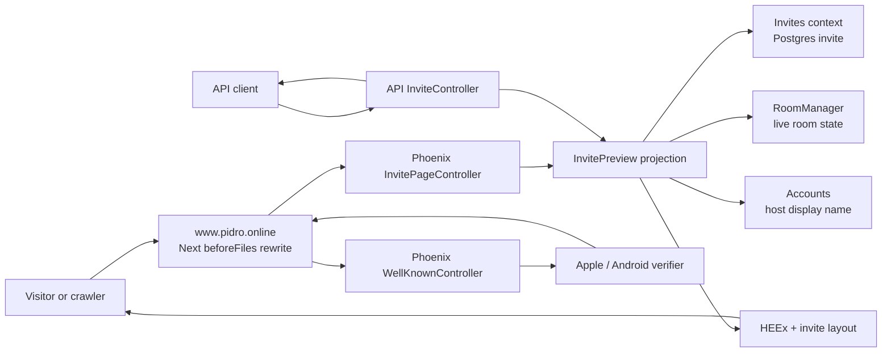
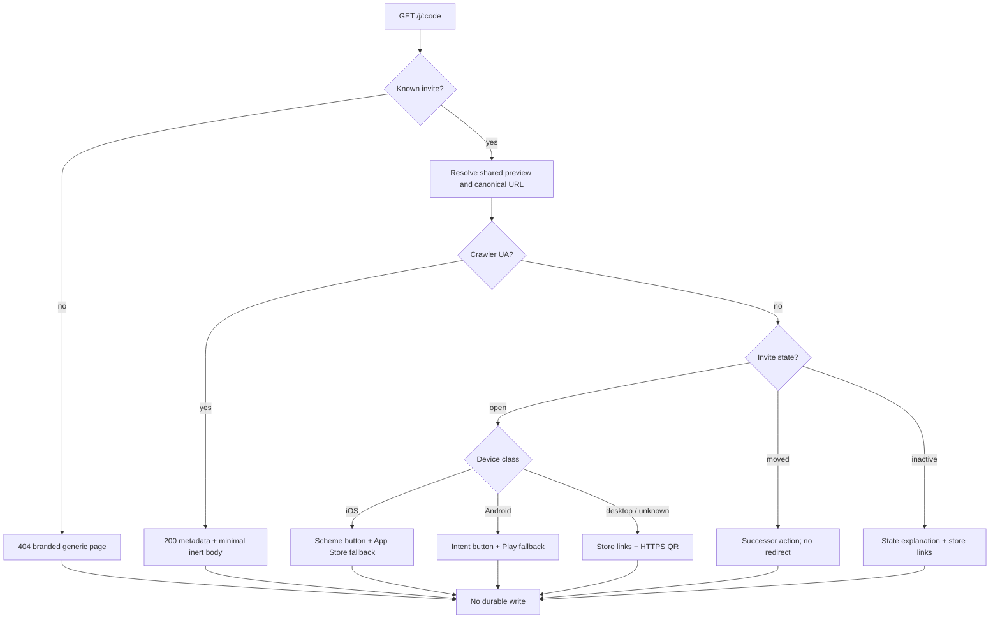

# Invite Landing Page and Association Proxy (Phase 2) - Plan

## Goal Capsule

- **Objective:** every Phase 1 invite URL produces a useful, trustworthy Pidro handoff: chat crawlers get a correct preview without consuming anything, mobile visitors can open or install the app, desktop visitors can continue on a phone by QR, and dead or moved tables explain what happened.
- **Means:** a server-rendered Phoenix page backed by the existing invite state machine, one shared read-model for the JSON and HTML views, a dedicated lightweight layout and script, Phoenix-owned association files, and `beforeFiles` proxy rules in the marketing site (KTD1-KTD12).
- **Authority:** this plan, then `apps/pidro_server/thoughts/AGENTS.md` and the marketing repo's `CLAUDE.md`, then the origin requirements. The origin's decisions D5 and D7, Landing page section, Link anatomy, build-plan phase 2, and answered questions 2 and 3 govern; `session-settled:` entries are not re-litigated.
- **Execution profile:** two coordinated PRs. The backend PR is stacked on Phase 1 / PR #20 because the page reads Phase 1 invites. The marketing PR targets its own `main` and is not deployed until the backend page and association endpoints are live. No migration, LiveView, client application, analytics write, deferred-install matcher, or web-join route.
- **Stop conditions:** a valid GET would need to mutate or reserve invite state; production cannot serve the chosen canonical host without a redirect; the association payload cannot be verified against the real signing identifiers; or a test requires weakening the Phase 1 state or privacy contracts.
- **Tail ownership:** the calling LFG pipeline owns implementation, review, browser verification, both PRs, CI babysitting, and the deploy-order handoff.

---

## Product Contract

### Summary

Render the invite handoff directly in Phoenix and proxy only the public invite and association paths through `www.pidro.online`. Reuse one invite preview projection for HTML and JSON, keep the page useful for every invite state, and add only the small browser behavior needed to open an installed app.

### Problem Frame

Phase 1 creates durable invites and exposes their safe public state, but the share URL still has no destination. A recipient currently sees the marketing site's 404 page, chat services cannot produce a Pidro invite card, and the app stores cannot reliably associate the public host with the native apps.

The current production topology adds a second reliability problem: `https://pidro.online` redirects to `https://www.pidro.online`, while Apple and Android require association files to be available directly over HTTPS without redirects. Phase 2 therefore establishes `www.pidro.online` as the canonical share-link host and uses the marketing application as a deliberately thin proxy to Phoenix. Phoenix remains the source of truth for both the page and association JSON.

### Key Decisions

- KD1. **The Phoenix landing page is the reliable path, even when native link opening fails.** (session-settled: user-approved — chosen over treating Universal/App Links as sufficient: in-app browsers, pasted URLs and users who chose the browser still reach the web.) Governs R1-R6.
- KD2. **Phoenix owns the association payloads; the marketing site proxies them.** (session-settled: user-approved in Phase 0 — chosen over maintaining separate Vercel files: one source prevents signing identifiers and paths from drifting.) Governs R8-R10.
- KD3. **iOS and Android handoff ship now; browser play remains Phase 6.** (session-settled: user-directed — chosen over adding `play.pidro.online/join/:code`: native has priority and the web join flow does not exist yet.) Governs R4, R6, R12.
- KD4. **No deferred-install matching or landing analytics in this phase.** (session-settled: user-approved phase sequence — chosen over pulling Phase 4's device fingerprint and event work forward: all invite GETs remain side-effect free.) Governs R3, R11, R12.
- KD5. **`https://www.pidro.online/j/:code` is the canonical share URL for Phase 2.** Chosen over the apex host after production verification showed the apex issues an HTTP redirect, which violates the platform association contract. The apex may remain associated for legacy compatibility, but new links do not depend on it. Governs R1, R7-R10.

### Requirements

**Landing request and metadata**

- R1. Public `GET /j/:code` is rate-limited per hashed invite code with a dedicated landing-page policy, normalizes and looks up the code, resolves the same invite state, host name, occupied-seat count and successor as the public invite API, and renders HTML without exposing `room_code`, user ids, labels, or other private fields. The dedicated policy is necessary because the Phoenix origin sees Vercel edge addresses for public-host traffic; it also prevents a busy landing page from starving the mobile API's per-client preview bucket. A known invite renders 200 for every state; an unknown code renders a branded 404. A throttled request keeps the existing compact 429 JSON contract and `Retry-After` header rather than adding a second limiter response path for HTML.
- R2. Every known invite response has a canonical `https://www.pidro.online/j/:code` URL, escaped state-aware `<title>` and description, Open Graph and Twitter card tags, and a 1200×630 branded Pidro image under 300 KB. An open invite names the host and seat count; inactive states do not advertise a table as joinable. Unknown invites use generic metadata.
- R3. Recognized crawler user agents receive the same complete metadata and a minimal no-action body. No landing GET creates an event, redemption, guest, reservation or other durable write. Responses use `Cache-Control: no-store` and `Vary: User-Agent` so a crawler representation cannot be served to a person or outlive room state.

**Human handoff**

- R4. An open invite renders a prominent device-appropriate action: on iOS, open `pidro-mobile://j/:code` and reveal/follow the App Store fallback when the page remains visible; on Android, use an `intent://` URL for `com.oneapps.pidro` with a Play Store fallback carrying `referrer=invite%3D<code>`; on desktop, show both stores and a QR encoding the canonical HTTPS URL. A plain store link remains available when user-agent classification is wrong or JavaScript is disabled.
- R5. The document head includes an iOS Smart App Banner with App Store id `1137091987` and the canonical invite URL as `app-argument`. Buttons and status messages have accessible names, keyboard focus, at least 44×44 CSS-pixel targets, sufficient contrast, and reduced-motion behavior.
- R6. The page communicates `open`, `full`, `started`, `locked`, `closed`, `expired`, `revoked`, and `moved` without pretending an unavailable table can be joined. A moved invite uses the successor's canonical URL for its primary action and explains that the host started a new table; it does not automatically redirect. All non-open states still offer an app-store path.
- R7. The page is mobile-first, fast on a cold connection, and recognizably Pidro: blue felt, restrained gold/cyan accents, tactile card cues and the existing Pidro logo. It uses server HTML, the existing CSS pipeline, Phoenix-owned static assets and one dedicated small script; it does not load LiveView, React, a UI framework, tracking, remote fonts or third-party images. Because the HTML is proxied on a different host, CSS, script and image URLs are absolute digest URLs from Phoenix's configured public static origin rather than relative `www` paths.

**Association and public-host routing**

- R8. Phoenix continues to serve `/.well-known/apple-app-site-association`, `/apple-app-site-association`, and `/.well-known/assetlinks.json` as JSON for any `Accept` header, with no application redirect and the existing one-hour cache policy. AASA covers `/j/*` and legacy `/app/*` for production, development and preview app ids configured by the environment. Asset Links carries the configured production, development and preview packages/fingerprints that are actually available.
- R9. The marketing site uses Next.js `beforeFiles` external rewrites for `/j/:path*`, `/.well-known/:path*`, and `/apple-app-site-association` to the Phoenix origin. These rules take precedence over public files. The Auth.js middleware matcher excludes those paths plus Next.js/static assets so invite crawlers and platform verifiers receive neither an auth redirect nor session cookies from Next.js; it does not newly exclude application or API routes whose middleware behavior is outside this phase.
- R10. The stale checked-in marketing copies of AASA and Asset Links are removed once the proxy configuration is active, leaving Phoenix as the single maintained source. The deploy runbook requires backend-first deployment and direct, no-redirect checks through both the Phoenix origin and `www.pidro.online` before the proxy change is promoted.

**Reliability, privacy and scope**

- R11. All dynamic text is escaped by HEEx, all generated URLs are derived from normalized Crockford codes and fixed configured origins, and the custom-scheme fallback starts only from a real user action. The page sends an explicit Content Security Policy limited to its Phoenix static origin plus `data:` images, with no framing, form submission or network connection capability. The implementation adds no cookies, local storage, fingerprinting or third-party request from the page.
- R12. This phase does not add native `associatedDomains`/intent filters, app routing, the `/join` UI, share sheets, guest-name entry, pending-invite storage, install-referrer consumption, deferred matching, browser play, post-game upgrade, or funnel events. Those remain in phases 3-6.

### Scope Boundaries

- Backend HTML rendering, presentation data, crawler/device classification, local assets, QR generation, metadata, association verification and production smoke checks.
- Marketing-site external rewrites and middleware exclusions only; no marketing redesign or authentication refactor.
- The Phase 1 public invite API remains backward compatible; extracting its duplicated read projection is in scope only to prevent HTML and JSON state drift.

#### Deferred to Follow-Up Work

- Native Universal/App Link declarations and `/join/:code` routing (phase 3).
- Invite creation/share UI and waiting-room QR on mobile or web (phase 3).
- Play Install Referrer consumption, iOS probabilistic matching, manual code entry and privacy notice (phase 4).
- Personalized/generated OG artwork, per-source attribution and invite funnel events. The Phase 2 image is a static branded asset; host and table state remain dynamic text metadata.
- Browser join and automated platform-association monitoring (phase 6). Phase 2 adds a release smoke command, not a monitoring service.
- Removing the Vercel apex-to-`www` redirect. New invite links use `www`; the apex association limitation is documented until the platform setting changes.

### Acceptance Examples

- AE1. **Open invite on iPhone.** Given Marcel's open invite with two occupied seats, an iPhone browser receives a page and Smart App Banner saying Marcel invited the visitor and two seats are taken; a tap attempts the Pidro scheme and, if the page remains visible, offers the App Store. No invite rows or events change. Covers R1-R5, R11.
- AE2. **Android install fallback.** Given an open invite and no installed app, tapping the Android primary action reaches Google Play for `com.oneapps.pidro` with the normalized invite in the referrer. A direct Play link also works without JavaScript. Covers R4, R11.
- AE3. **Desktop handoff.** Given an open invite on desktop, the page displays the host and seats, both store destinations, and a scannable QR whose payload is exactly the canonical HTTPS invite URL. It does not offer browser play. Covers R2, R4, R7, R12.
- AE4. **Crawler preview is inert.** Given WhatsApp, Slack, Telegram, Discord, X/Twitter, Facebook or Apple/iMessage crawler identification, the response contains correct OG metadata and no actionable scheme script, and the database is unchanged. A following human request is not served the crawler body. Covers R2, R3.
- AE5. **Inactive states tell the truth.** Full, started, locked, closed, expired and revoked invites render distinct useful copy with no join action. The response never exposes the room code. Covers R1, R6.
- AE6. **Moved table.** Given an old invite superseded by a live waiting invite, the old page says the table moved and its action and QR target the successor's canonical URL without a server or client auto-redirect. Covers R1, R6.
- AE7. **Unknown code.** Given a syntactically valid but unknown code, the response is a branded 404 with generic metadata, no room/invite facts and store links only. Covers R1, R2.
- AE8. **Association files through the public host.** Requests to all three association paths on `www.pidro.online` return 200 directly, JSON content type, no redirect, no Auth.js cookie, `/j/*` plus legacy `/app/*`, and the expected production identifiers. Covers R8-R10.
- AE9. **Proxy path parity.** The same known invite requested from the Phoenix origin and through `www.pidro.online` has matching canonical metadata and state. Framework assets and ordinary marketing/auth routes keep their current behavior. Covers R1, R9.

### Success Criteria

- Backend controller, presentation and association tests are green under `mix precommit`; the marketing application passes lint/build without a new test framework.
- Browser verification covers mobile, desktop, crawler, moved, inactive and unknown-page states with no console errors or unexpected network requests.
- Release smoke checks demonstrate direct 200 responses with correct content types and no redirects for the canonical public host before Phase 3 relies on native link verification.

### Sources

- Origin: `docs/brainstorms/2026-09-02-invite-links-and-guest-play-requirements.md` (D5, D7, Link anatomy, Landing page, Platform edge-case matrix, build-plan phase 2, answered questions 2-3).
- Research: `docs/research/2026-09-02-invite-links-deep-linking-guest-play-landscape.md` (universal/app-link limitations, crawlers, deferred-install boundary).
- Phase 0: `docs/plans/2026-09-02-1240-feat-invite-prereqs-plan.md` (`WellKnownController`, association configuration and deploy smoke foundation).
- Phase 1: `docs/plans/2026-09-02-1530-feat-invites-guests-backend-plan.md` (public invite state/API and link generation contract).
- Apple: [Supporting associated domains](https://developer.apple.com/documentation/xcode/supporting-associated-domains), [Debugging Universal Links](https://developer.apple.com/documentation/technotes/tn3155-debugging-universal-links), and [Smart App Banners](https://developer.apple.com/documentation/webkit/promoting-apps-with-smart-app-banners).
- Android: [Configure website associations](https://developer.android.com/training/app-links/configure-assetlinks) and [Chrome Android intents](https://developer.chrome.com/docs/android/intents).
- Next.js 15: [rewrites](https://nextjs.org/docs/15/app/api-reference/config/next-config-js/rewrites) and [middleware](https://nextjs.org/docs/15/app/building-your-application/routing/middleware).
- Phoenix: [controllers](https://hexdocs.pm/phoenix/Phoenix.Controller.html) and [function components/HEEx](https://hexdocs.pm/phoenix_live_view/Phoenix.Component.html).
- Architecture posture: [Rails Doctrine](https://rubyonrails.org/doctrine), [Pragmatic Programmer tips](https://pragprog.com/tips/), and Chris McCord's [How We Got to LiveView](https://fly.io/phoenix-files/how-we-got-to-liveview/): use the framework's integrated path, ship a thin end-to-end tracer bullet, keep knowledge in one place, and add a new abstraction only when it removes a real boundary.

---

## Planning Contract

### Key Technical Decisions

- KTD1. **Use an ordinary Phoenix controller, HTML module and HEEx templates.** `InvitePageController.show/2` calls one read projection and renders either the invite page or branded not-found page through a dedicated root layout. Its small browser pipeline runs secure headers and the existing rate-limit plug but not session, flash, CSRF or LiveView machinery. It is not a LiveView: no page state changes after the request, and adding a socket would be another failure mode with no product value. Governs R1-R3, R7.
- KTD2. **Extract one small `PidroServerWeb.InvitePreview` boundary shared by API and HTML.** It receives an invite code, calls `Invites.get_by_code/1`, `Invites.state/2`, the existing account lookup and live-room lookup, and returns presentation data (`invite`, `state`, `host`, `seats_taken`, `successor`) without serializing HTML or JSON. `API.InviteController.show/2` delegates to it, preserving the existing response. Chosen over copying private controller helpers: state and privacy rules must not fork. Governs R1, R6.
- KTD3. **Keep UA handling pure and conservative.** `InvitePage.UserAgent.classify/1` produces `:crawler`, `:ios`, `:android` or `:desktop` from a short documented matcher. Unknown/mobile UAs fall back to desktop-safe store links; no UA changes correctness or invite state. Crawler matching covers the origin's named bots case-insensitively and is unit tested. Governs R3-R4.
- KTD4. **Use one invite root layout and one tiny JavaScript entry.** The layout owns canonical/OG/Twitter/Smart-Banner tags and uses Phoenix's static-URL helper so stylesheet, script and image requests go to the configured Phoenix public origin even when the document is proxied on `www`. It loads `invite.js` only for a human iOS representation; crawlers, Android and desktop load no script. The script binds only `[data-open-ios]`, writes no storage, starts no timer until a click, cancels when the document hides, and reveals/navigates to the configured App Store fallback after roughly 1.5 seconds if still visible. Android and store actions remain plain anchors. Governs R2-R5, R7, R11.
- KTD5. **Generate QR server-side with `eqrcode ~> 0.2.1`.** A pure helper encodes only the configured canonical URL and returns a base64 SVG data URI for an `` with useful alt text. EQRCode is pure Elixir and has no transitive runtime dependencies. Chosen over a browser QR package, remote QR service or custom encoder: no client bundle, visitor leak or homemade protocol code. The dependency and lockfile are the complete QR change. Governs R4, R7, R11.
- KTD6. **Render one semantic page shell with state-specific data, not eight templates.** A pure presenter maps each Phase 1 state to eyebrow, heading, explanation, availability and target invite. Open and moved are the only actionable table states; unknown is a separate 404 presenter. The template branches only for crawler/minimal body and device actions. Chosen over separate controller actions/templates: the states share metadata, accessibility and privacy rules. Governs R1-R7.
- KTD7. **Use a static, locally served 1200×630 OG asset.** Dynamic title and description carry host and state; the image is branded but contains no host-specific raster text. Chosen over per-invite image generation: social crawlers already render dynamic text, while an image service/cache adds an unrelated subsystem. Governs R2, R7.
- KTD8. **Change only production-default invite origins to `https://www.pidro.online/j`.** Update `Invites`' compile-time fallback and `config/config.exs`; keep localhost development/test overrides and `INVITE_LINK_BASE_URL`. Update OpenAPI/docs/examples that claim the apex is canonical. Existing stored invites contain codes, not URLs, so no data migration exists. Governs KD5, R1-R2.
- KTD9. **Keep association responses in the existing controller.** Add/adjust only configured app identifiers and tests required by R8; do not create route handlers in Next.js. The marketing repo's obsolete public JSON files are deleted when `beforeFiles` rewrites shadow their paths. Chosen over two sources of truth. Governs R8-R10.
- KTD10. **Use Next.js `beforeFiles` rewrites and a static negative matcher.** `next.config.js` returns a rewrites object whose `beforeFiles` array proxies the three public path families to the configured Phoenix public origin (default `https://app.pidro.online`). `middleware.ts` keeps Auth.js but exports a literal matcher that excludes `j`, `.well-known`, root AASA, `_next/static`, `_next/image`, favicon and common public-file extensions. Existing application/API matching is otherwise preserved. Chosen over a runtime check inside auth middleware: excluded requests should never initialize auth. Governs R9.
- KTD11. **Verify the proxy as infrastructure, not just JSX.** Backend tests assert metadata, headers, state copy, crawler branch, escaping, QR payload and no event-row deltas. Marketing verification asserts `next build` accepts the matcher and rewrites. A local integration smoke runs Phoenix plus the Next production server when practical; the release script verifies status, directness, content type, cookies and required JSON members at both origins. Governs R1-R11.
- KTD12. **Ship backend before marketing.** Backend PR bases on the Phase 1 branch/PR. Marketing PR may merge independently but its deployment is held until `app.pidro.online/j/:code` and all association paths pass smoke checks; then the `www` rewrite is deployed and checked before generating native builds. Rollback is the inverse: revert/disable marketing rewrites first, leaving the Phoenix endpoints harmless. Governs R8-R10.

### High-Level Technical Design

The request path has one data projection and two renderers; the marketing site never learns invite internals:

The response branch is presentation-only; every path ends without a write:

### System-Wide Impact

- **Request path:** `www.pidro.online/j/*` and association requests traverse Vercel's edge then Phoenix; ordinary marketing, auth, API and Next static paths remain local to Next.js.
- **Data:** read-only invite/account/RoomManager access. No schema, event, counter, session or cache mutation.
- **Contracts:** the public invite API body is unchanged. Generated invite URLs change host from apex to `www`; canonical page metadata agrees with it. Association JSON remains environment-configurable and keeps the legacy AASA path.
- **Build/runtime:** backend gains one small Hex dependency and a second esbuild entry. Marketing gains configuration only and no package dependency.
- **Security/privacy:** HEEx escapes user text; only safe public preview fields render; no room code, visitor identifier, cookies, tracking request or fingerprint is introduced. The HTML route reuses Phase 1's IP throttle, and CSP constrains the cross-host static assets without allowing fetch/XHR or inline script.
- **Operations:** deploy ordering matters because the public proxy has an external destination. The smoke script becomes the release proof for direct association responses.

### Risks and Rollback

- **Vercel redirect precedes application routing.** New links use `www`, whose application receives the request. If the public host still redirects in the target project, stop before Phase 3; do not add redirect-following as a test workaround. The smoke request must use `--max-redirs 0` and inspect the first response rather than declaring success after curl follows it.
- **Association identifiers may be incomplete.** Production entries must remain correct; dev/preview entries are emitted only from verified configuration. A missing non-production fingerprint is documented, not invented.
- **UA detection is imperfect.** It controls presentation only; persistent store links and canonical QR keep the page usable. Roll back matcher additions independently from invite rendering if an overbroad bot rule appears.
- **Proxy deploy before backend or against a failing origin.** Prevent with the backend-first runbook and smoke gate. A failed external rewrite can otherwise turn a public link into an edge 5xx. Immediate rollback is the marketing rewrite commit or Vercel rollback; Phoenix endpoints need no rollback. The marketing deployment is not a required dependency of the backend deploy.
- **Auth matcher regression.** A negative matcher can accidentally bypass authentication more broadly than intended. Verify representative protected and sign-in routes in addition to the excluded public paths; the rewrite exclusion is path-specific and never changes authorization inside application routes.
- **Crawler caching leaks across variants.** `Vary: User-Agent` plus `no-store` is required on the Phoenix response and must survive Vercel proxying. Public smoke inspects both headers; if Vercel overwrites them, fix the proxy response before launch rather than duplicating pages in Next.js.
- **QR dependency issue.** `mix deps.unlock eqrcode` plus removal of the helper restores the pre-QR build; the rest of the page can temporarily omit desktop QR without affecting mobile association.

### Assumptions

- The user intends the complete Phase 2 build-plan item, not only visual HTML; the two-repository proxy and operational handoff are included.
- A static branded OG image satisfies the origin's “generated once” v1 constraint; personalized raster rendering is deferred because dynamic metadata already carries the host and state.
- The current App Store id, Android package and production signing fingerprint in the repos are authoritative. Development/preview identifiers remain configuration-driven where fingerprints are not present.
- `www.pidro.online` remains attached to the marketing Vercel project and does not redirect before Next.js routing; production smoke verification must prove this.
- The Phase 1 preview state and privacy contract on PR #20 is stable enough to reuse; Phase 2 does not redesign it.
- A single static English page is consistent with the origin's English-v1 decision; the Phase 3 native i18n layer is not pulled into Phoenix.

### Sequencing

1. Create the backend Phase 2 branch from the Phase 1 PR head and land the shared preview projection first, proving the existing API is unchanged.
2. Add the Phoenix request contract, template/layout, assets, QR and focused browser behavior with controller/unit tests.
3. Update canonical-host configuration, documentation and smoke checks; run the complete backend quality gate and browser verification against Phoenix directly.
4. Create an isolated marketing worktree from its remote `main` so existing local user changes remain untouched. Add rewrites/matcher exclusions, remove shadowed association files, then lint/build.
5. Open a stacked backend PR and a separate marketing PR. Backend/Phase 1 deploys and passes origin smoke first; marketing deploys second and passes public-host smoke. Native Phase 3 begins only afterward.

---

## Implementation Units

### U1. One invite preview projection for API and HTML

**Files:**

- Add `apps/pidro_server/lib/pidro_server_web/invite_preview.ex`.
- Modify `apps/pidro_server/lib/pidro_server_web/controllers/api/invite_controller.ex`.
- Modify `apps/pidro_server/test/pidro_server_web/controllers/api/invite_controller_test.exs`.
- Add `apps/pidro_server/test/pidro_server_web/invite_preview_test.exs` if pure edge cases are clearer outside controller tests.

**Work:**

- Move the public show action's host, live-room and seat projection behind one function returning either `{:ok, preview}` or `{:error, :not_found}`.
- Include the loaded successor invite only when Phase 1 state is `:moved`; keep room lookup and privacy logic identical for API and HTML.
- Make `API.InviteController.show/2` a thin serializer over the projection. Preserve its status, JSON keys, value semantics and rate-limit behavior verbatim.
- Add characterization assertions for open, closed, moved, missing-host and unknown-code cases before the HTML caller is added.

**Verification:**

- `mix test apps/pidro_server/test/pidro_server_web/controllers/api/invite_controller_test.exs apps/pidro_server/test/pidro_server_web/invite_preview_test.exs`
- Existing OpenAPI spec build remains warning-free.

### U2. Phoenix landing request, metadata and state presenter

**Files:**

- Modify `apps/pidro_server/lib/pidro_server_web/router.ex`.
- Add `apps/pidro_server/lib/pidro_server_web/controllers/invite_page_controller.ex`.
- Add `apps/pidro_server/lib/pidro_server_web/controllers/invite_page_html.ex`.
- Add `apps/pidro_server/lib/pidro_server_web/controllers/invite_page_html/show.html.heex`.
- Add `apps/pidro_server/lib/pidro_server_web/controllers/invite_page_html/not_found.html.heex`.
- Add `apps/pidro_server/lib/pidro_server_web/invite_page.ex` and `invite_page/user_agent.ex` only if keeping the state and UA maps out of the controller makes them independently pure.
- Add `apps/pidro_server/test/pidro_server_web/controllers/invite_page_controller_test.exs`.

**Work:**

- Add `/j/:code` to a purpose-built HTML pipeline with secure browser headers, the existing `RateLimit` plug and the invite root layout, avoiding session/flash/CSRF work that a read-only public page does not use. Tag the route with a dedicated `invite_page` policy keyed by the hashed `code` path parameter; keep `invite_preview` independent and per client IP for the mobile API.
- Resolve preview data once, construct state/device presentation assigns, and render 200 for known states or 404 for unknown codes.
- Generate canonical, title, description, OG/Twitter, Smart Banner and robots metadata in the server response. Use successor URL/data for moved actions while retaining old-link explanatory copy.
- Detect crawlers from the request UA and render metadata plus a minimal inert body with no scheme control or script.
- Set `Cache-Control: no-store`, append `Vary: User-Agent`, and set the restrictive page CSP on both known and unknown responses.
- Test every Phase 1 state, unknown and malformed codes, crawler/human split, host-name escaping, room-code absence, headers, throttle response and the moved successor target.

**Verification:**

- `mix test apps/pidro_server/test/pidro_server_web/controllers/invite_page_controller_test.exs`
- Inspect generated HTML with `LazyHTML` rather than brittle full-string snapshots.

### U3. Pidro page shell, assets, QR and progressive enhancement

**Files:**

- Modify `apps/pidro_server/mix.exs` and `mix.lock` for EQRCode.
- Modify `config/config.exs` esbuild arguments to include `js/invite.js` as a named second entry.
- Add `apps/pidro_server/assets/js/invite.js`.
- Modify `apps/pidro_server/assets/css/app.css` with an isolated `invite-*` section.
- Add `apps/pidro_server/lib/pidro_server_web/components/layouts/invite.html.heex`.
- Add Pidro-owned logo/store/OG assets under `apps/pidro_server/priv/static/images/invite/` and include their path through the existing static plug.
- Add focused QR/helper tests under `apps/pidro_server/test/pidro_server_web/`.

**Work:**

- Implement the mobile-first semantic design using CSS custom properties/classes in the existing Tailwind input, not a component system. Preserve recognizable blue-felt/gold Pidro character and use cyan only as a focused interactive accent.
- Copy only project-owned artwork from the marketing repo, optimize it, and create a 1200×630 static social image under 300 KB. Store badges keep their official artwork and accessible text equivalents. Render all static references with the Phoenix static-URL helper and verify their absolute host under proxy-style request headers.
- Produce the QR data URI from the canonical URL and expose it only for desktop/unknown presentation; test decoding/payload at the helper level if the library offers matrix access, otherwise assert deterministic non-empty SVG and embedded canonical payload separately.
- Build `invite.js` as plain DOM code scoped to the iOS button. Respect `visibilitychange`, page hide and repeat clicks; do not infer install success. Do not emit its script tag for crawler, Android or desktop representations.
- Verify keyboard order, visible focus, target sizes, color contrast, 320px layout, long escaped host names, reduced motion, missing image fallback and JS-disabled usefulness.

**Verification:**

- `mix deps.get && mix assets.deploy`
- Controller/helper tests plus direct browser checks at 320×568, 390×844 and desktop widths.
- Confirm the human page makes no network requests after load beyond same-origin digest assets.

### U4. Canonical host, association contract and backend operations

**Files:**

- Modify `apps/pidro_server/lib/pidro_server/invites.ex`, `config/config.exs` and their existing tests.
- Modify association configuration/tests only where verified Phase 2 identifiers require it: `config/config.exs`, `config/runtime.exs`, `apps/pidro_server/lib/pidro_server_web/controllers/well_known_controller.ex`, `apps/pidro_server/test/pidro_server_web/controllers/well_known_controller_test.exs`.
- Modify `apps/pidro_server/thoughts/API_DOCUMENTATION.md`, `apps/pidro_server/thoughts/DEPLOYMENT.md`, `docs/deployment/kamal_hetzner.md`, and `ops/smoke-production`.

**Work:**

- Switch production defaults and documentation from apex invite URLs to `www`; keep explicit local overrides and document why the apex redirect cannot be canonical for association.
- Reconfirm AASA `details/components` covers `/j/*` and `/app/*`, and Asset Links includes only real configured packages/fingerprints. Preserve any-Accept JSON, root AASA alias and one-hour cache behavior.
- Extend the production smoke script with a safe optional known invite code: assert no redirect, HTML content type, canonical metadata and absence of room code; always verify association status/content type/required members and fail on redirect.
- Document two-stage deployment, public/origin curl commands, Apple CDN propagation expectations and Android `adb shell pm get-app-links` verification for Phase 3.

**Verification:**

- `mix test apps/pidro_server/test/pidro_server/invites_test.exs apps/pidro_server/test/pidro_server_web/controllers/well_known_controller_test.exs`
- `mix precommit`
- `shellcheck ops/smoke-production` when available, plus `ops/smoke-production --help`/documented safe invocation.

### U5. Marketing proxy and Auth.js bypass

**Repository/worktree:** isolated worktree from `git@github.com:marcelfahle/pidro_landing_v2.git` remote `main`; do not touch or clean the user's existing dirty `feat/plausible-install` worktree.

**Files:**

- Modify `next.config.js`.
- Modify `middleware.ts`.
- Remove `public/.well-known/apple-app-site-association` and `public/.well-known/assetlinks.json` after the rewrites own those paths.
- Add a short deployment note to the existing README or operational documentation if the repo has an established place; do not create a documentation hierarchy for one rule.

**Work:**

- Add an external-origin constant sourced from a server-side environment variable with production default `https://app.pidro.online`, and return `beforeFiles` rewrites for invite and association path families without changing other Next config.
- Export an Auth.js matcher literal that excludes the proxied public paths before middleware execution as well as ordinary Next/static paths. Keep protected-route behavior unchanged, and explicitly exercise one route that currently requires a session so the negative matcher cannot silently widen the public surface.
- Remove static association files so reviewers cannot mistake them for the active source. Explain backend-first deploy and the rollback rule beside the rewrite config or existing operations doc.
- Avoid dependencies, route handlers, page components and auth refactors.

**Verification:**

- `pnpm lint`
- `pnpm build`
- Start the production build against a local/staging Phoenix origin and request `/j/<known>`, both well-known paths and root AASA without following redirects; confirm no `Set-Cookie` from Auth.js, preserved `Cache-Control`/`Vary`, and unchanged behavior for representative marketing/auth/static/protected routes.

### U6. Cross-repository release proof

**Work:**

- Capture backend browser evidence for open, moved, expired/revoked and unknown states; include iOS, Android and desktop UA behavior plus crawler HTML inspection.
- Deploy backend after PR #20/Phase 1 and run origin smoke at `app.pidro.online`. Do not promote the marketing rewrite until those checks pass.
- Deploy the marketing PR, then repeat public-host checks at `www.pidro.online` with redirect following disabled. Verify the canonical URL and QR both use `www`.
- Record any unavailable dev/preview signing fingerprint as a Phase 3 prerequisite rather than fabricating an entry.
- Hand Phase 3 the verified public URL, AASA/Asset Links outputs, App Store id, Android package/fingerprint and known platform propagation caveat.

**Verification:**

- `curl --fail --silent --show-error --max-redirs 0 -D - https://www.pidro.online/.well-known/apple-app-site-association`
- `curl --fail --silent --show-error --max-redirs 0 -D - https://www.pidro.online/.well-known/assetlinks.json`
- `curl --fail --silent --show-error --max-redirs 0 -D - https://www.pidro.online/apple-app-site-association`
- A known invite request through origin and public host, plus one crawler-UA request, with response-body assertions from `ops/smoke-production`.

---

## Verification Contract

| Layer | Proof | Gate |
|---|---|---|
| Pure presentation | Preview projection, state presenter, UA matcher, QR/canonical URL tests | Shared JSON semantics unchanged; every state deterministic |
| Phoenix HTTP | Controller tests for known/unknown/crawler/device/meta/header/privacy paths | Correct 200/404, no room code, no event delta |
| Association | Existing and extended well-known tests | JSON for any Accept, prod ids/path coverage, legacy path retained |
| Backend integration | `mix precommit`, `mix assets.deploy` | Format, compile warnings-as-errors, tests, Credo, Dialyzer, digested assets |
| Marketing build | `pnpm lint`, `pnpm build` | Next accepts static matcher and external rewrites |
| Browser | Real browser at mobile/desktop widths and crawler-source inspection | Accessible, usable without JS, no console/network surprises |
| Production | no-follow `curl`, smoke script, Android app-link inspection in Phase 3 | No redirect/cookie, correct type/payload/canonical host |

The tests must not stub away the Phase 1 state derivation at the controller boundary. Fixtures may control a room and invite, but the page should traverse the same projection used in production. No screenshot assertion substitutes for semantic HTML/header tests; no unit assertion substitutes for the public-host no-redirect smoke.

## Definition of Done

- A shareable Phase 1 invite opens a branded, accessible Phoenix page through `www.pidro.online` and carries correct dynamic social metadata.
- Crawlers, iOS, Android, desktop, moved/inactive and unknown states satisfy the acceptance examples without durable GET-side effects.
- JSON preview behavior remains backward compatible and the page never reveals the room code or private identifiers.
- AASA and Asset Links have one maintained Phoenix source, retain legacy coverage, and return directly through the canonical public host without Auth.js involvement.
- Backend `mix precommit`/asset build and marketing `pnpm lint`/build pass; browser checks produce clean evidence.
- Both PRs document their dependency/deploy order and have a reversible proxy-first rollback.
- Phase 3 inputs are verified and recorded; Phase 3/4/5/6 implementation has not leaked into the diff.
