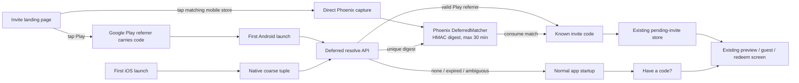
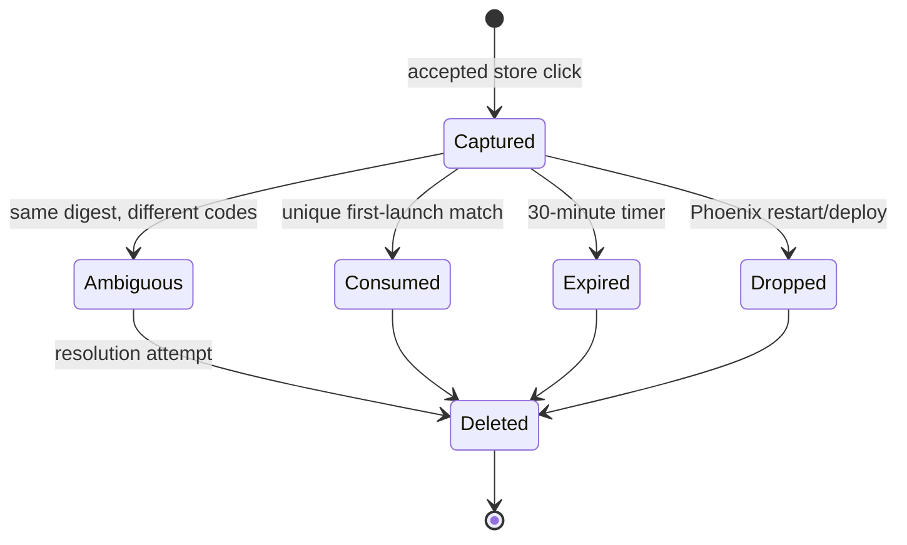

# Phoenix-Owned Deferred Invite Matching (Phase 4) - Plan

## Goal Capsule

- **Objective:** preserve an invite across a native-app installation so a recipient reaches the existing join flow on first launch, while always retaining a visible manual-code escape hatch.
- **Means:** deterministic Google Play Install Referrer handling on Android, Phoenix-owned 30-minute coarse matching for installs without a deterministic referrer, a one-shot native bootstrap, manual code entry, funnel events, and an explicit privacy disclosure (KTD1-KTD13).
- **Authority:** this plan, then repository-local `AGENTS.md` files, then the origin requirements and linked research. Answered question 4 and the user's current Phase 4 directive govern; `session-settled:` decisions are not re-litigated.
- **Execution profile:** three coordinated PRs: backend contract and matcher, marketing disclosure, then frontend native consumption. Phases 0-3 are treated as deployed foundations. No post-game registration, browser join, hosted attribution vendor, ad identifier, or durable fingerprint store.
- **Stop conditions:** the implementation would require a third party to receive matching data; the server cannot guarantee deletion no later than 30 minutes; a native path can bypass the existing invite preview/redeem authority; a requested app-store test would require publishing a production build without explicit release authority; or deployed Phase 3 contracts materially differ from this plan.
- **Tail ownership:** the calling LFG pipeline owns implementation, review, automated and practical native verification, coordinated PRs, CI follow-through, and documenting any store/device proof that cannot be completed locally.

---

## Product Contract

### Summary

Extend the deployed invite handoff with a Phoenix-owned, privacy-bounded deferred resolver. Google Play's referrer carries the invite deterministically on Android; otherwise the landing page and first native launch may match a coarse request signature for at most 30 minutes, after which manual code entry remains the recovery path.

### Problem Frame

Phase 3 can route an installed app from `https://www.pidro.online/j/:code`, but the invite context is lost when the recipient must visit an app store first. Android provides a first-party install-referrer channel; iOS does not provide an equivalent. A hosted deferred-link vendor would solve that asymmetry by receiving device and invite data, but answered question 4 explicitly rejects that ownership model.

The fallback therefore has to be deliberately modest. It should improve the common click-install-open path without claiming deterministic identity, retaining data, or silently joining the wrong table. A failed, expired, or ambiguous match opens Pidro normally and leaves the invitee with a short code field that uses the already-deployed join screen and server validation.

### Key Decisions

- KD1. **Phoenix owns deferred matching for exactly 30 minutes.** (session-settled: user-directed — chosen over Detour or another hosted deferred-link vendor: invite matching data stays inside Pidro and is hard-deleted after the brief handoff window.) Governs R1-R7, R12-R14.
- KD2. **Android prefers Google Play Install Referrer; coarse matching is fallback, not the primary Android contract.** Chosen over fingerprint-only parity: the first-party referrer is deterministic and carries less misrouting risk. Governs R5-R7, R11.
- KD3. **Ambiguity and absence fail closed into ordinary app startup.** Chosen over guessing the latest invite: a missed automation is recoverable through code entry, while opening the wrong private table is not. Governs R4, R7-R10.
- KD4. **The existing native join flow remains the only join authority.** Chosen over auto-redeeming from the matcher: deferred resolution returns an invite code, then existing preview, guest creation, authentication and redemption rules decide what happens. Governs R7-R10.
- KD5. **Phase 4 ends at deferred resolution, manual code entry, disclosure and measurement.** (session-settled: user-directed — chosen over folding in post-game registration or web join: those remain their separately scoped later phases.) Governs R8-R15.

### Requirements

**Landing capture and retention**

- R1. A real user action on a mobile invite landing page's matching App Store or Play Store link may submit one deferred hint directly to the configured Phoenix origin before navigation. Desktop and cross-platform badges navigate without capture. Rendering or crawling `GET /j/:code` remains side-effect-free, and crawlers never execute the capture path.
- R2. The browser supplies OS family/major, screen class, locale and IANA timezone. Phoenix derives the client address from the direct request after trusted-proxy normalization. The endpoint rejects unknown invites, malformed or overlong fields, unsupported platforms and requests without the complete coarse signature. Android browser collection accounts for Chrome's reduced user agent rather than assuming its frozen `Android 10` token is the device's real OS version.
- R3. Phoenix canonicalizes the coarse fields and stores only a keyed digest associated with the normalized invite id/code and an expiry. Matcher/controller code does not add raw address, user agent, screen size, locale, timezone, advertising id, hardware id, browser cookie or fingerprint to Postgres, application logs, events or analytics. Standard network/proxy access logs remain under the deployment's existing transport-log policy and must not include request bodies.
- R4. Each hint is physically removed from the Phoenix-owned in-memory matcher no later than 30 minutes after capture. Restarting or replacing the Phoenix process may delete it earlier. A successful match consumes all hints for that digest; two different live invite codes under one digest are ambiguous, return no code, and are consumed rather than guessed.

**Native resolution and join handoff**

- R5. The Android store URL continues to carry `referrer=invite%3D<normalized-code>`. On the first Phase 4 resolution attempt, Android reads Google Play Install Referrer through Expo Application's native API, accepts only the exact `invite=<code>` key from the decoded query, and sends it to Phoenix as the preferred resolution input. A valid referrer may resolve after 30 minutes because Phoenix retains no fingerprint for that deterministic path.
- R6. iOS and Android collect the same coarse match fields available to the browser. The native request includes a random per-install id for rate-limit fairness. It is stored in uninstall-scoped application storage, is never part of browser/native matching, and is not a trustworthy abuse boundary because a modified client can rotate it.
- R7. `POST /api/v1/invites/deferred` is public, permits at most five attempts per normalized client address per 30-minute window (with install id as a secondary fairness limit), and returns only a normalized invite code when either a valid Android referrer resolves or one unique unexpired coarse hint matches. The endpoint consumes the request's fallback digest buckets even when the Android referrer wins, so no redundant hint remains until expiry. Missing, expired, malformed and ambiguous cases reveal no invite facts and return the same empty result.
- R8. Deferred resolution runs once per installed app lifecycle, only after auth and pending-invite storage have hydrated and only when no Phase 3 direct-link invite is already pending. iOS and Android fingerprint fallback run only when the platform-reported original installation time is no more than 30 minutes old; an older Android install may still submit a syntactically valid Play referrer without fingerprint fields. Existing installs with no invite referrer and installs first opened after the fingerprint window mark the attempt complete without a match request. A three-second overall startup budget covers installation time, native referrer lookup and any Phoenix request. Completion, empty result, timeout, installation-time error and transport failure all mark the attempt complete and continue to the normal login/home route.
- R9. A resolved code is written to the existing pending-invite store with source `deferred` and navigates through the existing `/join/:code` preview and redeem screen. It never creates a guest, claims a seat or redeems an invite directly.
- R10. Both signed-out and signed-in users can open a localized “Have a code?” screen, paste or type a Crockford invite code, receive inline validation, and continue through the same join route with source `typed`. Invalid input stays local; an apparently valid but unknown/inactive code is explained by the existing server-backed join screen.
- R11. Expo Application's Play referrer reader is invoked only on Android; iOS never calls it. Development/sideload builds treat “no referrer” or an unavailable Play service as an expected fallback result rather than a fatal error.

**Measurement, privacy and compatibility**

- R12. A newly accepted store-hint capture records `store_clicked`; a returned deferred code records `deferred_matched`; and the first successful seat claim whose redemption source is `typed` records `code_typed`. The first two are arrival events while `code_typed` is a conversion-stage event. `store_clicked` excludes taps whose JavaScript/delivery/capture failed, so `deferred_matched / store_clicked` is an upper bound rather than the total real-world store-tap match rate. Events reuse the existing invite event ledger, contain only the established platform/UA class/user-id fields, and never include the coarse signature, digest, referrer string or install id.
- R13. Redemption accepts the internal sources `deferred` and `typed` for funnel attribution without accepting them as public share-link query parameters. Existing public share sources (`wa`, `im`, `sms`, `qr`, `copy`) and Phase 3 deep-link parsing remain backward compatible.
- R14. The invite landing page tells users, before the store action, that Pidro may use coarse device/network details for up to 30 minutes to restore the invite, links to the privacy policy, and keeps store navigation functional when capture fails or JavaScript is unavailable. The public privacy page names the fields, purpose, 30-minute maximum, hard deletion, absence of a matching vendor, and the separate random per-install identifier used for abuse limits and existing guest-account retention.
- R15. No Phase 4 behavior depends on browser play, post-game upgrade, account-registration prompts, ad attribution, cross-app tracking or a new analytics dashboard.

### Scope Boundaries

- Backend: one ephemeral matcher process, two public request paths, rate limits, validation, event attribution, OpenAPI/docs and focused operational configuration.
- Native mobile: first-install bootstrap, Android install-referrer bridge, coarse-field collection, stable install id, manual code UI and existing invite-flow integration for iOS and Android.
- Marketing: a targeted privacy-policy disclosure compatible with the existing CMS page and no other marketing redesign.
- Landing capture is attached to explicit store clicks only. Ordinary page loads, native direct links, QR scans that open an installed app, crawlers and inactive browser sessions do not create a deferred hint.

#### Deferred to Follow-Up Work

- Post-game guest-to-account conversion, migration or registration prompts (phase 5).
- Browser join/play routes and web guest flow (phase 6).
- A hosted attribution/deferred-link SDK, deterministic iOS identity, probabilistic ranking beyond one exact coarse tuple, ad-network campaign attribution, or long-term device graph.
- A product analytics dashboard, automated conversion experiments, multilingual landing-page content, and changes to invite creation/share UI.

### Acceptance Examples

- AE1. **Android Play install with referrer.** An invitee taps the Play button, installs from Google Play, and opens Pidro for the first time. The app reads `invite=<code>`, Phoenix validates it, returns only that code, and the existing join screen opens with source `deferred`.
- AE2. **iOS coarse match.** An invitee taps the App Store button and opens the newly installed app within 30 minutes from the same coarse network/device context. Phoenix finds exactly one digest candidate, consumes it, records the match, and the existing join screen opens.
- AE3. **Expired hint.** The first launch occurs after 30 minutes. No code is returned, no expired hint remains in memory, and the user reaches normal startup with “Have a code?” available.
- AE4. **Ambiguous shared context.** Two different invite codes are captured from the same coarse tuple before first launch. Phoenix returns no code and consumes the ambiguous bucket; the app opens normally instead of selecting either table.
- AE5. **Direct link wins.** A Phase 3 Universal/App Link has already stored a pending invite when startup runs. Deferred resolution is skipped, and the direct link remains unchanged.
- AE6. **Capture cannot delay store navigation.** JavaScript is disabled, the capture endpoint is down, or `sendBeacon`/keepalive fetch fails. The normal App Store/Play anchor still navigates, and manual code entry can recover the invite.
- AE7. **Manual code recovery.** A signed-out or signed-in user enters a valid printed/pasted code. Local normalization accepts the Crockford aliases, the existing join preview opens with source `typed`, and a successful redemption carries that source.
- AE8. **Privacy boundary.** Tests advance the matcher clock past retention and observe deletion; event rows and application logs contain none of the raw coarse fields, digest, referrer or install id. Proxy inspection confirms request bodies are absent from transport logs. The landing notice and public policy describe both matcher data and the separate install-id lifecycle accurately.
- AE9. **Sideload/native fallback.** A development Android build reports no Play referrer and an iOS build has no deterministic referrer API. Both make at most the one bounded fallback attempt and continue normally on no match or native-module error.
- AE10. **Two indistinguishable invitees.** Two devices with the same coarse tuple capture the same invite. The first unique resolution consumes the candidate; the second opens normally and uses manual code entry. Repeated clicks are not treated as proof of another device.

### Success Criteria

- Backend unit/controller tests prove canonical matching, ambiguity, one-time consumption, no-later-than-30-minute deletion, rate limiting, response non-disclosure and event privacy; `mix precommit` is green.
- Frontend shared/mobile tests prove referrer parsing, one-shot bootstrap, direct-link precedence, timeout/error continuation, typed-code normalization and source propagation; shared build, typecheck, lint and mobile tests are green.
- Native proof covers an Android build containing the Install Referrer service and at least its no-referrer/error path on an emulator or device. A real Google Play install-referrer round trip and physical iOS reinstall/match are executed when authenticated store tracks and online devices are available; unavailable proof is recorded explicitly in the PR rather than simulated.
- The backend event ledger supports a documented `deferred_matched / store_clicked` query by platform. The first release report calls out iCloud Private Relay, VPN and indistinguishable-household misses rather than treating total store clicks as automatically matchable traffic.
- Landing disclosure is browser-verified through the public-host proxy while capture is verified as a direct cross-origin Phoenix request, without adding a web join action. Marketing lint/build is green.

### Sources

- Origin: `docs/brainstorms/2026-09-02-invite-links-and-guest-play-requirements.md` (invitee flow, API surface, platform matrix, privacy/abuse section, analytics list, Phase 4 build plan, answered question 4).
- Linked research: `docs/research/2026-09-02-invite-links-deep-linking-guest-play-landscape.md` (platform link limits, Android referrer, Expo startup behavior, privacy boundary).
- Phase 2 plan: `docs/plans/2026-09-02-2143-feat-invite-landing-page-plan.md` (deployed landing/store URL and marketing proxy contract).
- Frontend Phase 3 implementation: native intent parsing, pending-invite persistence and `JoinInviteScreen` on the merged invite deep-link branch.
- Android: [Play Install Referrer overview](https://developer.android.com/google/play/installreferrer), [Play Install Referrer client library](https://developer.android.com/google/play/installreferrer/library), and [InstallReferrerClient API](https://developer.android.com/reference/com/android/installreferrer/api/InstallReferrerClient).
- Expo: [Create a local module](https://docs.expo.dev/modules/get-started/), [Device](https://docs.expo.dev/versions/latest/sdk/device/), and [Localization](https://docs.expo.dev/versions/latest/sdk/localization/).
- Expo Application: [SDK 56 API](https://docs.expo.dev/versions/v56.0.0/sdk/application/) (`getInstallReferrerAsync` on Android and `getInstallationTimeAsync` on Android/iOS make an extra native wrapper unnecessary and distinguish a fresh install from an app update).
- Chromium: [User-Agent Reduction](https://www.chromium.org/updates/ua-reduction/) and [User-Agent Client Hints](https://developer.chrome.com/docs/privacy-security/user-agent-client-hints) (Android's ordinary UA reports a frozen version 10, so OS-major parity cannot rely on server UA parsing).

---

## Planning Contract

### Key Technical Decisions

- KTD1. **Use one bounded supervised GenServer as the complete deferred-hint store.** `PidroServer.Invites.DeferredMatcher` owns an in-memory map from HMAC digest to candidate invites and per-candidate expiry timers. It stores no raw fingerprint and has no Ecto schema or migration. A 10,000-candidate ceiling rejects new hints once full without affecting store navigation, so a distributed caller cannot grow memory/timers without bound. A runtime `enabled` flag makes disabled capture a no-op and disabled resolution an empty result; production defaults off until the privacy disclosure is deployed. The current Kamal deployment declares one Phoenix web server, so one process is authoritative; a process/rolling-deploy restart deletes hints earlier, which is safe because the corresponding game room is also non-durable. Chosen over Postgres/Oban/Cachex: the small, privacy-critical retention contract benefits from one owner and immediate deletion semantics. Governs R3-R4, R14.
- KTD2. **Schedule deletion from capture time, not from a periodic sweep.** Every accepted candidate receives a `Process.send_after/3` timer for the configured 30-minute retention; the timer message carries an opaque reference so an older timer cannot delete a refreshed candidate. The process also filters against monotonic expiry during match calls. Tests inject a short retention and assert process state through public behavior. Governs R4.
- KTD3. **Derive one versioned, exact canonical tuple on both sides.** The tuple is `v1 | normalized-IP | platform | OS-major | screen-class | locale | timezone`. Browser and native code send the five device/locale values; Phoenix supplies its observed IP. Browser code resolves Android `platformVersion` from User-Agent Client Hints when available because Chromium freezes the ordinary Android UA at version 10. Native Android resolution checks the exact actual-major digest and the documented reduced-UA `10` compatibility digest, unions their live invite candidates, and still applies KD3: zero or more than one distinct code returns no match. Each string is allowlisted and length-bounded. A domain-separated HMAC derived from Phoenix's existing secret keeps raw tuple values out of matcher keys, events and ordinary application inspection; it is not a confidentiality boundary against process-memory access or brute force. The 30-minute deletion rule remains the primary privacy control. Governs R2-R4, R6.
- KTD4. **Bucket screens coarsely and identically.** A shared documented algorithm reduces the smaller viewport dimension to `compact`, `medium` or `large`; browser CSS pixels and React Native density-independent pixels are comparable enough for this intentionally coarse fallback. Locale uses the first BCP-47 language tag and timezone uses the current IANA name. Tests share fixture tuples across backend and TypeScript to catch drift. Governs R2, R6.
- KTD5. **Capture directly against Phoenix on explicit matching store-anchor handling.** `invite.js` pre-resolves high-entropy Android platform version into page-local memory but transmits nothing until the user taps the store for the page's detected mobile platform. It then sends URL-encoded, CORS-safelisted form data to the absolute Phoenix capture URL with `navigator.sendBeacon` when supported or a credential-omitting keepalive fetch otherwise. Avoiding JSON prevents a preflight from becoming the fragile hop immediately before store navigation. The handler never prevents the anchor's default navigation; desktop and cross-platform store badges navigate without capture. Direct capture is required because the deployed Next.js external rewrite makes Phoenix see a Vercel edge address, while the installed app calls Phoenix directly; proxying the POST would make IP tuple parity impossible. The controller rejects browser requests from any `Origin` except the configured public/backend invite origins and uses `Sec-Fetch-Site` only to distinguish a missing-Origin same-origin request; this blocks arbitrary browser sites but is not authentication because non-browser clients can forge headers. Exact-origin CORS controls response access, CSP `connect-src` controls the shipped page, and rate limits/field validation bound direct callers. The capture controller records `store_clicked` only when the matcher creates a new candidate and reveals no invite state. Governs R1-R3, R12, R14.
- KTD6. **Expose one empty-or-code API envelope and make candidate resolution atomic.** `API.DeferredInviteController.create/2` validates the request through OpenApiSpex and asks the matcher to consume the one iOS digest or the Android actual/reduced digest set in one GenServer call. The matcher unions distinct invite codes and deletes every queried bucket; another concurrent resolution cannot claim a sibling bucket. A valid, known Android referrer is authoritative over that consumed fallback result. Without one, the matcher returns a code only for one unique live candidate. The controller serializes only `data.invite.code` on success or an empty `data.invite` on every no-match class. Referrer parsing accepts one decoded query value with `invite` and ignores campaign extras; malformed/duplicate invite keys fail closed. Governs R4-R7, R12.
- KTD7. **Separate public share source from internal arrival source.** Keep `InviteSource` and link parsing limited to the five public query sources. Add an `InviteArrivalSource` union for those plus `deferred` and `typed`, use it in pending state and redeem requests, and extend the backend redemption source allowlist correspondingly. This prevents an arbitrary public URL from masquerading as a deferred match while preserving attribution through the common join flow. Governs R9-R10, R13.
- KTD8. **Make the first-install marker uninstall-scoped and gate fingerprint fallback by install time.** Add AsyncStorage for a single `deferred-install-attempted:v1` marker because iOS Keychain-backed SecureStore may survive uninstall. Compare Expo Application's original installation time with the same 30-minute handoff window before including fingerprint fields; this keeps an app update from running a probabilistic match. Android may still submit a valid invite referrer from an older install because that deterministic path uses no retained Phoenix fingerprint. Write the marker before native/network work and never retry later, including after timeout or transport failure. Existing SecureStore remains the right home for auth and pending invite. Governs R5, R8.
- KTD9. **Use Expo Application's first-party native wrapper for Play Install Referrer.** Add the SDK-56-compatible `expo-application` package and wrap `getInstallReferrerAsync()` behind a small testable helper that is called only on Android. The same module supplies `getInstallationTimeAsync()` on both platforms. Chosen over `react-native-play-install-referrer`: Expo already exposes the required official Play service through the app's supported native-module toolchain, removes one third-party compatibility surface, and provides the upgrade guard KTD8 needs. Pidro's match request still goes directly to Phoenix. Governs R5, R8, R11.
- KTD10. **Collect native fields with maintained Expo modules and an uninstall-scoped install-id helper.** `expo-device` supplies OS version, `expo-localization` supplies locale/timezone, `useWindowDimensions`/`Dimensions` supplies screen class, and `expo-crypto` supplies a UUID. AsyncStorage persists the random install id only for the current installation; the guest creation request reuses it so the already-deployed fairness limit becomes effective without creating cross-install identity. Modified clients can rotate it, so the address limit in R7 remains the abuse boundary. No advertising/device identifier API is used. Governs R6, R14.
- KTD11. **Put bootstrap orchestration before the existing initial-route decision.** A `useDeferredInviteBootstrap` hook exposes `pending | complete`, waits for auth and pending stores, skips when pending already exists, applies one three-second budget to install-time/referrer/API work, and writes `{code, source: 'deferred'}` on success. `app/index.tsx` keeps its splash until all three hydration/bootstrap conditions settle, then calls the existing `initialRoute`. Unit tests drive the pure orchestration helpers; the hook remains thin. Governs R8-R9.
- KTD12. **Add one reusable manual-code route.** `app/join-code.tsx` uses existing `ScreenShell`, `Input`, `Button`, responsive tokens and i18n strings. Login and home surface accessible actions to it. Submission calls shared `normalizeInviteCode`, marks `code_typed` through the normal redeem source, and routes to `/join/:code?source=typed`; it does not duplicate preview or guest UI. Governs R10, R12-R13.
- KTD13. **Append a code-owned disclosure to the CMS privacy page.** The marketing `[slug]` renderer adds a narrowly scoped “Invite installation matching” section when the slug is `privacy-policy`, after the CMS body, so the legally relevant shipping behavior is versioned without rewriting unrelated policy content. It distinguishes 30-minute coarse matching data from the random per-install abuse identifier that can be stored with a guest account until account deletion or the existing 30-day guest reaper. The landing page links to the canonical policy URL. Chosen over editing only CMS data: the required disclosure must review and deploy with the code change. Governs R14.

### High-Level Technical Design

The deterministic and fallback paths converge only at the existing native join screen:

Every hint has a deliberately short terminal lifecycle:

### System-Wide Impact

- **Request path:** the invite HTML still traverses the public-host rewrite, but its store-click capture calls `https://app.pidro.online` directly so Phoenix observes the visitor rather than Vercel's edge. The installed app calls the same Phoenix origin. Neither path authenticates, so both receive dedicated throttles, exact-origin CORS and strict request validation.
- **Data:** Postgres gains no matcher table or raw device fields. The existing event ledger receives three already-declared event kinds; the redemption source vocabulary expands by two values. Runtime memory is bounded by per-address/per-code rate limits, a fixed live-candidate ceiling and 30-minute per-record timers.
- **Contracts:** Phase 3 Universal/App Links, pending-invite precedence, guest/auth flow and invite preview/redeem responses stay intact. The new resolve API is additive. Public share-link sources remain unchanged.
- **Build/runtime:** backend adds one supervised process and derives a domain-separated HMAC key from the existing Phoenix secret. Mobile adds three Expo modules plus AsyncStorage; Expo Application contains the Android referrer bridge, so no third-party native wrapper is added. A fresh development/preview native build still proves the actual manifest/Gradle integration rather than relying on Expo Go.
- **Security/privacy:** exact tuple matching is intentionally low-information and rate-limited. HMAC keeps raw tuple values out of matcher keys and downstream records but does not protect against process-memory access. No application log, event or telemetry metadata receives request bodies. Ambiguity fails closed; manual entry remains visible.
- **Operations:** backend must deploy before mobile builds use the endpoint. The privacy disclosure must be live before or with the store-distributed native behavior. Process restart is a privacy-safe early eviction, not an availability incident requiring recovery.

### Risks and Rollback

- **Coarse match false positive/negative.** Exact matching plus ambiguous-bucket rejection prioritizes no misroute. If field parity proves poor, disable capture/resolution through runtime configuration and retain Android referrer plus manual entry; do not loosen to ranked guessing without a new privacy/product decision.
- **Same-egress invite harvesting.** A person sharing NAT/CGNAT, locale, timezone and a common device profile with an invitee can try to claim the code first and consume the hint. The five-attempt address budget applies whether attempts match or not, install id is not trusted, every result still passes the existing invite join authority, and manual code entry recovers the intended invitee. This is an inherent residual risk of answered question 4's coarse matcher; do not increase the budget or add ranked matching without a new security review.
- **Indistinguishable same-invite devices.** Two legitimate invitees on the same coarse tuple and invite code are indistinguishable from one person clicking repeatedly. The matcher serves one automatic handoff and the second uses manual entry; keeping a replayable count would improve convenience but would also multiply the harvesting window.
- **Future Phoenix replicas.** In-memory hints are node-local. The checked-in Kamal deployment currently names one web server, so Phase 4 adds an invariant test/deploy note that scaling beyond one app replica requires a first-party shared ephemeral store or cluster-wide single owner before rollout. Rolling deploys can cause an early, privacy-safe miss; manual entry is the recovery path.
- **Proxy or IP normalization drift.** The landing GET is proxied and unsuitable for capture identity, so the browser capture deliberately calls Phoenix directly. Controller tests cover trusted forwarding, CORS and IPv4/IPv6 normalization. If browser and app network egress legitimately differ, the safe outcome is no match.
- **Private Relay, VPN and browser-proxy misses.** iCloud Private Relay and split-tunnel/browser-only VPNs make Safari and the native app use different egress addresses by construction, so iOS matching cannot work for those visits. Funnel reporting treats them as expected fallback traffic; it does not interpret `store_clicked` as a guaranteed-match denominator.
- **Android UA reduction.** Modern Chromium freezes the ordinary Android UA version at 10. Capture prefers `navigator.userAgentData` platform version and native resolution also checks the documented reduced-UA compatibility tuple; tests cover both actual and reduced tuples. If another browser withholds the version, fallback may miss rather than expanding the fingerprint.
- **Timer/process pressure.** Rate limits and per-digest coalescing bound live timers. If observed load makes one timer per candidate inappropriate, replace internals with a nearest-expiry timer heap while preserving the GenServer API and exact deadline; do not switch to a sweep that can exceed retention.
- **Expo Application integration drift.** SDK 56 documents both installation time and Android referrer APIs. A fresh Android prebuild/build proves the resolved package and Install Referrer dependency. If the pinned SDK package does not expose the documented method at runtime, update within the Expo 56-compatible range or implement a tiny Expo local module over Google's official client behind the same TypeScript helper; do not add a hosted SDK.
- **One-shot request fails.** Strict one-shot behavior honors the privacy language but can miss on transient startup networking. Rollback is disabling the automatic bootstrap while keeping manual code entry. A retry policy would change the stated “once on first launch” boundary and needs explicit follow-up.
- **Disclosure mismatch.** Landing and policy text must describe fields and retention exactly. If behavior changes, block release until both texts and tests agree.
- **Rollback order:** stop/distribute no new native build first, disable backend capture/resolve second, then revert marketing disclosure only after the data path is no longer shipped. Manual code entry can remain independently useful if product wants it, but the coordinated Phase 4 rollback reverts it with the frontend PR.

### Assumptions

- The checked-in Kamal configuration's single web host is the production scaling contract for Phase 4. A release check still confirms only one active app replica before enabling capture.
- A three-band smaller-viewport screen class gives enough parity between browser CSS pixels and React Native density-independent pixels for a conservative exact match.
- The shipped page's CSP permits a credential-free POST from `https://www.pidro.online` directly to the configured Phoenix origin; capture never relies on the Vercel rewrite preserving the visitor address. CORS governs response access, while server-side origin checks and rate limits govern browser submissions.
- Expo Application's SDK 56 documented referrer/install-time methods work in the app's React Native 0.85 native build. A fresh native build and runtime call are the proof.
- App Store and Play Store credentials/tracks may not be available in this workspace. Native release-grade tests are attempted only through already-authorized accounts/devices; otherwise PR verification states the exact untested hop.
- The dynamic marketing privacy page may retain its existing CMS body while a version-controlled Phase 4 addendum supplies the new disclosure.
- English-only copy remains valid for v1, but all new native strings enter the Phase 3 i18n catalog.

### Sequencing

1. Branch each repository from its current remote default branch, preserving the already-merged Phase 0-3 history. Confirm the checked-in single-replica deployment and direct browser-to-Phoenix path.
2. Implement and test the backend matcher, disabled-by-default capture/resolve paths, rate limits, event/source updates, CSP/disclosure link, OpenAPI and runtime configuration.
3. Implement, deploy and verify the marketing privacy addendum before enabling backend capture; verify the existing GET rewrite and protected/ordinary marketing routes remain unchanged.
4. Implement shared TypeScript contracts and pure deferred helpers, then mobile install-id/referrer/fingerprint collection, one-shot bootstrap and manual-code screen.
5. Run focused and full quality gates. Produce fresh native projects/builds, exercise simulator/emulator fallback paths, and attempt real Play/iOS reinstall flows where authorized devices/tracks permit.
6. Open coordinated PRs. Deploy the marketing disclosure first, then deploy/enable the backend API, then distribute the frontend build. Record exact native proof and any unavailable external-store hop in the frontend PR.

---

## Implementation Units

### U1. Ephemeral Phoenix matcher with enforceable retention

**Files:**

- Add `apps/pidro_server/lib/pidro_server/invites/deferred_matcher.ex`.
- Modify `apps/pidro_server/lib/pidro_server/application.ex`.
- Modify `config/config.exs`, `config/runtime.exs`, `config/test.exs`, and `config/deploy.yml`.
- Modify `docs/deployment/kamal_hetzner.md`.
- Add `apps/pidro_server/test/pidro_server/invites/deferred_matcher_test.exs`.

**Work:**

- Implement a supervised API to capture a versioned normalized signature and to consume a match without exposing digest/state internals.
- HMAC canonical tuples with a domain-separated key derived from Phoenix's existing `secret_key_base`; tests provide a fixed non-production secret base and assert the raw tuple is not recoverable from matcher state.
- Coalesce repeated capture of the same invite/digest without extending the original 30-minute deadline. Return created-versus-existing status so duplicate clicks do not duplicate funnel events. Preserve multiple distinct invite candidates so the subsequent resolution can reject ambiguity.
- Enforce a fixed maximum candidate count before allocating a timer. At capacity, reject the hint internally while the controller still returns its ordinary non-blocking response. Test the cap with a small injected limit.
- Add a runtime enable flag whose disabled behavior stores/returns nothing and records no funnel event. Keep production disabled until the marketing disclosure deploy is verified; document enable/disable and rollback order.
- Assert the matcher has one named supervised owner. Document the checked-in single-web-replica invariant and require a first-party shared ephemeral store or cluster-wide owner before adding another app replica.
- Schedule exact candidate deletion and make stale timer messages harmless via opaque references. Match calls also drop anything whose monotonic deadline has passed before deciding.
- Accept one or more digest candidates in the consume call, union them atomically, delete every queried bucket on any resolution attempt, and return only a single distinct live invite code.
- Verify unique match consumption, multi-digest atomicity, replay failure, same-code deduplication, different-code ambiguity, capacity rejection, exact boundary expiry, early process restart deletion and absence of raw fields in process state/log capture.

**Verification:**

- `mix test apps/pidro_server/test/pidro_server/invites/deferred_matcher_test.exs`
- `mix test --warnings-as-errors apps/pidro_server/test/pidro_server/invites/deferred_matcher_test.exs`

### U2. Store-click capture endpoint and landing disclosure

**Files:**

- Modify `apps/pidro_server/lib/pidro_server_web/router.ex`.
- Add `apps/pidro_server/lib/pidro_server_web/controllers/deferred_invite_capture_controller.ex`.
- Modify `apps/pidro_server/lib/pidro_server_web/controllers/invite_page_controller.ex`.
- Modify `apps/pidro_server/lib/pidro_server_web/controllers/invite_page_html/show.html.heex` and the invite root layout if the policy link belongs there.
- Modify `apps/pidro_server/assets/js/invite.js` and the isolated invite styles in `apps/pidro_server/assets/css/app.css`.
- Modify `apps/pidro_server/test/pidro_server_web/controllers/invite_page_controller_test.exs`; add a focused capture-controller test if it keeps cases clearer.

**Work:**

- Add `POST /j/:code/deferred` to a URL-encoded, CSRF-free public pipeline with secure headers, exact-origin CORS and a dedicated rate limit. It is invoked directly on the Phoenix origin from the already-public page; do not send it through the marketing rewrite or require a preflight.
- Validate `Origin` against the configured public/backend invite origins. Permit missing `Origin` only with same-origin fetch metadata, and document that this is a browser-site guard rather than authentication because a direct client can forge either header.
- Validate platform, OS major, screen class, locale and timezone, derive the trusted address, resolve the target invite (including moved-target behavior consistently), and capture the matcher tuple. Cover Chromium's actual client-hint version and frozen Android-10 fallback fixtures.
- Record `store_clicked` only after an accepted human capture. Return an empty success response; unknown/malformed inputs expose no public invite fields.
- Expand the current iOS-only invite-script load condition to all non-crawler known invite pages while preserving its existing installed-app fallback behavior. Pre-resolve Android client-hint platform version into memory, but perform no capture request until an eligible store tap.
- Add non-blocking direct-Phoenix capture only to the App Store link on iOS pages and Play Store link on Android pages, without calling `preventDefault`; desktop/opposite-platform links and every no-script/error path remain plain anchors. Update CSP to allow only the configured Phoenix capture origin and production CORS/deploy settings to allow only the canonical public site.
- Add concise pre-click disclosure and canonical privacy link. Preserve crawler inertness, all existing metadata, device actions and accessibility.

**Verification:**

- `mix test apps/pidro_server/test/pidro_server_web/controllers/invite_page_controller_test.exs apps/pidro_server/test/pidro_server_web/controllers/deferred_invite_capture_controller_test.exs`
- Browser/network inspection: one cross-origin capture POST on a human store click, none on load/crawler, exact CORS origin, Phoenix-observed visitor IP, navigation still starts with the endpoint offline, and no raw tuple in event rows or logs.

### U3. Deferred resolve API, attribution and abuse controls

**Files:**

- Add `apps/pidro_server/lib/pidro_server_web/controllers/api/deferred_invite_controller.ex` and its JSON view or schema module following current controller conventions.
- Modify `apps/pidro_server/lib/pidro_server_web/router.ex` and `apps/pidro_server/lib/pidro_server_web/api_spec.ex`.
- Modify invite OpenAPI schema modules under `apps/pidro_server/lib/pidro_server_web/schemas/`.
- Modify `apps/pidro_server/lib/pidro_server/invites/redemption.ex`, `apps/pidro_server/lib/pidro_server/invites.ex`, and `apps/pidro_server/lib/pidro_server_web/controllers/api/invite_controller.ex` for internal arrival sources and event recording.
- Modify `apps/pidro_server/lib/pidro_server_web/plugs/rate_limit.ex`, `apps/pidro_server/lib/pidro_server/rate_limit.ex`, `config/config.exs`, `config/dev.exs`, `config/test.exs`, and `config/runtime.exs` for capture/resolve policies.
- Add `apps/pidro_server/test/pidro_server_web/controllers/api/deferred_invite_controller_test.exs`; modify invite/rate-limit tests and API documentation.

**Work:**

- Parse the Android referrer as query data, require exactly one valid invite value, normalize via `Invites.Codes`, and validate the invite before returning it. Do not accept a raw URL/path or infer arbitrary query keys.
- For the fallback path, validate native coarse fields, derive the trusted address, call the matcher and collapse all no-match reasons to one non-disclosing response.
- Record `deferred_matched` only when returning a code. Record `code_typed` when the authenticated redeem request first claims a seat with source `typed`; keep repeated redemption idempotent.
- Expand stored redemption source validation for `deferred`/`typed`, but keep public link-source parsing elsewhere unchanged.
- Add capture policies of 20 requests per IP and 200 per hashed invite code per 30 minutes, plus resolve policies of 5 per IP and 2 per install id per 30 minutes, with runtime overrides that may tighten but never extend the match-retention deadline. Count successful and unsuccessful resolve attempts alike; treat the install id as a fairness dimension that a modified client can rotate. Never log the request body or place it in rate-limit keys without hashing.
- Document request fields, empty/success bodies, first-launch intent and privacy semantics in OpenAPI and the API thoughts/readme used by native developers.

**Verification:**

- `mix test apps/pidro_server/test/pidro_server_web/controllers/api/deferred_invite_controller_test.exs apps/pidro_server/test/pidro_server_web/controllers/api/invite_controller_test.exs apps/pidro_server/test/pidro_server_web/plugs/rate_limit_test.exs`
- `mix openapi.spec.json --spec PidroServerWeb.ApiSpec` or the repository's existing OpenAPI validation command.

### U4. Shared and mobile deferred bootstrap

**Files:**

- Modify `pidro_frontend/package.json`, `bun.lock`, and `packages/mobile/package.json` for SDK-compatible `@react-native-async-storage/async-storage`, `expo-application`, `expo-device`, and `expo-crypto`.
- Modify `packages/shared/src/api/invites.ts`, `packages/shared/src/api/index.ts`, `packages/shared/src/utils/inviteLink.ts`, `packages/shared/src/stores/pendingInvite.ts`, and their exported types.
- Add mobile helpers under `packages/mobile/src/features/invites/`: `deferredInstall.ts`, `deferredFingerprint.ts`, `installId.ts`, and a testable `playInstallReferrer.ts` wrapper over Expo Application.
- Add `packages/mobile/src/hooks/useDeferredInviteBootstrap.ts` and modify `packages/mobile/app/index.tsx`.
- Modify `packages/mobile/src/api/invites.ts`, `packages/mobile/src/api/auth.ts`, `packages/mobile/src/constants/config.ts`, and guest creation in `packages/mobile/src/components/invites/JoinInviteScreen.tsx`.
- Add/modify focused tests under `packages/shared/test/` and `packages/mobile/test/invites/`.

**Work:**

- Add additive shared request/response contracts and keep `InviteSource` distinct from `InviteArrivalSource`. Sanitize persisted pending data for both new internal sources without accepting them from external URLs.
- Implement strict Android referrer parsing behind the Expo Application wrapper. Treat unavailable Play Store/service/referrer as empty fallback input, and never call the referrer method on iOS.
- Compute OS major, coarse screen band, primary locale and timezone; create/persist a random install id in the same uninstall-scoped AsyncStorage boundary as the attempt marker without exposing it to fingerprint comparison.
- Read the platform installation time and, on Android, the Play referrer within the shared startup budget. Mark the one-shot attempt in AsyncStorage before referrer/network work. Include fingerprint fields only for an installation age within 30 minutes; an older Android install calls Phoenix only when strict parsing found an invite referrer. If installation time is unavailable, fail closed to referrer-only Android behavior or normal iOS startup. Settle all errors as complete and do not retry.
- Skip when a Phase 3 pending invite exists. On match, store the deferred invite and let existing `initialRoute` select the join screen. Send the same install id during guest creation.
- Characterize direct-link precedence, fresh-versus-upgraded install time, matched/no-match/error/timeout paths, iOS no-referrer behavior, Android parser edge cases, and the invariant that bootstrap never redeems or creates a guest.

**Verification:**

- From `pidro_frontend/`: `bun install`, `bun run shared:build`, the repository's shared/mobile unit tests, lint, and TypeScript checks.
- `npx expo prebuild --clean --platform android` in an isolated/clean native-output context, then inspect Gradle/autolinking for Expo Application's Install Referrer dependency and build the debug app.
- Run a sideload/emulator first launch to prove the no-referrer path continues normally; attempt a Google Play track install with a real browser referrer when credentials and a Play-enabled device are available.

### U5. Manual code recovery UI

**Files:**

- Add `packages/mobile/app/join-code.tsx`.
- Modify `packages/mobile/app/_layout.tsx`, `packages/mobile/app/(auth)/login.tsx`, and `packages/mobile/app/home.tsx`.
- Modify `packages/mobile/src/i18n/en.json` and, if needed, typed i18n accessors.
- Add `packages/mobile/test/invites/manualCode.test.mjs` and targeted navigation/UI coverage following current test conventions.

**Work:**

- Build a responsive, accessible code-entry screen with paste-friendly input, automatic uppercase/Crockford normalization, clear inline invalid-code feedback and an explicit continue action.
- Add “Have a code?” entry points to login and the signed-in home action area without displacing the primary sign-in/play actions.
- Route valid input to the existing join screen as `typed`. Do not preview inside the form, create a guest, or add a web/browser fallback.
- Verify portrait, landscape, keyboard focus, screen-reader labels, disabled/loading state and back navigation against the mobile design system.

**Verification:**

- Focused helper/navigation tests and the existing UI grammar test.
- iOS simulator and Android emulator/device manual passes for signed-out and signed-in code entry in portrait and landscape.

### U6. Version-controlled privacy-policy disclosure

**Files:**

- Modify `pidro_landing_v2/app/(default)/[slug]/page.tsx` (repository checkout currently represented by `pidro_site_phase2/`).
- Add a small local component or styles only if the existing page structure cannot express the addendum cleanly.
- Add/update marketing tests if present; otherwise rely on lint/build and rendered-page inspection.

**Work:**

- Append the Phase 4 disclosure only on the canonical privacy-policy slug, after the CMS policy body, using the site's typography and link conventions.
- State the coarse fields, invite-restoration purpose, 30-minute maximum, hard deletion, first-launch request and that no hosted matching vendor receives the data. Separately name the random per-install abuse identifier and its possible storage on a guest record until deletion or the 30-day guest reaper.
- Leave all other CMS pages, auth middleware and rewrites unchanged. Confirm the capture URL in rendered Phoenix HTML points directly to the backend origin and no new marketing API/proxy route is introduced.

**Verification:**

- Marketing lint and production build.
- Render `/privacy-policy` and a non-policy CMS slug; only the former contains the addendum. Browser smoke from the public origin confirms the capture POST goes directly to Phoenix with accepted CORS rather than through the rewrite.

### U7. End-to-end native and release evidence

**Files:**

- Update repository testing/deployment documentation with exact Phase 4 native proof and known external prerequisites.
- Add small smoke scripts only when they make the proxy/endpoint checks repeatable without embedding secrets.

**Work:**

- Start Phoenix and the proxied landing app, create/use a valid invite fixture, click a store action, confirm the network request targets Phoenix directly, then launch a clean iOS simulator install with matching coarse settings inside retention. Verify one join handoff, event rows and subsequent replay/no-match.
- Build and launch Android on an available Play-enabled emulator/device. Prove local native-module loading and the expected no-referrer result for sideload. If an authorized internal/production Play track is available, publish/use the existing track, browse through the invite link, install from Play and verify deterministic referrer resolution.
- On physical iOS, perform uninstall/reinstall and coarse match only if an online registered device and authorized build path are already available. Do not treat simulator success as proof of App Store handoff; separately state which boundary it covers.
- Exercise expiry and ambiguity with controlled backend retention/fixtures, then verify manual code entry recovers both signed-out and signed-in flows.
- Inspect application logs, matcher state through tests, database events and network payloads for privacy fields. Confirm and record the Kamal proxy/access-log behavior separately so the policy does not confuse standard transport logs with matcher persistence. Capture commands/results in PR verification sections.

**Verification:**

- Backend `mix precommit`.
- Frontend full build/type/lint/test gates and fresh iOS/Android native builds.
- Marketing production build.
- Coordinated smoke matrix: Android deterministic, iOS coarse, expired, ambiguous, direct-link precedence, endpoint unavailable, and manual typed code. Mark each as automated, simulator/emulator, physical/store, or unavailable with reason.

---

## Verification Contract

### Automated Gates

- Backend: formatter, compile with warnings-as-errors, focused deferred/invite/rate-limit tests, full server tests, OpenAPI validation and `mix precommit`.
- Frontend: frozen/verified Bun install, shared build, package typechecks, lint, shared/mobile invite tests, UI grammar tests and production web/mobile bundle checks that apply to touched packages.
- Marketing: lint and `next build`.
- No migration is expected. Any generated native-project diff is either intentionally committed according to the current Expo policy or discarded after build proof; it must not leak unrelated generated changes into the PR.

### Scenario Matrix

| Scenario | Expected result | Evidence level |
|---|---|---|
| Android Play referrer contains one valid invite | Code returned; fingerprint fallback unnecessary; existing join screen opens | Unit/controller plus real Play install when authorized |
| Android sideload/no referrer | Coarse fallback attempted once; empty/error continues normally | Debug native build + emulator/device |
| iOS unique hint within 30 minutes | Hint consumed; code returned once; existing join screen opens | Backend integration + clean simulator install; physical reinstall when online |
| Hint older than 30 minutes | Physically absent and empty response | Deterministic matcher test + integration smoke |
| Same digest for two invite codes | Empty response and bucket consumed | Deterministic matcher/controller test |
| Same digest and same code captured twice | One automatic match; replay is empty and the second invitee uses manual code | Deterministic matcher test + simulator/manual recovery |
| Direct deep link already pending | Deferred native/API work skipped | Mobile test + simulator link smoke |
| Capture endpoint down/slow | Store anchor navigates; no browser error blocks action | Browser network fault injection |
| Invalid/unknown typed code | Local format error or existing server-backed unavailable state | Mobile test + simulator/emulator UI |
| Privacy inspection | No raw tuple/referrer/install id in events/logs/persistent DB | Tests + manual request/event inspection |

### Deployment and Rollback Gate

- Merge/deploy the marketing privacy disclosure first and verify it on the canonical public page while capture remains disabled.
- Merge/deploy the backend second, enable deferred invites only after the disclosure check, and smoke direct Phoenix capture from the public landing origin, including server-side origin rejection, CORS and the absence of a preflight.
- Merge frontend after backend contract CI and smoke checks are green; do not submit a store build until backend resolve and privacy pages are live.
- Rollback mobile distribution/bootstrap before disabling the API. Existing direct links and manual code paths must continue to work while coordinated rollback propagates.

---

## Definition of Done

- A newly installed Android build can recover a valid invite from Google Play Install Referrer and route through the existing join flow; the no-referrer path is safe.
- A newly installed iOS/Android build can recover one unique Phoenix-owned coarse match within 30 minutes, while expired/ambiguous/missing matches reveal nothing and open normally.
- Every stored matcher hint is deleted at match, ambiguity, restart or no later than 30 minutes, with no raw matching fields persisted or emitted.
- “Have a code?” works for signed-out and signed-in users and uses the existing preview/redeem authority with `typed` attribution.
- Landing and privacy pages disclose the mechanism accurately; store navigation does not depend on successful capture.
- Post-game registration and web join are absent from all diffs.
- Backend, frontend and marketing quality gates pass; practical native/store verification is completed wherever the available devices/accounts permit and limitations are explicit.
- Coordinated PRs are open with dependency/deploy order, rollback notes, verification evidence and no unresolved high-severity review findings.
