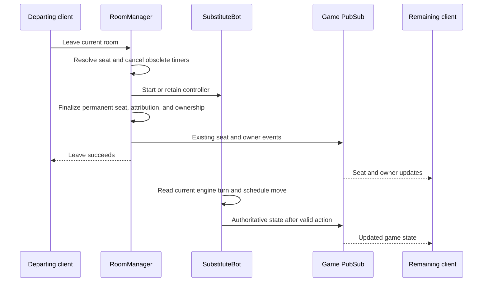

# PID-75 Live Multiplayer Departures - Plan

## Goal Capsule

- **Objective:** Remaining players can continue a multiplayer game after other players leave.
- **Means:** Extend the existing permanent bot takeover path to explicit live-game departures (KTD1).
- **Authority:** User instructions take precedence, followed by PID-75 and its linked lifecycle contracts. Requirements govern behavior; technical decisions govern implementation within those requirements.
- **Execution profile:** Implement the confirmed departure defect test-first. Keep the unverified three-live-bot symptom under a separate evidence gate (R9).
- **Stop conditions:** Surface a conflict with existing product behavior or a failure that requires a different causal explanation. Do not broaden bot scheduling changes without reproduction.
- **Delivery:** After implementation is authorized, open a focused backend PR and babysit checks and review feedback until merge-ready. Do not merge or deploy automatically.

---

## Product Contract

### Summary

Explicit departures from a running multiplayer room should transfer the seat to a permanent bot. The running game, ownership transfer, and original player's result attribution must survive that transition. Verification covers the remaining client's received game updates as well as the server's actions.

### Problem Frame

PID-75 reports a stalled bidder after three mobile players leave or disconnect. At backend commit `b99e86544818f3928942835525f6be7d9eb73354`, explicit leave makes the current seat vacant without a controller. A non-owner leave additionally resets the room to `:waiting`. The engine stays in bidding, and the human-only turn timeout discards the vacant turn without applying an action.

A prior diagnostic run reproduced both explicit and mixed departure stalls: the engine event count stayed at two, the current bidder did not change, and no timer remained after expiry. Three socket disconnects created three live bots and reached hand two while the diagnostic drove only the remaining human. All 27 existing disconnect cascade tests passed. The exact reported state with three live, stalled bot processes has not been reproduced; the original device builds, deployment, and final screenshot are unavailable.

### Requirements

**Departure and control**

- R1. An explicit leave from a running multiplayer room keeps that room `:playing` and transfers the user's occupied or reserved seat to a permanent bot. A seat already opened by the owner remains vacant under R5.
- R2. Leaving during hiccup or grace, or after permanent conversion, leaves exactly one live bot controller at that seat and cancels obsolete phase timers, unless the owner has already opened it under R5.
- R3. Owner departure uses the existing promotion priority; when no connected human remains, the active multiplayer game continues to completion under bots, consistent with PID-35.
- R4. A departed user can enter another room and cannot reclaim the relinquished seat or submit subsequent actions from a stale game channel.

**Compatibility and results**

- R5. Pre-start departure, waiting-room kicks, and single-player exit retain their existing behavior. Open Seat remains the owner-controlled vacant-seat path defined by PID-34.
- R6. Explicit multiplayer departure records abandonment once, and the original player's completed result remains attributable after permanent takeover.
- R7. The remaining client receives bot-seat, ownership, and subsequent authoritative game-state updates through the existing channel contract. Pending or dismissed owner decisions do not gate bot moves.

**Proof and scope**

- R8. Explicit, socket-only, and mixed three-player departures each allow the remaining human and three bots to progress through bidding and play into the next hand.
- R9. A departure-fix PR must not claim that the unverified three-live-bot stall or transient rejected-move recovery criterion is resolved without corresponding evidence.

### Acceptance Examples

- AE1. **Covers R1, R7, R8.** With four humans in bidding, the current bidder and two others explicitly leave. The remaining human receives bot takeover updates, the bidder acts, and the hand completes with only that human's moves supplied by the test.
- AE2. **Covers R2, R6.** A player disconnects, receives a substitute bot, then explicitly leaves before grace expires. The same live controller remains, the reservation disappears, and replaying old timer messages neither spawns another bot nor duplicates abandonment.
- AE3. **Covers R3, R5.** The last connected human leaves an active multiplayer game. Bots finish the game and results are saved; the same action in a single-player practice game closes that room.
- AE4. **Covers R4.** A player leaves room A, joins room B, and room A later cleans up. Room B's membership survives; the old channel cannot act for the bot in room A.

### Scope Boundaries

The implementation targets the backend departure transition and the tests needed to prove it. It does not change bidding rules, bot strategy, pacing defaults, or the owner-controlled Open Seat contract.

**Deferred to Follow-Up Work:** PID-73 lobby occupancy and PID-74 owner-prompt presentation remain their own work. Rejected-move retry changes and a general bot-supervision redesign require separate causal evidence under R9. The remaining PID-75 acceptance criteria stay open where this focused fix does not establish them.

### Sources

- [PID-75: reported bidding stall](https://linear.app/boldvideo/issue/PID-75/game-stalls-in-bidding-after-three-departed-players-are-replaced-by), including its evidence limitations.
- [PID-35: score protection](https://linear.app/boldvideo/issue/PID-35/score-protection-games-always-complete-rage-quitting-doesnt-cheat), including the shipped persistence comments.
- [PID-34: substitute seat opening](https://linear.app/boldvideo/issue/PID-34/substitute-seat-opening-let-owner-invite-strangers-into-bot-seats), whose contract intentionally terminates a bot when a seat is opened.
- [Backend PR #18](https://github.com/marcelfahle/pidro-backend/pull/18): the forced-dealer timeout fix is already in the baseline and does not explain a vacant seat.

---

## Planning Contract

### Key Technical Decisions

- KTD1. **Give active multiplayer leave its own coordinated transition in RoomManager.** Reuse the existing Seat operations, SubstituteBot startup, phase-timer cancellation, ownership promotion, and permanent-seat notifications. Keep the generic pre-start removal helper scoped to R5. Avoid invoking RoomManager's public synchronous API from inside its callbacks.
- KTD2. **Resolve the seat before releasing the user's active membership.** For R1, R2, and R4, create a bot only when no live controller exists, remove the explicit leaver from `positions` and `player_rooms`, and clear the reservation. Keep bot occupancy in the existing seat struct; do not invent a synthetic human identity. This avoids leaving an old user ID able to interfere with later room cleanup.
- KTD3. **Use existing abandonment events for historical attribution.** For R6, record the user and original position before clearing identity. Reuse the existing uniqueness constraint and final-result merge instead of adding another participant store. Ensure account-deletion cleanup can still relinquish a seat after its user record is gone.
- KTD4. **Close registered channels for the explicit leaver and check current seat authority for subsequent actions.** For R4, follow the existing forced-channel shutdown pattern without waiting synchronously for channel termination inside RoomManager. Channel termination must not restart the disconnect cascade. Preserve the response shape used for rejected game actions.
- KTD5. **Use real engine and bot processes for progression tests.** For R7 and R8, drive only the surviving human. Assert event progression and serialized channel delivery. Use bounded eventual assertions and restore lifecycle configuration after each test.
- KTD6. **Separate confirmed repair from unresolved diagnosis.** For R9, reference PID-75 in the PR without automatic closure while the three-live-bot and transient rejection cases remain unverified. The existing `SubstituteBot` startup check is present; do not add a second startup mechanism on assumption alone.

### High-Level Technical Design

The transition matrix governs the lifecycle branches under R1-R5.

| Room / seat before explicit leave | Controller handling | Resulting room / seat |
|---|---|---|
| Waiting or ready human seat | Existing pre-start removal | Existing waiting-room behavior |
| Single-player human seat | Existing teardown | Room closes |
| Playing multiplayer, connected or reconnecting human | Start one substitute bot | Playing / permanent bot |
| Playing multiplayer, grace substitute with live bot | Reuse controller | Playing / permanent bot |
| Playing multiplayer, already permanent bot | Reuse controller; release stale membership only | Playing / permanent bot |
| Playing multiplayer, owner-opened vacant seat with former membership | Release former membership only | Playing / vacant, per PID-34 |
| Finished room | Existing post-game leave behavior | No new bot or abandonment |

The diagram shows the successful boundary, not a promise of ordering between independent PubSub senders. Consumers must converge on the committed seat and engine state. Human turn timers are reconciled after takeover so no paused or active timer remains attached to a surrendered turn.

### Risks and Implementation Constraints

- Bot startup can fail. Do not publish a bot seat with no controller or crash the shared RoomManager through an unchecked success match. A failed start must preserve a recoverable seat and return a controlled result; establish this failure path with a focused test.
- Stale disconnect and phase messages can arrive after leave. Seat state and membership, rather than timer cancellation alone, must make them harmless.
- `GameChannel` currently caches position and applies game actions directly. KTD4 must prevent commands issued after relinquishment from using that cached authority.
- `Auth` calls the same leave API after deleting an account. R6 cannot turn that cleanup into a database constraint failure that strands the room.
- Existing tests include a case named as a ready-room departure that actually auto-starts four joined players and asserts `:waiting`. Split pre-start coverage from the new running-game contract; do not simply rename the old assertion as a regression fix.

### Deferred Questions

- **Non-blocking for this repair:** Did the original report reach three live bot controllers, three stale client labels, or owner-opened vacancies? Capture room code, deployment commit, seat status and PID liveness, engine phase and turn, legal actions, scheduling state, and action errors during a fresh reproduction.
- **Non-blocking for this repair:** Can a transient rejection strand the current live bot with no pending move? Reproduce this before choosing a retry policy. It remains a PID-75 acceptance gap under R9.

---

## Implementation Units

### U1. Preserve live seats through explicit departure

**Goal:** Implement the coordinated permanent takeover for R1-R3 and preserve R5.

**Dependencies:** None.

**Files:**

- `apps/pidro_server/lib/pidro_server/games/room_manager.ex`
- `apps/pidro_server/lib/pidro_server/games/room/seat.ex` only if a pure transition is needed
- `apps/pidro_server/test/pidro_server/games/room_manager_test.exs`
- `apps/pidro_server/test/pidro_server/games/ownership_promotion_test.exs`
- `apps/pidro_server/test/pidro_server/games/disconnect_cascade_test.exs`

**Approach:** Apply KTD1 and KTD2 to the active multiplayer branch. Keep ownership policy in the existing promotion helper. Reconcile timers after seat mutation and reuse live bots instead of restarting them. Guard stale messages with the resulting seat state.

**Execution note:** Start with failing tests for the confirmed vacant-bidder and `:waiting` regressions.

**Test scenarios:**

1. Covers AE1. Owner and non-owner current bidders leave; each becomes a permanent bot while the engine process and room remain active.
2. Covers AE2. Leave during hiccup, grace, and after permanent conversion; assert one live bot, no reservation, and no active phase timer.
3. Replay Phase 2, Phase 3, and disconnect notifications after leave; assert no duplicate bot or takeover notification.
4. Covers AE3. Owner promotion prefers the connected partner, then another connected human; last-human departure retains the multiplayer game.
5. A waiting-room human leaves or is kicked; no replacement bot starts. Single-player exit still closes its room.
6. Bot startup fails; the manager remains alive and the seat retains a recoverable controller or human state.
7. Leave after owner-opened vacancy clears stale membership without closing the seat to a bot.

**Verification:** The confirmed departure tests pass and existing waiting-room, ownership, and cascade contracts remain green.

### U2. Preserve attribution and retire departed sessions

**Goal:** Satisfy R4 and R6 without changing account-deletion behavior.

**Dependencies:** U1.

**Files:**

- `apps/pidro_server/lib/pidro_server/games/room_manager.ex`
- `apps/pidro_server/lib/pidro_server_web/channels/game_channel.ex`
- `apps/pidro_server/lib/pidro_server/stats/stats.ex` only if the existing persistence result needs handling
- `apps/pidro_server/test/pidro_server/games/room_manager_test.exs`
- `apps/pidro_server/test/pidro_server/stats/score_protection_test.exs`
- `apps/pidro_server/test/pidro_server_web/channels/game_channel_test.exs`
- `apps/pidro_server/test/pidro_server_web/controllers/api/auth_controller_test.exs`

**Approach:** Apply KTD2-KTD4. Reuse abandonment uniqueness and result merging. Close the old user's registered channels through the existing message-driven shutdown pattern. Check live seat authority before forwarding subsequent user actions.

**Test scenarios:**

1. Covers AE2. Explicit departure records one abandonment; duplicate leave and stale Phase 3 processing do not double-count it.
2. A completed game includes the departing original human with the earned team result and abandoned participation.
3. Covers AE4. Leaving A, joining B, and later cleaning up A preserves B's membership and channel registrations.
4. A channel still holding its old position after leave cannot bid or play; other players' channels remain active.
5. Channel teardown following explicit leave does not mark the permanent bot reconnecting or start another cascade.
6. Account deletion during multiplayer play leaves a functioning bot and does not attempt to recreate a deleted user. Pre-start deletion retains existing cleanup behavior.

**Verification:** Original-player attribution and session isolation pass using database fixtures with valid user IDs, together with existing account-deletion and channel tests.

### U3. Prove gameplay and client delivery across departure sequences

**Goal:** Prove R7-R8 and document the limits required by R9.

**Dependencies:** U1, U2.

**Files:**

- `apps/pidro_server/test/pidro_server/games/disconnect_cascade_test.exs`
- `apps/pidro_server/test/pidro_server/games/substitute_seat_test.exs`
- `apps/pidro_server/test/pidro_server_web/channels/game_channel_test.exs`
- `apps/pidro_server/test/pidro_server_web/controllers/api/room_controller_test.exs`

**Approach:** Apply KTD5 and KTD6. Cover the REST leave entry point and real channel subscriptions. Use the existing cascade test home for multi-bot progression. Keep the socket-only case as a working comparison and test pending owner decisions by leaving them unanswered.

**Test scenarios:**

1. Covers AE1. Three explicit leaves, including the current bidder and original host, advance into hand two with three live bots.
2. Three socket disconnects advance into hand two; permanent conversion retains the same bot PIDs.
3. Mixed departures in both host-first and non-host-first order preserve the game, ownership, and remaining client's updates.
4. A bot starts while its seat already owns the turn and acts without a later external state update.
5. Pending owner decisions require no response for progression. Open Seat and close-seat behavior retain PID-34's explicit vacancy and replacement semantics.
6. The surviving channel receives serialized game states matching advancing server events, rather than only seat-status notifications.
7. If the three-live-bot symptom recurs, capture its causal evidence and add a failing test before altering scheduling; otherwise record it as unverified.
8. Covers AE3. After the last human leaves a multiplayer game, all four bots reach game over and save the original humans' results before room cleanup.

**Verification:** The original confirmed reproduction passes against the implementation, and focused integration checks establish server action plus client delivery. The handoff states which PID-75 criteria remain unverified.

---

## Verification Contract

Use the repository's pinned Erlang 29.0.3 and Elixir 1.20.2-otp-29 through `mise exec`; the ambient shell previously selected OTP 28.1.1. Tests use the local PostgreSQL sandbox and restore temporary lifecycle settings.

- Run the focused test files named in U1-U3, including real engine, bot, channel, and database integration cases.
- Run `mise exec -- mix precommit` from the backend root. This covers dependency audit, formatting, compilation with warnings as errors, the full test suite, diff-scoped Credo, and Dialyzer.
- During four-client QA, record the actual backend and client versions, room code, departure order, owner decisions, authoritative phase/turn, bot liveness, and delivered state updates. Do not infer live controllers from a client label.
- Review only fix-owned changes. Require green PR checks and address actionable review feedback before declaring the PR merge-ready.

---

## Definition of Done

- U1-U3 satisfy their named verification outcomes and R1-R8 have corresponding evidence.
- No debug instrumentation, abandoned experiments, unrelated frontend changes, or unintended test-configuration changes remain in the diff.
- The PR explains the confirmed departure trigger and resulting behavior, cites PID-75, and follows R9 for unresolved symptoms.
- The PR is open and merge-ready after checks and review feedback. Merge and deployment remain outside this plan's delivery scope.
